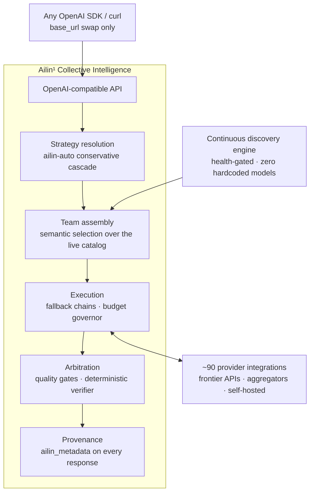
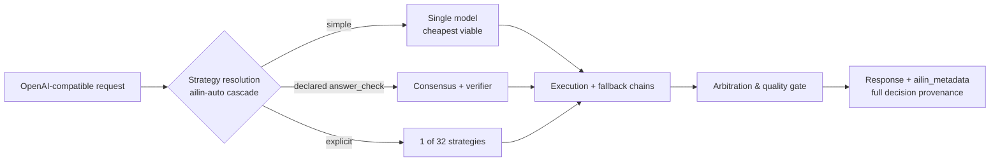

<!--
Copyright (C) 2026 Ailin One, Inc.

This file is part of Collective Intelligence Engine (ci).
Licensed under the GNU Affero General Public License v3.0 or later.
See LICENSE in the repository root, or <https://www.gnu.org/licenses/>.

SPDX-License-Identifier: AGPL-3.0-or-later
Source: https://github.com/ailinone/collective-intelligence
-->

<p align="center">
  
</p>

# Ailin¹ Collective Intelligence

<p align="center">
  <a href="https://github.com/ailinone/collective-intelligence"><b>⭐ Gib dem Repo einen Stern und unterstütze eine neue, kollektivere und kollaborativere Ära der KI</b></a>
</p>

> 🌐 Englisch ist die kanonische Version. Diese Übersetzung folgt Commit 596a94e6. Im Zweifel lies das englische README ([README.md](README.md)).

<p align="center">
  <a href="README.md"></a>
  <a href="README.zh-CN.md"></a>
  <a href="README.pt-BR.md"></a>
  <a href="README.es.md"></a>
  <a href="README.ja.md"></a>
  <a href="README.ko.md"></a>
  <a href="README.fr.md"></a>
  <a href="README.de.md"></a>
  <a href="README.ru.md"></a>
</p>

> **TL;DR**: Ailin¹ lässt **76,636 KI-Modelle** in einem einzigen kollektiven Modell zusammenarbeiten, orchestriert über **32 Strategien** statt an ein einzelnes Modell geroutet. Strukturierte Diversität, unabhängiges Reasoning und ein vollständiger Entscheidungs-Audit-Trail bei jedem Request: zuverlässiger, resilienter und auditierbarer als jede Einzelmodell-Integration, und [gegen die Frontier bewiesen, öffentlich](#gegen-die-frontier-bewiesen-öffentlich).
>
> **→ [Quickstart](#quickstart) · [Die Belege ansehen](#gegen-die-frontier-bewiesen-öffentlich) · [Docs](https://ailin.guide)**

**Tausende KI-Modelle koordinieren sich in einem einzigen kollektiven Modell.**

Strukturierte Diversität, unabhängiges Reasoning und vollständige
Entscheidungs-Provenienz bei jedem Request, entworfen, um Ausgaben
zuverlässiger, resilienter und auditierbarer zu machen als jede
Einzelmodell-Integration. Jeden Tag erscheint ein neues Modell, das
behauptet, das beste zu sein. Dies ist die Schicht, in der sie
zusammenarbeiten. Vollständige Dokumentation: **[ailin.guide](https://ailin.guide)**.

[](https://github.com/ailinone/collective-intelligence/actions/workflows/ci.yml)
[](LICENSE)
[](https://github.com/ailinone/collective-intelligence/actions/workflows/license-compliance.yml)
[](https://github.com/ailinone/collective-intelligence/actions/workflows/dco.yml)
[](CODE_OF_CONDUCT.md)
[](https://github.com/ailinone/collective-intelligence/security/code-scanning)
[](https://ailin.guide/architecture/provider-ecosystem)
[](#zehntausende-modelle-immer-an-der-frontier)
[](#der-weg-eines-requests)
[](https://github.com/ailinone/collective-intelligence/stargazers)
[](https://github.com/ailinone/collective-intelligence/discussions)

[Quickstart](#quickstart) · [Die nächste Frontier](#kollektive-intelligenz-die-nächste-frontier-der-ki) ·
[Warum ein Kollektiv](#warum-ein-kollektiv-das-größte-einzelmodell-schlägt) ·
[Die Belege](#gegen-die-frontier-bewiesen-öffentlich) ·
[Immer an der Frontier](#zehntausende-modelle-immer-an-der-frontier) ·
[Wie es funktioniert](#architektur-auf-einen-blick) ·
[Mitwirken](#mitwirken-kollektive-intelligenz-braucht-ein-kollektiv) · [Docs](https://ailin.guide)

## Kollektive Intelligenz: die nächste Frontier der KI

Die KI-Industrie hat sich darauf konzentriert, immer größere Einzelmodelle
zu bauen. Ailin¹ verfolgt einen komplementären Ansatz: ein Kollektiv aus
**76,636 KI-Modellen** (Live-Produktionszählung, 2026-07), die gemeinsam
kollaborieren, debattieren, kritisieren und synthetisieren können, und
[strukturierte Diversität](https://ailin.guide/architecture/cognitive-diversity) auf Probleme anwenden, bei denen ein
Einzelmodell ein Single Point of Training, of Architecture, of Bias und
of Failure ist.

**Das ist kein Multi-Model-Routing. Das ist kein API-Gateway. Das ist
Kollektive Intelligenz**: ein System, in dem Modelle aus jeder großen
Architektur (Frontier-APIs, Open-Weight-Herausforderer und unsere eigene
Modellfamilie) über [Dutzende Strategien](https://ailin.guide/architecture/strategy-catalog) koordinieren, mit dem Ziel
höherer Zuverlässigkeit, breiterer Evaluationsabdeckung und vollständigerer
Auditierbarkeit, als jede Einzelmodell-Integration sie bietet.

Das Prinzip ist in der Forschung zu kollektiver Intelligenz und kognitiver
Diversität verankert: Hong & Pages Resultat „diversity trumps ability"
und die Arbeiten von Woolley et al. zu kollektiver Leistung (siehe die
öffentliche [Bibliographie](https://ailin.guide/reference/bibliography)).
Ailin¹ setzt dieses Prinzip als Engineering-Plattform um: eine
Discovery-Engine, die 76,636 Modelle indexiert, Dutzende
Koordinationsstrategien, ein [Audit-Substrat](https://ailin.guide/architecture/collective-intelligence), das
jede Koordinationsentscheidung aufzeichnet, und eine
Closed-Loop-Trainingspipeline. Einige dieser Schichten sind heute
Production-Grade, andere reifen noch; die Docs tragen Status-Badges,
sodass du immer weißt, was ausgeliefert wird und was auf der Roadmap
steht.

## Warum ein Kollektiv das größte Einzelmodell schlägt

Frontier-Modelle werden immer größer, und das jeweils stärkste
Einzelmodell ist bemerkenswert. Aber ein Einzelmodell ist immer **ein Single
Point of Training, ein Single Point of Architecture, ein Single Point of
Failure und ein Single Point of Bias**. Ein gut koordiniertes Kollektiv
adressiert jede dieser strukturellen Grenzen auf eine Weise, die
Skalierung allein nicht leisten kann.

| Strukturelles Risiko eines Einzelmodells | Wie das Kollektiv es adressiert |
|---|---|
| **Resilienz**: eine einzelne Abhängigkeit; Provider-Ausfall, Drosselung oder Fehlbepreisung blockiert jeden Call | Routet automatisch um Ausfälle, degradierte Modelle und lokale Fehler herum; der Request gelingt trotzdem, mit vollständiger Provenienz ([Resilienz-Deep-Dive](https://ailin.guide/architecture/why-collective-resilience)) |
| **Evaluationsdiversität**: ein Modell wiederholt mit voller Überzeugung seine eigenen blinden Flecken | Vergleicht Ausgaben über unterschiedlich trainierte Modelle hinweg; Uneinigkeit wird zum Qualitätssignal statt zum Bug |
| **Anti-Konzentration**: an Roadmap, Preisgestaltung und Policy eines einzigen Anbieters gekettet | Entkoppelt Fähigkeit von jedem einzelnen Provider; funktioniert weiter, während sich die Frontier verschiebt |
| **Reduzierter Single-Point-Bias**: die Trainingsverzerrung und Refusal-Muster eines einzelnen Modells dominieren | Verdünnt den Einfluss architektonisch unterschiedlicher Modelle, insbesondere in Arbitrationsstrategien, die Konvergenz über unabhängige Reasoner hinweg verlangen |
| **Dynamische Spezialisierung**: kein Modell ist in allem das beste | Routet jeden Request zum Spezialisten, der für diese Aufgabe stark ist (Reasoning, Code, Vision, Long-Context, Latenz) |
| **Stärkere Governance**: der Integrator muss Audit-, Kosten- und Isolationskontrollen selbst bauen | Erzwingt Provenienz, Kosten-Caps, Quota-Isolation und Policy-Durchsetzung auf der Plattformschicht, für jeden Request, jede Strategie, jedes Modell |

Der Effekt verstärkt sich gegenseitig. Das sind keine sechs unabhängigen
Features; es sind sechs Facetten einer einzigen strukturellen
Entscheidung: Koordiniere viele Modelle gut, und das Ergebnis ist
zuverlässiger, besser steuerbar, langlebiger, und auf der wachsenden
Menge von Aufgaben, deren Korrektheit sich objektiv verifizieren lässt,
**messbar genauer als jedes Frontier-Flaggschiff, das wir getestet haben**
(97% vs. 68–82%, Belege unten).

## Gegen die Frontier bewiesen, öffentlich

Wir testen die These gegen uns selbst, öffentlich, mit objektiver
Bewertung: gepinnte Judges, maschinell prüfbare Antworten überall dort,
wo eine Aufgabe sie zulässt, und die Per-Execution-Rohdaten committet in
diesem Repository
(**[vollständiger Report](reports/experiments/AILIN-COLLECTIVE-FRONTIER-BENCHMARK-2026-07.md)** ·
[rohe CSVs + Skripte](reports/experiments/) ·
[jede Tabelle selbst regenerieren](docs/experiments/REPRODUCING_THE_BENCHMARK.md)).

**✅ Validiert: Das Kollektiv schlägt jedes Frontier-Flaggschiff bei
verifizierbaren Aufgaben.**
- Consensus, bewaffnet mit einem deterministischen Antwort-Verifier,
  erzielte **97% objektive Genauigkeit (37/38)** gegenüber **68–82%** für
  GPT-5.5-pro, Claude Opus 4.8, Gemini 3.1 Pro und Grok 4.3, gepoolt über
  alle drei Läufe
- In jedem einzelnen Lauf hat **der Verifier nie eine objektiv falsche
  Antwort ausgewählt**
- Ein Pool von Sub-Frontier-Open-Weight-Modellen, gut koordiniert, hat auf
  denselben Aufgaben besser geantwortet als jedes Flaggschiff
  ([Leaderboard mit jedem n und jedem Vorbehalt, §3](reports/experiments/AILIN-COLLECTIVE-FRONTIER-BENCHMARK-2026-07.md))

**Die aktuelle Frontier der These**, ehrlich gemessen, und sie treibt
die Roadmap:

| Achse | Heute | Was wir daran tun |
|---|---|---|
| Verifizierbare Korrektheit | ✅ **Kollektiv gewinnt** (97% vs 68–82%) | Ausweitung der Verifier-Abdeckung auf mehr Aufgabenformen (Tool-Calling-Kampagne abgeschlossen 2026-07-18) |
| Offene Prosa | Einzelmodelle gewinnen weiterhin bei Creative Writing & Refactoring | Die Decider-Auswahl trennt messbar Gewinner- von Verlierer-Läufen, ein lernbarer Hebel ([Decider-Auswahl, §7](reports/experiments/AILIN-COLLECTIVE-FRONTIER-BENCHMARK-2026-07.md)) |
| Kosten | Kollektiv-Aufpreis wie protokolliert, **außer** beim Verifier-Short-Circuit, der ihn ~100× einbrechen lässt, wenn er zündet ([Kostenaufschlüsselung, §5](reports/experiments/AILIN-COLLECTIVE-FRONTIER-BENCHMARK-2026-07.md)) | Verbreiterung des Short-Circuit-Pfads; `ailin-auto` wählt per Default die günstigste tragfähige Strategie |
| Latenz | Mehrrunden-Arbitration, bei der jede Strategie ab dem ersten Token Echtzeit-Fortschritt streamt | `ailin-auto` reserviert die tiefsten Strategien für den Fall, dass das Quality-Gate sie tatsächlich verlangt; latenzkritischer Traffic routet by design auf `single` |

Jede Zahl oben ist durch die Rohdaten pro Ausführung und die
reproduzierbaren Skripte belegt, die in diesem Repository committet
sind. Führe den Harness selbst aus, auf deinem eigenen Workload, und
halte uns daran fest.

## Zehntausende Modelle, immer an der Frontier

Das Ailin¹-Kollektiv hängt nicht von hartkodierten Modelllisten oder
manuellen Provider-Integrationen ab. Eine kontinuierliche Discovery-Engine
scannt das globale KI-Ökosystem und absorbiert neue Modelle automatisch,
sobald sie veröffentlicht werden.

Das Ergebnis: ein lebendes Kollektiv aus **76,636 Modellen** über [~90
Provider-Integrationen](https://ailin.guide/architecture/provider-ecosystem), das mit dem Ökosystem Schritt hält.
Veröffentlicht eine entdeckte Quelle ein neues Modell, absorbiert die
Discovery-Engine es ohne Codeänderungen, Konfiguration oder Downtime.

### Semantische Discovery, null hartkodierte Modelle

Die Discovery-Engine scannt Dutzende Quellen parallel:
- Native Provider-APIs
- Cloud-Hubs
- Modell-Aggregatoren
- Open-Model-Repositories
- Private Inference-Endpoints

Aber nicht die Quellen sind der Punkt, sondern **wie Modelle ausgewählt
werden**.

Jedes entdeckte Modell wird analysiert, klassifiziert und indexiert:
nach **Capabilities**, **Performance-Profil**, **Pricing**,
**Kontextfenster**, **Modalitäten** und **Architektur**, automatisch
inferiert, ohne manuelles Mapping oder Konfiguration. Routen sind
health-gated: Ein Modell wird
erst beworben, nachdem es live bewiesen wurde.

Die Modellauswahl ist **vollständig semantisch**. Wenn ein Request
eintrifft, wählt das Kollektiv nicht aus einer statischen Liste. Es
stellt das ideale Team von Modellen zusammen, basierend auf den
Anforderungen der Aufgabe, der gewählten Strategie und dem gewünschten
Ergebnisprofil (maximale Qualität, bestes Preis-Leistungs-Verhältnis,
niedrigste Kosten, schnellste Antwort). Die richtigen Modelle werden in
Echtzeit gewählt, für jeden einzelnen Request. Wenn morgen das „beste
Modell aller Zeiten" erscheint, absorbiert das Kollektiv es, statt mit
ihm zu konkurrieren.

### Eigene Modelle in derselben Arena

Die `ailin`-Modellfamilie und ihr Trainings-Flywheel sind Teil des
Designs: Koordinator-Checkpoints, trainiert auf dem eigenen
Koordinationstraffic der Engine, konkurrieren im selben Pool wie jedes
Drittanbieter-Modell, ohne Routing-Privileg. **Das Audit-Substrat, das
jede Koordinationsentscheidung erfasst, wird heute ausgeliefert;
produktive Koordinator-Gewichte sind die Kante, an der gerade entwickelt
wird** ([ehrlicher Status, immer aktuell](https://ailin.guide)).

### Kollektivstrategien als falsifizierbare Hypothesen

32 registrierte Strategien (Konsens mit Konvergenz-Untergrenzen,
Blind-Debatte, Expertenpanels, Advocatus-Diaboli-Konsens, Kostenkaskade,
Best-of-N mit objektiver Verifikation), jede mit ehrlicher Erreichbarkeit
gelabelt (auto-selektierbar / nur explizit / Roadmap), jede
falsifizierbar durch den Experiment-Harness in diesem Repo. **Strategien
verdienen sich ihren Platz mit Evidenz, oder verlieren ihn.**

### Multimodal + deterministische Dateigenerierung

Multimodale Generierung (Bilder, Audio, Video) geroutet nach
Capability, plus deterministisches Datei-Rendering (DOCX, XLSX, PDF,
PPTX, ZIP, Code) aus jedem Chat-Modell mit strukturiertem Output,
bewiesen in Produktion.

### Governance, die Unternehmen wirklich brauchen

| Kontrolle | Was sie liefert |
|---|---|
| Entscheidungs-Provenienz | `ailin_metadata`: Strategie, Modelle, finaler Decider, Kosten pro Subcall, Dissens |
| Kosten-Governance | `max_cost` pro Request, bei der Admission erzwungen |
| Mandantenisolation | Architektonisch, nicht nur auf Konfigurationsebene |
| AGPL-§13-Compliance | Endpoints `/source`, `/license`, von der Engine selbst ausgeliefert |
| Release-Provenienz | SLSA/Sigstore + SPDX SBOM |

**Derselbe Audit-Trail, der unsere Benchmark-Behauptungen beweist, governt deinen Produktions-Traffic**: Governance als [First-Class-Prinzip](https://ailin.guide/architecture/principles), nicht als Overhead.

## Architektur auf einen Blick

Das System, End-to-End. Discovery speist die Team-Zusammenstellung, jeder
Ausführungspfad mündet in denselben, Provenienz erzeugenden
Arbitrationsschritt:



*In Textform: Ein Request kommt über die OpenAI-kompatible API herein,
egal ob von einem beliebigen OpenAI-SDK oder per curl (nur die base_url
ändert sich). Die Strategieauflösung wendet die konservative
`ailin-auto`-Kaskade an und übergibt an die Team-Zusammenstellung, die
eine semantische Auswahl über den Live-Modellkatalog trifft, der
kontinuierlich von der Discovery-Engine gespeist wird (health-gated,
null hartkodierte Modelle). Das zusammengestellte Team läuft in der
Ausführung, die Fallback-Ketten und einen Budget-Governor verwaltet und
dabei bidirektional mit ~90 Provider-Integrationen kommuniziert. Die
Ausgabe der Ausführung geht in die Arbitration, die Quality-Gates und
den deterministischen Verifier anwendet und so die finale Antwort mit
vollständiger Provenienz (`ailin_metadata`) erzeugt.*

## Der Weg eines Requests

Fokussiert auf einen einzelnen Request, welchen der drei oben
beschriebenen Pfade er nimmt, und warum:



*In Textform: Die `ailin-auto`-Kaskade der Strategieauflösung schickt
einen Request auf einen von drei Pfaden: Ein einfacher Request geht an
ein einzelnes, günstigstes tragfähiges Modell; ein Request, der
`ailin_constraints.answer_check` deklariert, geht an Consensus plus den
deterministischen Verifier; ein Request, der explizit eine Strategie
nennt, nutzt diese eine der 32 registrierten Strategien. Alle drei
Pfade münden in die Ausführung mit ihren Fallback-Ketten, dann in die
Arbitration mit ihrem Quality-Gate, was die Antwort mit vollständiger
`ailin_metadata`-Provenienz erzeugt.*

Der Verifier wird scharfgeschaltet, wenn der Request über
`ailin_constraints.answer_check` eine maschinell prüfbare Antwort
deklariert. Die Kaskade ist konservativ: Die Ökonomie ist so ausgelegt,
dass sie standardmäßig den günstigen Pfad bevorzugt und nur eskaliert,
wenn das Quality-Gating es verlangt.

**Nicht geeignet für das Kollektiv** ([vollständige Anleitung](docs/use-cases/when-not-to-use-collective.md), [dieselbe Anleitung auf ailin.guide](https://ailin.guide/use-cases/when-not-to-use-collective)):
- Hochvolumiger Low-Stakes-Traffic
- Enge Latenz-SLAs
- Prosa im Dokumentationsstil

Die Entscheidung ist operativ, nicht philosophisch.

## Quickstart

> Benötigt Docker mit Compose v2, ~8 GB freien RAM, freie Ports
> 3000/5432/6379, `python3` (zum Parsen der Register-Antwort unten) und
> `pip install openai` (für das Python-Client-Beispiel). Unter Windows
> den Block unten in **Git Bash oder WSL** ausführen (er nutzt ein
> Heredoc und `openssl`).

### Schritt 1: Repository klonen und Secrets konfigurieren

```bash
git clone https://github.com/ailinone/collective-intelligence.git
cd collective-intelligence/docker
cat > .env <<EOF
# strong JWT secrets are REQUIRED — the app refuses weak/default values
JWT_SECRET=$(openssl rand -base64 48)
AILIN_SHARED_JWT_SECRET=$(openssl rand -base64 48)
# local-first secrets: skip GCP Secret Manager entirely
SECRETS_PROVIDER_PRIMARY=env
# one provider key is the minimum — any of the ~90 works
OPENAI_API_KEY=sk-...
EOF
```

Bearbeite `.env` und ersetze `sk-...` durch einen echten Key (oder lass
Keys komplett weg, siehe die Ollama-Option unten). Vollständige Liste der
Konfigurationsoptionen: [api/.env.example](api/.env.example). Dann:

### Schritt 2: Den Stack starten

```bash
docker compose up -d api postgres redis   # coord-serving baut und bootet ebenfalls automatisch, wie erwartet
docker compose logs -f api    # ersten Boot beobachten: DB-Migrationen + Provider-/Modell-Discovery-Scan, ~1-5 Min
curl http://localhost:3000/health
# → {"status":"ok","uptime":…,"version":"0.1.0"}
```

### Schritt 3: Registrieren und Token holen

```bash
export TOKEN=$(curl -s -X POST http://localhost:3000/v1/auth/register \
  -H 'Content-Type: application/json' \
  -d '{"email":"you@example.com","password":"pick-a-strong-one","name":"You"}' \
  | python3 -c "import sys,json; print(json.load(sys.stdin)['tokens']['accessToken'])")
echo "Token: ${TOKEN:0:12}..."   # nicht leer bestätigt, dass die Registrierung geklappt hat
```

### Schritt 4: Python-Client installieren

```bash
pip install openai
```

### Schritt 5: Das Kollektiv aufrufen

```python
# in derselben Shell-Sitzung wie der export oben ausführen (oder TOKEN vorher neu exportieren)
import os
from openai import OpenAI
client = OpenAI(base_url="http://localhost:3000/v1", api_key=os.environ["TOKEN"])

r = client.chat.completions.create(
    model="ailin-auto",   # or ailin-best / ailin-fast / ailin-economy / ailin-consensus
    messages=[{"role": "user", "content": "Why is the sky blue?"}],
)
print(r.choices[0].message.content)
# → Der Himmel erscheint blau aufgrund von Rayleigh-Streuung...
print(r.model_extra["ailin_metadata"])  # strategy, models, costs, dissent — the receipts
# → {'strategy_used': 'single', 'models_used': ['...'], 'cost_actual': 0.0003, ...}
```

**Wenn es nicht hochkommt**: `Cannot connect to the Docker daemon` →
zuerst Docker Desktop bzw. den Docker-Dienst starten. `bind: address
already in use` auf 3000/5432/6379 → beenden, was sonst diesen Port
belegt, oder ihn in `docker/docker-compose.override.yml` umbiegen.
`docker compose logs -f api` spammt `Secret retrieval failed` → siehe
[Degraded Boot Mode](docs/hardening/DEGRADED_BOOT_MODE.md).

Gar kein externer API-Key? Setze `OLLAMA_URL=http://host.docker.internal:11434`
in `docker/.env`, und die Engine bootet im degradierten
Self-Hosted-Modus ([Docs zum degradierten Boot-Modus](docs/hardening/DEGRADED_BOOT_MODE.md)). Unter
nativem Linux zusätzlich `extra_hosts: ["host.docker.internal:host-gateway"]`
zum api-Service hinzufügen (oder die Bridge-IP verwenden). Natives Setup
ohne Docker für OpenAPI-Validierung: [Installationsanleitung](docs/getting-started/installation.md).
Hosted-API-Quickstart: [ailin.guide/getting-started/quickstart](https://ailin.guide/getting-started/quickstart).

Weiter: [die richtige Strategie wählen](docs/guides/strategy-selection.md) ·
[Modell-Aliasse erklärt](docs/guides/model-aliases-and-routing.md).

## Was heute ausgeliefert wird vs. was in Entwicklung ist

| Wird heute ausgeliefert | In Entwicklung |
|---|---|
| OpenAI-kompatible API (chat, responses, embeddings, images, files) | Trainierte Koordinator-Gewichte (Design + Audit-Substrat werden heute ausgeliefert) |
| 32 Orchestrierungsstrategien (inkl. Einzelmodell-Baselines) + `ailin-auto`-Kaskade | Produktionsgewichte der proprietären Modellfamilie (Trainings-Flywheel gebaut) |
| Discovery-Engine, health-gated Routing, Fallback-Ketten | Erweiterte Benchmark-Kampagne mit vollständig auditierter Kostenrechnung |
| Vollständige Entscheidungs-Provenienz (`ailin_metadata`) | Schritt-für-Schritt-Kampagnenleitfaden für unabhängige Evaluationen |
| Multimodal + deterministische Dateigenerierung (DOCX/XLSX/PDF/PPTX/ZIP/Code) | |
| AGPL-§13-Endpoints (`/source`, `/license`) + Lizenz-Response-Header | |
| Broadcast-Delivery-Pipeline (Code ausgeliefert hinter `BROADCAST_FEATURE_ENABLED`, standardmäßig aus; noch nicht produktionsvalidiert) | |

Ehrlichkeit über Validierung ist ein Feature: Alles, was nicht in der
linken Spalte steht, ist in den Docs genauso gelabelt wie hier.

## Mitwirken: kollektive Intelligenz braucht ein Kollektiv

Die These selbst sagt es voraus: Diverse, unabhängige Mitwirkende, gut
koordiniert, bauen etwas, das keine Solo-Anstrengung schaffen kann.
Code-Beiträge sind willkommen unter dem **DCO** (`git commit -s`, siehe
[DCO.md](DCO.md) und [CONTRIBUTING.md](CONTRIBUTING.md)):
Provider-Adapter (dünne, in sich geschlossene Module),
Strategie-Implementierungen, objektive Task-Checker, Docs auf
[ailin.guide](https://ailin.guide).

Und dieses Projekt hat eine Beitragsfläche, die die meisten Projekte
nicht haben: **Führe den Benchmark selbst aus und veröffentliche das
Ergebnis, egal, wie es ausgeht.** Starte mit
[REPRODUCING_THE_BENCHMARK.md](docs/experiments/REPRODUCING_THE_BENCHMARK.md):
Jede veröffentlichte Tabelle aus den committeten Rohdaten zu
regenerieren dauert etwa zwei Minuten und braucht nur Pythons stdlib.
Jede unabhängige Replikation, validierend oder invalidierend, macht
das Kollektiv klüger. Genau das ist der Punkt.

Fragen und Ergebnisse: [GitHub Discussions](https://github.com/ailinone/collective-intelligence/discussions).
Sicherheitsmeldungen: **niemals** als öffentliches Issue, siehe [SECURITY.md](SECURITY.md).

## Lizenz & Governance

**AGPL-3.0-or-later.** Wer eine modifizierte Version als Netzwerkdienst
betreibt, muss deren Nutzern nach §13 den korrespondierenden Quellcode
anbieten; die Engine liefert die Endpoints `/source` und `/license` aus
und sendet `X-License`-/`X-Source-Code`-Header mit jeder Response, um
die Compliance einfach zu machen (setze `AGPL_SOURCE_URL` so, dass es
auf *deinen* modifizierten Quellcode zeigt). Siehe
[COMPLIANCE.md](COMPLIANCE.md); kommerzielle Lizenzierung:
licensing@ailin.one.

| Governance-Thema | Referenz |
|---|---|
| Contributor-Sign-off (DCO 1.1) | [DCO.md](DCO.md) |
| Verhaltenskodex (Contributor Covenant 2.1) | [CODE_OF_CONDUCT.md](CODE_OF_CONDUCT.md) |
| Marken („Ailin", „Ailin One", „ailin.one") | [TRADEMARKS.md](TRADEMARKS.md) |
| Release-Provenienz (SLSA/Sigstore + SPDX SBOM) | [release-provenance.yml](.github/workflows/release-provenance.yml) |
| Sicherheitsrichtlinie | [SECURITY.md](SECURITY.md) |
| Changelog (v0.1.0) | [CHANGELOG.md](CHANGELOG.md) |
| Vollständige Dokumentation | [ailin.guide](https://ailin.guide) |

Betreut von **Ailin One, Inc.** Die AGPL lizenziert den Code, nicht die
Marken.

## Star-Historie & Mitwirkende

<p align="center">
  <a href="https://github.com/ailinone/collective-intelligence"><b>⭐ Gib dem Repo einen Stern und unterstütze eine neue, kollektivere und kollaborativere Ära der KI</b></a>
</p>

[](https://star-history.com/#ailinone/collective-intelligence&Date)

<a href="https://github.com/ailinone/collective-intelligence/graphs/contributors">
  
</a>

Wenn die These der kollektiven Intelligenz (öffentlich getestet, Belege
im Repo) etwas ist, das es aus deiner Sicht in der Welt geben sollte,
dann ist ein ⭐ die Art, anderen Entwicklerinnen und Entwicklern zu
sagen, dass es ihre zehn Minuten wert ist.
