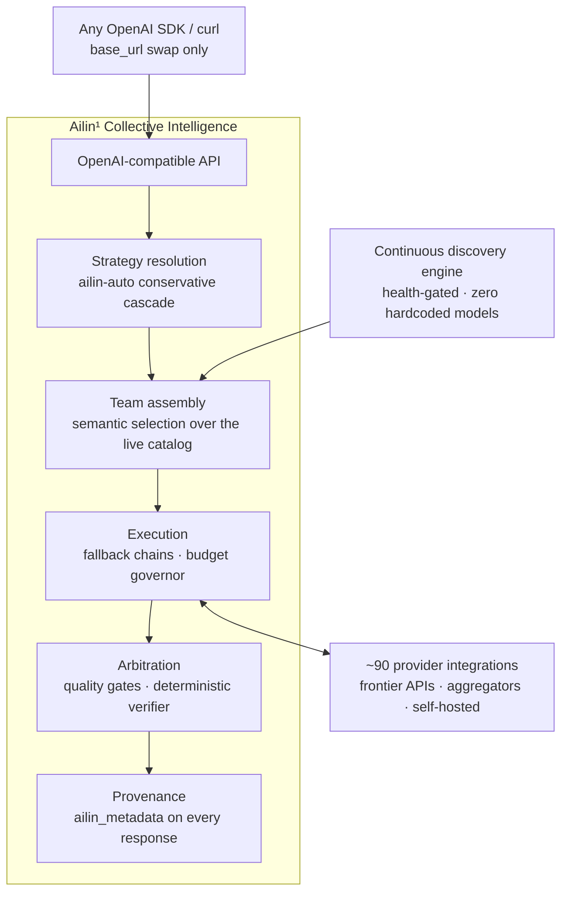
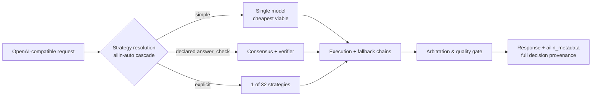

<!--
Copyright (C) 2026 Ailin One, Inc.

This file is part of Collective Intelligence Engine (ci).
Licensed under the GNU Affero General Public License v3.0 or later.
See LICENSE in the repository root, or <https://www.gnu.org/licenses/>.

SPDX-License-Identifier: AGPL-3.0-or-later
Source: https://github.com/ailinone/collective-intelligence
-->

<p align="center">
  
</p>

# Ailin¹ Collective Intelligence

<p align="center">
  <a href="https://github.com/ailinone/collective-intelligence"><b>⭐ Dale una estrella al repositorio y apoya una nueva era de la IA, más colectiva y colaborativa</b></a>
</p>

> 🌐 El inglés es la versión canónica. Esta traducción sigue el commit 596a94e6. Ante la duda, lee el [README en inglés](README.md).

<p align="center">
  <a href="README.md"></a>
  <a href="README.zh-CN.md"></a>
  <a href="README.pt-BR.md"></a>
  <a href="README.es.md"></a>
  <a href="README.ja.md"></a>
  <a href="README.ko.md"></a>
  <a href="README.fr.md"></a>
  <a href="README.de.md"></a>
  <a href="README.ru.md"></a>
</p>

> **TL;DR:** Ailin¹ hace que **76,636 modelos de IA** colaboren dentro de un único modelo colectivo, coordinados mediante **32 estrategias** en lugar de enrutados a uno solo. Diversidad estructurada, razonamiento independiente y procedencia completa de las decisiones en cada solicitud: más confiable, resiliente y auditable que cualquier integración de modelo único, y [probado contra la frontera, en abierto](#probado-contra-la-frontera-en-abierto).
>
> **→ [Inicio rápido](#inicio-rápido) · [Ver la evidencia](#probado-contra-la-frontera-en-abierto) · [Docs](https://ailin.guide)**

**Miles de modelos de IA se coordinan dentro de un único modelo colectivo.**

Diversidad estructurada, razonamiento independiente y procedencia completa
de las decisiones en cada solicitud, todo diseñado para producir salidas
más confiables, más resilientes y más auditables que una integración de
modelo único. Cada día se lanza un nuevo modelo que afirma ser el mejor.
Esta es la capa donde trabajan juntos. Documentación completa:
**[ailin.guide](https://ailin.guide)**.

[](https://github.com/ailinone/collective-intelligence/actions/workflows/ci.yml)
[](LICENSE)
[](https://github.com/ailinone/collective-intelligence/actions/workflows/license-compliance.yml)
[](https://github.com/ailinone/collective-intelligence/actions/workflows/dco.yml)
[](CODE_OF_CONDUCT.md)
[](https://github.com/ailinone/collective-intelligence/security/code-scanning)
[](https://ailin.guide/architecture/provider-ecosystem)
[](#decenas-de-miles-de-modelos-siempre-en-la-frontera)
[](#cómo-fluye-una-solicitud)
[](https://github.com/ailinone/collective-intelligence/stargazers)
[](https://github.com/ailinone/collective-intelligence/discussions)

[Inicio rápido](#inicio-rápido) · [La próxima frontera](#inteligencia-colectiva-la-próxima-frontera-de-la-ia) ·
[Por qué un colectivo](#por-qué-un-colectivo-supera-al-modelo-individual-más-grande) ·
[La evidencia](#probado-contra-la-frontera-en-abierto) ·
[Siempre en la frontera](#decenas-de-miles-de-modelos-siempre-en-la-frontera) ·
[Cómo funciona](#la-arquitectura-de-un-vistazo) ·
[Contribuir](#contribuir-la-inteligencia-colectiva-necesita-un-colectivo) · [Docs](https://ailin.guide)

## Inteligencia colectiva: la próxima frontera de la IA

La industria de la IA se ha concentrado en construir modelos individuales
cada vez más grandes. Ailin¹ adopta un enfoque complementario: un colectivo
de **76,636 modelos de IA** (conteo de producción en vivo, 2026-07) que
pueden colaborar, debatir, criticar y sintetizar juntos, aplicando
[diversidad estructurada](https://ailin.guide/architecture/cognitive-diversity) a problemas donde un
modelo único es un punto único de entrenamiento, de arquitectura, de sesgo
y de fallo.

**Esto no es enrutamiento multi-modelo. Esto no es un gateway de API. Esto
es Inteligencia Colectiva**: un sistema donde modelos de todas las grandes
arquitecturas (APIs de frontera, retadores de pesos abiertos y nuestra
propia familia de modelos) se coordinan mediante [docenas de estrategias](https://ailin.guide/architecture/strategy-catalog), con el objetivo de lograr mayor
confiabilidad, una cobertura de evaluación más amplia y una auditabilidad
más completa que las que ofrece cualquier integración de modelo único.

El principio se fundamenta en la investigación sobre inteligencia colectiva
y diversidad cognitiva: el resultado de Hong & Page de que «la diversidad
supera a la habilidad» ("diversity trumps ability") y el trabajo de
Woolley et al. sobre desempeño colectivo (ver la
[Bibliografía](https://ailin.guide/reference/bibliography) pública). Ailin¹ aplica
ese principio como plataforma de ingeniería: un motor de descubrimiento que
indexa 76,636 modelos, docenas de estrategias de coordinación, un
[sustrato de auditoría](https://ailin.guide/architecture/collective-intelligence) que
registra cada decisión de coordinación y un pipeline de entrenamiento de
ciclo cerrado. Algunas de estas capas son de grado de producción hoy y
otras aún están madurando: la documentación lleva insignias de estado para
que siempre sepas qué está disponible y qué está en la hoja de ruta.

## Por qué un colectivo supera al modelo individual más grande

Los modelos de frontera siguen creciendo, y el modelo individual más fuerte
de cada momento es extraordinario. Pero un modelo único es siempre **un
punto único de entrenamiento, un punto único de arquitectura, un punto
único de fallo y un punto único de sesgo**. Un colectivo bien coordinado
aborda cada uno de esos límites estructurales de una forma que la escala
por sí sola no puede.

| Riesgo estructural de un modelo único | Cómo lo aborda el colectivo |
|---|---|
| **Resiliencia**: una dependencia única; si el proveedor sufre una caída, throttling o precios mal fijados en un día dado, todas las llamadas se ven afectadas | Enruta esquivando caídas de proveedores, modelos degradados y fallos locales sin intervención; la solicitud se completa igualmente, con procedencia completa ([análisis en profundidad de la resiliencia](https://ailin.guide/architecture/why-collective-resilience)) |
| **Diversidad de evaluación**: un modelo único, por grande que sea, repite con total confianza sus propios puntos ciegos | Compara las salidas entre modelos entrenados con datos y objetivos distintos; el desacuerdo se convierte en una señal de calidad, no en un bug |
| **Anti-concentración**: atado a la hoja de ruta, los precios y las decisiones de política de un único proveedor | Desacopla la capacidad de cualquier proveedor individual; la plataforma sigue funcionando mientras la frontera se desplaza |
| **Menos sesgo de punto único**: el sesgo de entrenamiento y los patrones de rechazo de un solo modelo dominan la respuesta | Difumina la influencia entre modelos arquitectónicamente distintos, especialmente en estrategias de arbitraje que exigen convergencia entre razonadores independientes |
| **Especialización dinámica**: ningún modelo único es el mejor en todo | Enruta cada solicitud hacia el especialista fuerte en esa tarea (razonamiento, código, visión, contexto largo, latencia) |
| **Gobernanza más sólida**: el integrador debe construir por su cuenta los controles de auditoría, costo y aislamiento | Aplica la gobernanza en la capa de plataforma: procedencia de decisiones, topes de costo, aislamiento de cuotas y políticas rigen cada solicitud, cada estrategia, cada modelo |

El efecto es acumulativo. No son seis características independientes; son
seis facetas de una única decisión estructural: coordina bien muchos
modelos, y el resultado es más confiable, más gobernable, más duradero y,
en el conjunto creciente de tareas donde la corrección puede verificarse
objetivamente, **más preciso, de forma medible, que todos los buques
insignia de frontera que probamos** (97% vs 68–82%; los recibos, más
abajo).

## Probado contra la frontera, en abierto

Ponemos la tesis a prueba contra nosotros mismos, públicamente, con
calificación objetiva: jueces fijados (pinned), respuestas verificables por
máquina siempre que la tarea lo permite, y los datos crudos de cada
ejecución versionados en este repositorio
(**[informe completo](reports/experiments/AILIN-COLLECTIVE-FRONTIER-BENCHMARK-2026-07.md)** ·
[CSVs crudos + scripts](reports/experiments/) ·
[regenera tú mismo cada tabla](docs/experiments/REPRODUCING_THE_BENCHMARK.md)).

**✅ Validado: el colectivo supera a todos los buques insignia de frontera
en tareas verificables.**
- **97% de precisión objetiva (37/38)** frente a **68–82%** agregado de
  GPT-5.5-pro, Claude Opus 4.8, Gemini 3.1 Pro y Grok 4.3, a lo largo de
  las tres ejecuciones
- En todas las ejecuciones, **el verificador nunca seleccionó una
  respuesta objetivamente incorrecta**
- Un pool de modelos de pesos abiertos por debajo de la frontera, bien
  coordinado, respondió mejor que todos los buques insignia en las mismas
  tareas ([tabla de posiciones con cada n y cada salvedad, §3](reports/experiments/AILIN-COLLECTIVE-FRONTIER-BENCHMARK-2026-07.md))

**La frontera actual de la tesis**, medida con honestidad, guiando la hoja
de ruta:

| Eje | Hoy | Qué estamos haciendo al respecto |
|---|---|---|
| Corrección verificable | ✅ **El colectivo gana** (97% vs 68–82%) | Ampliando la cobertura del verificador a más formas de tarea (campaña de tool-calling completada el 2026-07-18) |
| Prosa abierta | Los modelos individuales aún ganan en escritura creativa y refactorización | La selección del decisor separa de forma medible las ejecuciones ganadoras de las perdedoras: una palanca aprendible ([selección del decisor, §7](reports/experiments/AILIN-COLLECTIVE-FRONTIER-BENCHMARK-2026-07.md)) |
| Costo | Prima del colectivo tal como quedó registrada, **excepto** el short-circuit del verificador, que la colapsa ~100× cuando se activa ([desglose de costos, §5](reports/experiments/AILIN-COLLECTIVE-FRONTIER-BENCHMARK-2026-07.md)) | Ensanchando la ruta del short-circuit; `ailin-auto` usa por defecto la estrategia viable más barata |
| Latencia | Arbitraje multi-ronda, con cada estrategia transmitiendo el progreso en tiempo real desde el primer token | `ailin-auto` reserva las estrategias más profundas para cuando la compuerta de calidad realmente lo exige; el tráfico crítico en latencia se enruta a `single` por diseño |

Cada número anterior está respaldado por los datos crudos de cada
ejecución y por los scripts reproducibles versionados en este
repositorio: ejecuta tú mismo el arnés de experimentos, con tu propia
carga de trabajo, y tómanos la palabra.

## Decenas de miles de modelos, siempre en la frontera

El colectivo Ailin¹ no depende de listas de modelos hardcodeadas ni de
integraciones manuales de proveedores. Un motor de descubrimiento continuo
escanea el ecosistema global de IA y absorbe automáticamente los nuevos
modelos a medida que se lanzan.

El resultado: un colectivo vivo de **76,636 modelos** a través de [~90
integraciones de proveedores](https://ailin.guide/architecture/provider-ecosystem) que se mantiene al día con el ecosistema. Cuando
una fuente descubierta publica un nuevo modelo, el motor de descubrimiento
lo absorbe sin cambios de código, sin configuración y sin downtime.

### Descubrimiento semántico, cero modelos hardcodeados

El motor de descubrimiento escanea docenas de fuentes en paralelo:
- APIs nativas de proveedores
- Hubs de nube
- Agregadores de modelos
- Repositorios de modelos abiertos
- Endpoints privados de inferencia

Pero las fuentes en sí no son el punto. Lo que importa es **cómo se
seleccionan los modelos**.

Cada modelo descubierto se analiza, se clasifica y se indexa por
**capacidades, perfil de desempeño, precios, ventana de contexto,
modalidades y arquitectura**: todo inferido automáticamente, sin mapeo
manual ni configuración. Las rutas pasan por compuertas de salud
(health-gated): un modelo solo se anuncia después de haberse probado vivo.

La selección de modelos es **totalmente semántica**. Cuando llega una
solicitud, el colectivo no elige de una lista estática. Ensambla el equipo
ideal de modelos según los requisitos de la tarea, la estrategia elegida y
el perfil de resultado deseado (máxima calidad, mejor costo-beneficio,
menor costo, respuesta más rápida). Los modelos correctos se eligen en
tiempo real, para cada solicitud individual. Cuando mañana se lance el
«mejor modelo de la historia», el colectivo lo absorberá; no competirá
con él.

### Modelos propios en la misma arena

La familia de modelos `ailin` y su flywheel de entrenamiento son parte del
diseño: checkpoints coordinadores entrenados sobre el propio tráfico de
coordinación del motor, compitiendo en el mismo pool que cualquier modelo
de terceros, sin privilegio de enrutamiento. **El sustrato de auditoría que
captura cada decisión de coordinación se entrega hoy; los pesos de
coordinador de producción son el frente en desarrollo**
([estado honesto, siempre actualizado](https://ailin.guide)).

### Estrategias colectivas como hipótesis falsables

32 estrategias registradas (consenso con pisos de convergencia, debate
ciego, paneles de expertos, consenso con abogado del diablo, cascada de
costos, best-of-N con verificación objetiva), cada una etiquetada con su
alcanzabilidad honesta (auto-seleccionable / solo-explícita / hoja de
ruta), cada una falsable por el arnés de experimentos de este repo. **Las
estrategias se ganan su lugar con evidencia, o lo pierden.**

### Multimodalidad + generación determinista de archivos

Generación multimodal (imágenes, audio, video) enrutada por capacidad,
más renderizado determinista de archivos (DOCX, XLSX, PDF, PPTX, ZIP,
código) desde cualquier modelo de chat con salida estructurada, probado en
producción.

### La gobernanza que las empresas realmente necesitan

| Control | Qué entrega |
|---|---|
| Procedencia de decisiones | `ailin_metadata`: estrategia, modelos, decisor final, costo por sub-llamada, disenso |
| Gobernanza de costos | `max_cost` por solicitud aplicado en la admisión |
| Aislamiento de tenants | Arquitectónico, no solo a nivel de configuración |
| Cumplimiento AGPL §13 | Endpoints `/source`, `/license` servidos por el propio motor |
| Procedencia de releases | SLSA/Sigstore + SBOM SPDX |

**El mismo rastro de auditoría que prueba nuestras afirmaciones de benchmark gobierna tu tráfico de producción**: la gobernanza como [principio de primera clase](https://ailin.guide/architecture/principles), no como sobrecarga.

## La arquitectura de un vistazo

El sistema, de principio a fin: el descubrimiento alimenta el ensamblaje de
equipos, y todo camino de ejecución converge en el mismo paso de arbitraje
que genera la procedencia:



*En texto: una solicitud entra por la API compatible con OpenAI, desde
cualquier SDK de OpenAI o cliente curl (solo cambia el `base_url`). La
resolución de estrategia aplica la cascada conservadora de `ailin-auto` y
pasa el testigo al ensamblaje de equipos, que hace selección semántica
sobre el catálogo de modelos vivo, alimentado sin pausa por el motor de
descubrimiento continuo (con compuertas de salud, cero modelos
hardcodeados). El equipo ensamblado corre en la ejecución, que gestiona
las cadenas de fallback y un gobernador de presupuesto, comunicándose en
ambos sentidos con las ~90 integraciones de proveedores. La salida de la
ejecución pasa al arbitraje, que aplica las compuertas de calidad y el
verificador determinista, y produce la respuesta final con procedencia
completa (`ailin_metadata`).*

## Cómo fluye una solicitud

Con zoom sobre una sola solicitud, cuál de los tres caminos anteriores
toma, y por qué:



*En texto: la cascada `ailin-auto` de la resolución de estrategia envía la
solicitud por uno de tres caminos. Una solicitud simple va a un único
modelo, el más barato viable. Una solicitud que declara
`ailin_constraints.answer_check` va a consenso más el verificador
determinista. Una solicitud que nombra una estrategia de forma explícita
usa esa estrategia, una entre las 32 registradas. Los tres caminos
convergen en la ejecución y sus cadenas de fallback, luego en el arbitraje
y su compuerta de calidad, y producen la respuesta final con procedencia
completa vía `ailin_metadata`.*

El verificador se arma cuando la solicitud declara una respuesta
verificable por máquina vía `ailin_constraints.answer_check`. La cascada es
conservadora: la economía está diseñada para favorecer por defecto la ruta
barata, escalando solo cuando la compuerta de calidad lo exige.

**No es un buen ajuste para el colectivo**
([guía completa](docs/use-cases/when-not-to-use-collective.md),
[la misma guía en ailin.guide](https://ailin.guide/use-cases/when-not-to-use-collective)):
- Tráfico de alto volumen y bajo riesgo
- SLAs de latencia estrictos
- Prosa estilo documentación

La decisión es operativa, no filosófica.

## Inicio rápido

> Requiere Docker con Compose v2, ~8 GB de RAM libre, los puertos
> 3000/5432/6379 libres, `python3` (para analizar la respuesta de registro
> más abajo) y `pip install openai` (para el ejemplo del cliente Python).
> En Windows, ejecuta el bloque siguiente en **Git Bash o WSL** (usa un
> heredoc y `openssl`).

### Paso 1: clonar y configurar los secretos

```bash
git clone https://github.com/ailinone/collective-intelligence.git
cd collective-intelligence/docker
cat > .env <<EOF
# strong JWT secrets are REQUIRED — the app refuses weak/default values
JWT_SECRET=$(openssl rand -base64 48)
AILIN_SHARED_JWT_SECRET=$(openssl rand -base64 48)
# local-first secrets: skip GCP Secret Manager entirely
SECRETS_PROVIDER_PRIMARY=env
# one provider key is the minimum — any of the ~90 works
OPENAI_API_KEY=sk-...
EOF
```

Edita `.env` y reemplaza `sk-...` con una clave real (o prescinde de claves
por completo: mira la opción de Ollama más abajo). Lista completa de
opciones de configuración: [api/.env.example](api/.env.example). Después:

### Paso 2: iniciar la pila

```bash
docker compose up -d api postgres redis   # coord-serving también se construye/arranca automáticamente, es lo esperado
docker compose logs -f api    # watch first boot: DB migrations + provider/model discovery scan, ~1-5 min
curl http://localhost:3000/health
# → {"status":"ok","uptime":…,"version":"0.1.0"}
```

### Paso 3: registrarte y obtener un token

```bash
export TOKEN=$(curl -s -X POST http://localhost:3000/v1/auth/register \
  -H 'Content-Type: application/json' \
  -d '{"email":"you@example.com","password":"pick-a-strong-one","name":"You"}' \
  | python3 -c "import sys,json; print(json.load(sys.stdin)['tokens']['accessToken'])")
echo "token: ${TOKEN:0:12}..."   # non-empty confirms registration worked
```

### Paso 4: instalar el cliente de Python

```bash
pip install openai
```

### Paso 5: llamar al colectivo

```python
# run in the same shell session as the export above (or re-export TOKEN first)
import os
from openai import OpenAI
client = OpenAI(base_url="http://localhost:3000/v1", api_key=os.environ["TOKEN"])

r = client.chat.completions.create(
    model="ailin-auto",   # or ailin-best / ailin-fast / ailin-economy / ailin-consensus
    messages=[{"role": "user", "content": "Why is the sky blue?"}],
)
print(r.choices[0].message.content)
# → The sky looks blue because of Rayleigh scattering...
print(r.model_extra["ailin_metadata"])  # strategy, models, costs, dissent — the receipts
# → {'strategy_used': 'single', 'models_used': ['...'], 'cost_actual': 0.0003, ...}
```

**Si no arranca:** `Cannot connect to the Docker daemon` → primero inicia
Docker Desktop o el servicio de Docker. `bind: address already in use` en
3000/5432/6379 → detén lo que esté usando ese puerto o remápealo en
`docker/docker-compose.override.yml`. `docker compose logs -f api` lleno de
`Secret retrieval failed` → revisa el
[modo de arranque degradado](docs/hardening/DEGRADED_BOOT_MODE.md).

¿Sin ninguna clave de API externa? Configura
`OLLAMA_URL=http://host.docker.internal:11434` en `docker/.env` y el motor
arranca en modo degradado auto-hospedado
([docs de modo de arranque degradado](docs/hardening/DEGRADED_BOOT_MODE.md)). En Linux nativo, agrega
además `extra_hosts: ["host.docker.internal:host-gateway"]` al servicio api
(o usa la IP de tu bridge). Configuración de desarrollo nativa (sin Docker)
para validar el OpenAPI:
[guía de instalación](docs/getting-started/installation.md). Inicio rápido
con la API hospedada:
[ailin.guide/getting-started/quickstart](https://ailin.guide/getting-started/quickstart).

Siguiente: [cómo elegir una estrategia](docs/guides/strategy-selection.md) ·
[alias de modelos explicados](docs/guides/model-aliases-and-routing.md).

## Qué se entrega hoy vs. qué está en desarrollo

| Se entrega hoy | En desarrollo |
|---|---|
| API compatible con OpenAI (chat, responses, embeddings, imágenes, archivos) | Pesos de coordinador entrenados (el diseño + el sustrato de auditoría se entregan ya) |
| 32 estrategias de orquestación (incl. líneas base de modelo único) + cascada `ailin-auto` | Pesos de producción de la familia de modelos propia (flywheel de entrenamiento construido) |
| Motor de descubrimiento, enrutamiento con compuertas de salud, cadenas de fallback | Campaña de benchmark ampliada con contabilidad de costos totalmente auditada |
| Procedencia completa de decisiones (`ailin_metadata`) | Guía paso a paso de campañas para evaluaciones independientes |
| Generación multimodal + determinista de archivos (DOCX/XLSX/PDF/PPTX/ZIP/código) | |
| Endpoints AGPL §13 (`/source`, `/license`) + headers de licencia en las respuestas | |
| Pipeline de entrega broadcast (código entregado detrás de `BROADCAST_FEATURE_ENABLED`, desactivado por defecto; aún no validado en producción) | |

La honestidad sobre la validación es una característica: todo lo que no
está en la columna izquierda está etiquetado en la documentación igual que
aquí.

## Contribuir: la inteligencia colectiva necesita un colectivo

La propia tesis lo predice: contribuidores diversos e independientes, bien
coordinados, construyen algo que ningún esfuerzo en solitario puede. Las
contribuciones de código son bienvenidas bajo el **DCO** (`git commit -s`,
ver [DCO.md](DCO.md) y [CONTRIBUTING.md](CONTRIBUTING.md)): adaptadores de
proveedores (módulos delgados y autocontenidos), implementaciones de
estrategias, verificadores objetivos de tareas, documentación en
[ailin.guide](https://ailin.guide).

Y este proyecto tiene una superficie de contribución que la mayoría de los
proyectos no tiene: **ejecuta el benchmark tú mismo y publica el resultado,
salga como salga.** Empieza por
[REPRODUCING_THE_BENCHMARK.md](docs/experiments/REPRODUCING_THE_BENCHMARK.md):
regenerar cada tabla publicada a partir de los datos crudos versionados
toma unos dos minutos y la stdlib de Python. Cada replicación independiente,
que valide o que invalide, hace más inteligente al colectivo. Ese es
precisamente el punto.

Preguntas y resultados: [GitHub Discussions](https://github.com/ailinone/collective-intelligence/discussions).
Reportes de seguridad: **nunca** en un issue público; ver [SECURITY.md](SECURITY.md).

## Licencia y gobernanza

**AGPL-3.0-or-later.** Si ejecutas una versión modificada como servicio de
red, el §13 exige ofrecer a sus usuarios el código fuente correspondiente.
El motor sirve los endpoints `/source` y `/license` y envía los headers
`X-License`/`X-Source-Code` en cada respuesta para facilitar el
cumplimiento (configura `AGPL_SOURCE_URL` para que apunte a *tu* código
fuente modificado). Ver [COMPLIANCE.md](COMPLIANCE.md); licenciamiento
comercial: licensing@ailin.one.

| Tema de gobernanza | Referencia |
|---|---|
| Firma del contribuidor (DCO 1.1) | [DCO.md](DCO.md) |
| Código de conducta (Contributor Covenant 2.1) | [CODE_OF_CONDUCT.md](CODE_OF_CONDUCT.md) |
| Marcas ("Ailin", "Ailin One", "ailin.one") | [TRADEMARKS.md](TRADEMARKS.md) |
| Procedencia de releases (SLSA/Sigstore + SBOM SPDX) | [release-provenance.yml](.github/workflows/release-provenance.yml) |
| Política de seguridad | [SECURITY.md](SECURITY.md) |
| Changelog (v0.1.0) | [CHANGELOG.md](CHANGELOG.md) |
| Documentación completa | [ailin.guide](https://ailin.guide) |

Mantenido por **Ailin One, Inc.** La AGPL licencia el código, no las marcas.

## Historial de estrellas y contribuidores

<p align="center">
  <a href="https://github.com/ailinone/collective-intelligence"><b>⭐ Dale una estrella al repositorio y apoya una nueva era de la IA, más colectiva y colaborativa</b></a>
</p>

[](https://star-history.com/#ailinone/collective-intelligence&Date)

<a href="https://github.com/ailinone/collective-intelligence/graphs/contributors">
  
</a>

Si la tesis de la inteligencia colectiva (puesta a prueba en abierto, con
los recibos en el repo) es algo que quieres que exista en el mundo, una ⭐
es la forma de decirles a otros desarrolladores que vale sus diez minutos.

