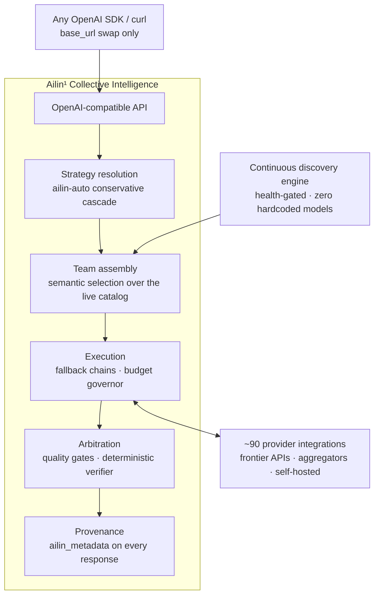
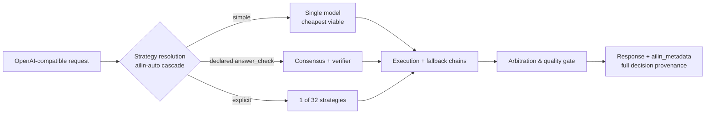

<!--
Copyright (C) 2026 Ailin One, Inc.

This file is part of Collective Intelligence Engine (ci).
Licensed under the GNU Affero General Public License v3.0 or later.
See LICENSE in the repository root, or <https://www.gnu.org/licenses/>.

SPDX-License-Identifier: AGPL-3.0-or-later
Source: https://github.com/ailinone/collective-intelligence
-->

<p align="center">
  
</p>

# Ailin¹ Collective Intelligence

<p align="center">
  <a href="https://github.com/ailinone/collective-intelligence"><b>⭐ Mettez une étoile au dépôt et soutenez une nouvelle ère de l'IA, plus collective et collaborative</b></a>
</p>

> 🌐 L'anglais est la version canonique. Cette traduction suit le commit 596a94e6. En cas de doute, lisez le README anglais ([README.md](README.md)).

<p align="center">
  <a href="README.md"></a>
  <a href="README.zh-CN.md"></a>
  <a href="README.pt-BR.md"></a>
  <a href="README.es.md"></a>
  <a href="README.ja.md"></a>
  <a href="README.ko.md"></a>
  <a href="README.fr.md"></a>
  <a href="README.de.md"></a>
  <a href="README.ru.md"></a>
</p>

> **TL;DR** : Ailin¹ fait collaborer **76,636 modèles d'IA** au sein d'un seul modèle collectif, orchestrés par **32 stratégies** plutôt que routés vers un seul. Diversité structurée, raisonnement indépendant et traçabilité décisionnelle complète sur chaque requête : plus fiable, résilient et auditable que toute intégration mono-modèle, et [éprouvé face à la frontière, au grand jour](#éprouvé-face-à-la-frontière-au-grand-jour).
>
> **→ [Démarrage rapide](#démarrage-rapide) · [Voir les preuves](#éprouvé-face-à-la-frontière-au-grand-jour) · [Docs](https://ailin.guide)**

**Des milliers de modèles d'IA se coordonnent au sein d'un seul modèle collectif.**

Diversité structurée, raisonnement indépendant et provenance décisionnelle
complète sur chaque requête, le tout conçu pour rendre les sorties plus
fiables, plus résilientes et plus auditables qu'une intégration
mono-modèle. Chaque jour, un nouveau modèle sort en se proclamant le
meilleur. Voici la couche où ils travaillent ensemble. Documentation
complète : **[ailin.guide](https://ailin.guide)**.

[](https://github.com/ailinone/collective-intelligence/actions/workflows/ci.yml)
[](LICENSE)
[](https://github.com/ailinone/collective-intelligence/actions/workflows/license-compliance.yml)
[](https://github.com/ailinone/collective-intelligence/actions/workflows/dco.yml)
[](CODE_OF_CONDUCT.md)
[](https://github.com/ailinone/collective-intelligence/security/code-scanning)
[](https://ailin.guide/architecture/provider-ecosystem)
[](#des-dizaines-de-milliers-de-modèles-toujours-à-la-frontière)
[](#le-parcours-dune-requête)
[](https://github.com/ailinone/collective-intelligence/stargazers)
[](https://github.com/ailinone/collective-intelligence/discussions)

[Démarrage rapide](#démarrage-rapide) · [La prochaine frontière](#intelligence-collective--la-prochaine-frontière-de-lia) ·
[Pourquoi un collectif](#pourquoi-un-collectif-bat-le-plus-grand-modèle-unique) ·
[Les preuves](#éprouvé-face-à-la-frontière-au-grand-jour) ·
[Toujours à la frontière](#des-dizaines-de-milliers-de-modèles-toujours-à-la-frontière) ·
[Comment ça marche](#larchitecture-en-un-coup-dœil) ·
[Contribuer](#contribuer--lintelligence-collective-a-besoin-dun-collectif) · [Docs](https://ailin.guide)

## Intelligence collective : la prochaine frontière de l'IA

L'industrie de l'IA s'est concentrée sur la construction de modèles
individuels toujours plus gros. Ailin¹ adopte une approche
complémentaire : un collectif de **76,636 modèles d'IA** (comptage de
production en direct, 2026-07) capables de collaborer, débattre, se
critiquer et synthétiser ensemble, en appliquant la
[diversité structurée](https://ailin.guide/architecture/cognitive-diversity) aux problèmes où un
modèle unique est un point unique d'entraînement, d'architecture, de
biais et de défaillance.

**Ce n'est pas du routage multi-modèles. Ce n'est pas une passerelle
d'API. C'est l'Intelligence Collective** : un système où des modèles
issus de toutes les grandes architectures (API de frontière, challengers
open-weight et notre propre famille de modèles) se coordonnent à travers
[des dizaines de stratégies](https://ailin.guide/architecture/strategy-catalog), avec pour objectif une
fiabilité supérieure, une couverture d'évaluation plus large et une
auditabilité plus complète que ce qu'offre n'importe quelle intégration
mono-modèle.

Le principe s'ancre dans la recherche sur l'intelligence collective et la
diversité cognitive : le résultat « diversity trumps ability » de
Hong & Page et les travaux de Woolley et al. sur la performance
collective (voir la [Bibliographie](https://ailin.guide/reference/bibliography)
publique). Ailin¹ applique ce principe sous forme de plateforme
d'ingénierie : un moteur de découverte qui indexe 76,636 modèles, des
dizaines de stratégies de coordination, un [substrat d'audit](https://ailin.guide/architecture/collective-intelligence) qui
enregistre chaque décision de coordination, et un pipeline d'entraînement
en boucle fermée. Certaines de ces couches sont de qualité production dès
aujourd'hui, d'autres sont encore en maturation ; la documentation porte
des badges de statut pour que vous sachiez toujours ce qui est livré et
ce qui reste sur la feuille de route.

## Pourquoi un collectif bat le plus grand modèle unique

Les modèles de frontière ne cessent de grossir, et le meilleur modèle
unique du moment est remarquable. Mais un modèle unique reste toujours
**un point unique d'entraînement, un point unique d'architecture, un
point unique de défaillance et un point unique de biais**. Un collectif
bien coordonné répond à chacune de ces limites structurelles d'une
manière que l'échelle seule ne peut pas atteindre.

| Risque structurel d'un modèle unique | Comment le collectif y répond |
|---|---|
| **Résilience** : un modèle unique, c'est une dépendance unique ; si son fournisseur est dégradé, bridé, limité en débit ou mal tarifé un jour donné, chaque appel en pâtit | Contourne les pannes de fournisseurs, les modèles dégradés et les défaillances locales sans intervention ; la requête aboutit quand même, avec une provenance complète ([analyse approfondie de la résilience](https://ailin.guide/architecture/why-collective-resilience)) |
| **Diversité d'évaluation** : un modèle unique, aussi grand soit-il, répète ses propres angles morts avec aplomb | Compare les sorties de modèles entraînés différemment ; le désaccord devient un signal de qualité, pas un bug |
| **Anti-concentration** : dépendre d'un seul modèle enchaîne une organisation à la feuille de route, à la tarification et aux décisions de politique d'un seul fournisseur | Découple la capacité de tout fournisseur unique ; la plateforme continue de fonctionner à mesure que la frontière se déplace |
| **Réduction du biais de point unique** : chaque modèle porte les biais de ses données d'entraînement, ses schémas de refus et ses réflexes stylistiques | Dilue l'influence des angles morts de chacun à travers des modèles architecturalement différents, en particulier dans les stratégies d'arbitrage qui exigent une convergence entre des raisonneurs indépendants |
| **Spécialisation dynamique** : aucun modèle unique n'est le meilleur en tout | Affecte le bon spécialiste à la bonne tâche (raisonnement intensif, code, vision, long contexte, faible latence) et route chaque requête vers des modèles forts exactement là où la tâche l'exige |
| **Gouvernance renforcée** : une intégration mono-modèle laisse à l'intégrateur le soin de construire lui-même les contrôles d'audit, de coût et d'isolation | Applique la gouvernance au niveau de la plateforme : provenance décisionnelle, plafonds de coût, isolation des quotas et application des politiques, pour chaque requête, chaque stratégie, chaque modèle |

L'effet se cumule. Ce ne sont pas six fonctionnalités indépendantes. Ce
sont six facettes d'un seul et même choix structurel : coordonnez bien de
nombreux modèles, et le résultat est plus fiable, plus gouvernable, plus
durable ; et, sur l'ensemble croissant de tâches où la justesse peut être
vérifiée objectivement, **mesurablement plus précis que chaque flagship
de frontière que nous avons testé** (97% vs 68–82%, les preuves
ci-dessous).

## Éprouvé face à la frontière, au grand jour

Nous testons la thèse contre nous-mêmes, publiquement, avec une notation
objective : des juges épinglés, des réponses vérifiables par machine
partout où une tâche le permet, et les données brutes par exécution
commitées dans ce dépôt
(**[rapport complet](reports/experiments/AILIN-COLLECTIVE-FRONTIER-BENCHMARK-2026-07.md)** ·
[CSV bruts + scripts](reports/experiments/) ·
[régénérez chaque tableau vous-même](docs/experiments/REPRODUCING_THE_BENCHMARK.md)).

**✅ Validé : le collectif bat chaque flagship de frontière sur les
tâches vérifiables.**
- **97% de précision objective (37/38)** contre **68–82%** cumulés pour
  GPT-5.5-pro, Claude Opus 4.8, Gemini 3.1 Pro et Grok 4.3
- Sur chaque run, **le vérificateur n'a jamais sélectionné une réponse
  objectivement fausse**
- Un pool de **modèles open-weight sous-frontière**, bien coordonné, a
  mieux répondu que chaque flagship sur les mêmes tâches
  ([classement avec chaque n et chaque réserve, §3](reports/experiments/AILIN-COLLECTIVE-FRONTIER-BENCHMARK-2026-07.md))

**La frontière actuelle de la thèse**, mesurée honnêtement, et qui
pilote la feuille de route :

| Axe | Aujourd'hui | Ce que nous faisons pour y remédier |
|---|---|---|
| Justesse vérifiable | ✅ **Le collectif gagne** (97% vs 68–82%) | Extension de la couverture du vérificateur à davantage de formes de tâches (campagne tool-calling achevée le 2026-07-18) |
| Prose ouverte | Les modèles seuls gagnent encore en écriture créative et en refactoring | La sélection du décideur sépare de façon mesurable les runs gagnants des runs perdants, un levier apprenable ([sélection du décideur, §7](reports/experiments/AILIN-COLLECTIVE-FRONTIER-BENCHMARK-2026-07.md)) |
| Coût | Surcoût du collectif tel qu'enregistré, **sauf** le court-circuit du vérificateur, qui l'effondre ~100× quand il se déclenche ([répartition des coûts, §5](reports/experiments/AILIN-COLLECTIVE-FRONTIER-BENCHMARK-2026-07.md)) | Élargissement du chemin de court-circuit ; `ailin-auto` choisit par défaut la stratégie viable la moins chère |
| Latence | Arbitrage multi-tours, chaque stratégie diffusant une progression en temps réel dès le premier jeton | `ailin-auto` réserve les stratégies les plus profondes aux cas où le contrôle qualité les exige réellement ; le trafic critique en latence est routé en `single` par conception |

Chaque chiffre ci-dessus s'appuie sur les données brutes par exécution et
les scripts reproductibles commités dans ce dépôt : exécutez le harnais
vous-même, sur votre propre charge de travail, et demandez-nous des
comptes.

## Des dizaines de milliers de modèles, toujours à la frontière

Le collectif Ailin¹ ne dépend d'aucune liste de modèles codée en dur ni
d'intégrations de fournisseurs manuelles. Un moteur de découverte
continue scanne l'écosystème mondial de l'IA et absorbe automatiquement
les nouveaux modèles dès leur sortie.

Le résultat : un collectif vivant de **76,636 modèles** répartis sur
[~90 intégrations de fournisseurs](https://ailin.guide/architecture/provider-ecosystem) qui reste à jour avec
l'écosystème. Quand un nouveau modèle est publié par une source
découverte, le moteur de découverte l'absorbe sans changement de code,
sans configuration et sans interruption de service.

### Découverte sémantique, zéro modèle codé en dur

Le moteur de découverte scanne des dizaines de sources en parallèle :
- API natives de fournisseurs
- Hubs cloud
- Agrégateurs de modèles
- Dépôts de modèles ouverts
- Endpoints d'inférence privés

Mais les sources ne sont pas ce qui compte : c'est **la façon dont les
modèles sont sélectionnés**.

Chaque modèle découvert est analysé, classifié et indexé par
**capacités**, **profil de performance**, **tarification**, **fenêtre de
contexte**, **modalités** et **architecture**, le tout inféré
automatiquement, sans mapping manuel ni configuration. Les routes sont
conditionnées à la santé : un modèle n'est annoncé qu'après avoir été
prouvé vivant.

La sélection de modèles est **entièrement sémantique**. Quand une requête
arrive, le collectif ne pioche pas dans une liste statique. Il assemble
l'équipe idéale de modèles en fonction des exigences de la tâche, de la
stratégie choisie et du profil de résultat souhaité (qualité maximale,
meilleur rapport coût-bénéfice, coût minimal, réponse la plus rapide).
Les bons modèles sont élus en temps réel, pour chaque requête, sans
exception. Quand le « meilleur modèle de tous les temps » de demain sera
lancé, le collectif l'absorbera : il ne le concurrencera pas.

### Nos propres modèles dans la même arène

La famille de modèles `ailin` et son volant d'entraînement font partie du
design : des checkpoints de coordinateur entraînés sur le trafic de
coordination du moteur lui-même, en compétition dans le même pool que
chaque modèle tiers, sans aucun privilège de routage. **Le substrat
d'audit qui capture chaque décision de coordination est livré dès
aujourd'hui ; les poids de coordinateur de production sont le front en
développement** ([statut honnête, toujours à jour](https://ailin.guide)).

### Des stratégies collectives comme hypothèses falsifiables

32 stratégies enregistrées (consensus avec planchers de convergence,
débat en aveugle, panels d'experts, consensus avec avocat du diable,
cascade de coûts, best-of-N avec vérification objective), chacune
étiquetée avec une accessibilité honnête (auto-sélectionnable / explicite
uniquement / feuille de route), chacune falsifiable par le harnais
d'expérimentation de ce dépôt. **Les stratégies gagnent leur place avec
des preuves, ou la perdent.**

### Multimodal + génération déterministe de fichiers

Génération multimodale (images, audio, vidéo) routée par capacité, plus
un rendu de fichiers déterministe (DOCX, XLSX, PDF, PPTX, ZIP, code) à
partir de n'importe quel modèle de chat à sortie structurée, prouvé en
production.

### La gouvernance dont les entreprises ont réellement besoin

| Contrôle | Ce qu'il apporte |
|---|---|
| Provenance décisionnelle | `ailin_metadata` : stratégie, modèles, décideur final, coût par sous-appel, dissension |
| Gouvernance des coûts | `max_cost` par requête, appliqué à l'admission |
| Isolation par tenant | Architecturale, pas seulement au niveau de la configuration |
| Conformité AGPL §13 | Endpoints `/source` et `/license` servis par le moteur lui-même |
| Provenance des releases | SLSA/Sigstore + SBOM SPDX |

**La même piste d'audit qui prouve nos affirmations de benchmark gouverne votre trafic de production** : la gouvernance comme [principe de premier ordre](https://ailin.guide/architecture/principles), pas comme un surcoût.

## L'architecture en un coup d'œil

Le système, de bout en bout (la découverte alimente l'assemblage
d'équipe, chaque chemin d'exécution converge vers la même étape
d'arbitrage génératrice de provenance) :



*En texte : une requête entre par l'API compatible OpenAI, depuis
n'importe quel SDK OpenAI ou client curl (seul le `base_url` change). La
résolution de stratégie applique la cascade conservatrice `ailin-auto`
et transmet la main à l'assemblage d'équipe, qui effectue une sélection
sémantique sur le catalogue de modèles en direct, alimenté en continu
par le moteur de découverte (conditionné à la santé, zéro modèle codé en
dur). L'équipe assemblée passe à l'exécution, qui gère les chaînes de
repli et un régulateur de budget, en dialoguant dans les deux sens avec
~90 intégrations de fournisseurs. La sortie de l'exécution va vers
l'arbitrage, qui applique les portes de qualité et le vérificateur
déterministe, produisant la réponse finale avec une provenance complète
(`ailin_metadata`).*

## Le parcours d'une requête

Zoom sur une seule requête (lequel des trois chemins ci-dessus elle
emprunte, et pourquoi) :



*En texte : la cascade `ailin-auto` de la résolution de stratégie envoie
chaque requête vers l'un de trois chemins. Une requête simple va vers un
seul modèle, le moins cher qui reste viable. Une requête qui déclare
`ailin_constraints.answer_check` va vers le consensus plus le
vérificateur déterministe. Une requête qui nomme une stratégie explicite
utilise celle-ci parmi les 32 stratégies enregistrées. Les trois chemins
convergent vers l'exécution et ses chaînes de repli, puis vers
l'arbitrage et sa porte de qualité, produisant la réponse avec la
provenance complète `ailin_metadata`.*

Le vérificateur s'arme quand la requête déclare une réponse vérifiable
par machine via `ailin_constraints.answer_check`. La cascade est
conservatrice : l'économie est conçue pour favoriser le chemin bon marché
par défaut, et n'escalader que lorsque le contrôle qualité l'exige.

**Pas fait pour le collectif** ([le guide complet](docs/use-cases/when-not-to-use-collective.md), [le même guide sur ailin.guide](https://ailin.guide/use-cases/when-not-to-use-collective)) :
- Trafic à fort volume et faible enjeu
- SLA de latence serrés
- Prose de type documentation

La décision est opérationnelle, pas philosophique.

## Démarrage rapide

> Nécessite Docker avec Compose v2, ~8 Go de RAM libre, les ports
> 3000/5432/6379 libres, `python3` (pour analyser la réponse
> d'inscription ci-dessous) et `pip install openai` (pour l'exemple de
> client Python). Sous Windows, exécutez le bloc ci-dessous dans **Git
> Bash ou WSL** (il utilise un heredoc et `openssl`).

### Étape 1 : cloner le dépôt et configurer les secrets

```bash
git clone https://github.com/ailinone/collective-intelligence.git
cd collective-intelligence/docker
cat > .env <<EOF
# strong JWT secrets are REQUIRED — the app refuses weak/default values
JWT_SECRET=$(openssl rand -base64 48)
AILIN_SHARED_JWT_SECRET=$(openssl rand -base64 48)
# local-first secrets: skip GCP Secret Manager entirely
SECRETS_PROVIDER_PRIMARY=env
# one provider key is the minimum — any of the ~90 works
OPENAI_API_KEY=sk-...
EOF
```

Éditez `.env` et remplacez `sk-...` par une vraie clé (ou passez-vous
entièrement de clés, voir l'option Ollama ci-dessous). Liste complète des
options de configuration : [api/.env.example](api/.env.example). Puis :

### Étape 2 : démarrer la stack

```bash
docker compose up -d api postgres redis   # coord-serving also builds/boots automatically — expected
docker compose logs -f api    # watch first boot: DB migrations + provider/model discovery scan, ~1-5 min
curl http://localhost:3000/health
# → {"status":"ok","uptime":…,"version":"0.1.0"}
```

### Étape 3 : s'inscrire et récupérer un jeton

```bash
export TOKEN=$(curl -s -X POST http://localhost:3000/v1/auth/register \
  -H 'Content-Type: application/json' \
  -d '{"email":"you@example.com","password":"pick-a-strong-one","name":"You"}' \
  | python3 -c "import sys,json; print(json.load(sys.stdin)['tokens']['accessToken'])")
echo "token: ${TOKEN:0:12}..."   # non-empty confirms registration worked
```

### Étape 4 : installer le client Python

```bash
pip install openai
```

### Étape 5 : appeler le collectif

```python
# run in the same shell session as the export above (or re-export TOKEN first)
import os
from openai import OpenAI
client = OpenAI(base_url="http://localhost:3000/v1", api_key=os.environ["TOKEN"])

r = client.chat.completions.create(
    model="ailin-auto",   # or ailin-best / ailin-fast / ailin-economy / ailin-consensus
    messages=[{"role": "user", "content": "Why is the sky blue?"}],
)
print(r.choices[0].message.content)
# → The sky looks blue because of Rayleigh scattering...
print(r.model_extra["ailin_metadata"])  # strategy, models, costs, dissent — the receipts
# → {'strategy_used': 'single', 'models_used': ['...'], 'cost_actual': 0.0003, ...}
```

**Si ça ne démarre pas** : `Cannot connect to the Docker daemon` →
démarrez d'abord Docker Desktop ou le service docker. `bind: address
already in use` sur le port 3000/5432/6379 → arrêtez ce qui occupe déjà
ce port ou remappez-le dans `docker/docker-compose.override.yml`.
`docker compose logs -f api` qui déverse `Secret retrieval failed` en
boucle → voir [Mode de démarrage dégradé](docs/hardening/DEGRADED_BOOT_MODE.md).

Aucune clé d'API externe du tout ? Définissez
`OLLAMA_URL=http://host.docker.internal:11434` dans `docker/.env` et le
moteur démarre en mode auto-hébergé dégradé
([documentation du mode de démarrage dégradé](docs/hardening/DEGRADED_BOOT_MODE.md)).
Sous Linux natif, ajoutez aussi `extra_hosts:
["host.docker.internal:host-gateway"]` au service api (ou utilisez l'IP
de votre bridge). Configuration native (sans Docker) pour la validation
OpenAPI : [guide d'installation](docs/getting-started/installation.md).
Démarrage rapide de l'API hébergée : [ailin.guide/getting-started/quickstart](https://ailin.guide/getting-started/quickstart).

Suite : [choisir une stratégie](docs/guides/strategy-selection.md) ·
[les alias de modèles expliqués](docs/guides/model-aliases-and-routing.md).

## Ce qui est livré aujourd'hui vs ce qui est en développement

| Livré aujourd'hui | En développement |
|---|---|
| API compatible OpenAI (chat, responses, embeddings, images, fichiers) | Poids de coordinateur entraînés (le design + le substrat d'audit sont livrés dès maintenant) |
| 32 stratégies d'orchestration (y compris des baselines mono-modèle) + cascade `ailin-auto` | Poids de production de la famille de modèles propriétaire (volant d'entraînement construit) |
| Moteur de découverte, routage conditionné à la santé, chaînes de repli | Campagne de benchmark élargie avec une comptabilité des coûts intégralement auditée |
| Provenance décisionnelle complète (`ailin_metadata`) | Guide de campagne pas à pas pour les évaluations indépendantes |
| Multimodal + génération déterministe de fichiers (DOCX/XLSX/PDF/PPTX/ZIP/code) | |
| Endpoints AGPL §13 (`/source`, `/license`) + en-têtes de réponse de licence | |
| Pipeline de diffusion broadcast (code livré derrière `BROADCAST_FEATURE_ENABLED`, désactivé par défaut ; pas encore validé en production) | |

L'honnêteté sur la validation est une fonctionnalité : tout ce qui ne
figure pas dans la colonne de gauche est étiqueté dans la documentation
exactement comme il l'est ici.

## Contribuer : l'intelligence collective a besoin d'un collectif

La thèse elle-même le prédit : des contributeurs divers et indépendants,
bien coordonnés, construisent quelque chose qu'aucun effort solitaire ne
peut atteindre. Les contributions de code sont bienvenues sous le **DCO**
(`git commit -s`, voir [DCO.md](DCO.md) et
[CONTRIBUTING.md](CONTRIBUTING.md)) : adaptateurs de fournisseurs
(modules fins et autonomes), implémentations de stratégies, vérificateurs
de tâches objectifs, documentation sur [ailin.guide](https://ailin.guide).

Et ce projet offre une surface de contribution que la plupart des projets
n'ont pas : **exécutez le benchmark vous-même et publiez le résultat,
quel qu'il soit.** Commencez par
[REPRODUCING_THE_BENCHMARK.md](docs/experiments/REPRODUCING_THE_BENCHMARK.md) :
régénérer chaque tableau publié à partir des données brutes commitées
prend environ deux minutes et la stdlib de Python. Chaque réplication
indépendante (qu'elle valide ou qu'elle invalide) rend le collectif
plus intelligent. C'est tout l'enjeu.

Questions et résultats : [GitHub Discussions](https://github.com/ailinone/collective-intelligence/discussions).
Signalements de sécurité : **jamais** via une issue publique, voir [SECURITY.md](SECURITY.md).

## Licence et gouvernance

**AGPL-3.0-or-later.** Si vous exploitez une version modifiée en tant que
service réseau, le §13 exige d'offrir à ses utilisateurs le code source
correspondant : le moteur sert les endpoints `/source` et `/license` et
envoie les en-têtes `X-License`/`X-Source-Code` sur chaque réponse pour
rendre la mise en conformité facile (définissez `AGPL_SOURCE_URL` pour
pointer vers *votre* source modifiée). Voir
[COMPLIANCE.md](COMPLIANCE.md) ; licence commerciale : licensing@ailin.one.

| Sujet de gouvernance | Référence |
|---|---|
| Signature des contributeurs (DCO 1.1) | [DCO.md](DCO.md) |
| Code de conduite (Contributor Covenant 2.1) | [CODE_OF_CONDUCT.md](CODE_OF_CONDUCT.md) |
| Marques (« Ailin », « Ailin One », « ailin.one ») | [TRADEMARKS.md](TRADEMARKS.md) |
| Provenance des releases (SLSA/Sigstore + SBOM SPDX) | [release-provenance.yml](.github/workflows/release-provenance.yml) |
| Politique de sécurité | [SECURITY.md](SECURITY.md) |
| Changelog (v0.1.0) | [CHANGELOG.md](CHANGELOG.md) |
| Documentation complète | [ailin.guide](https://ailin.guide) |

Maintenu par **Ailin One, Inc.** L'AGPL licencie le code, pas les marques.

## Historique des étoiles et contributeurs

<p align="center">
  <a href="https://github.com/ailinone/collective-intelligence"><b>⭐ Mettez une étoile au dépôt et soutenez une nouvelle ère de l'IA, plus collective et collaborative</b></a>
</p>

[](https://star-history.com/#ailinone/collective-intelligence&Date)

<a href="https://github.com/ailinone/collective-intelligence/graphs/contributors">
  
</a>

Si la thèse de l'intelligence collective (testée au grand jour, preuves
dans le dépôt) est quelque chose que vous voulez voir exister dans le
monde, une ⭐ est votre façon de dire aux autres développeurs qu'elle
vaut leurs dix minutes.
</content>
