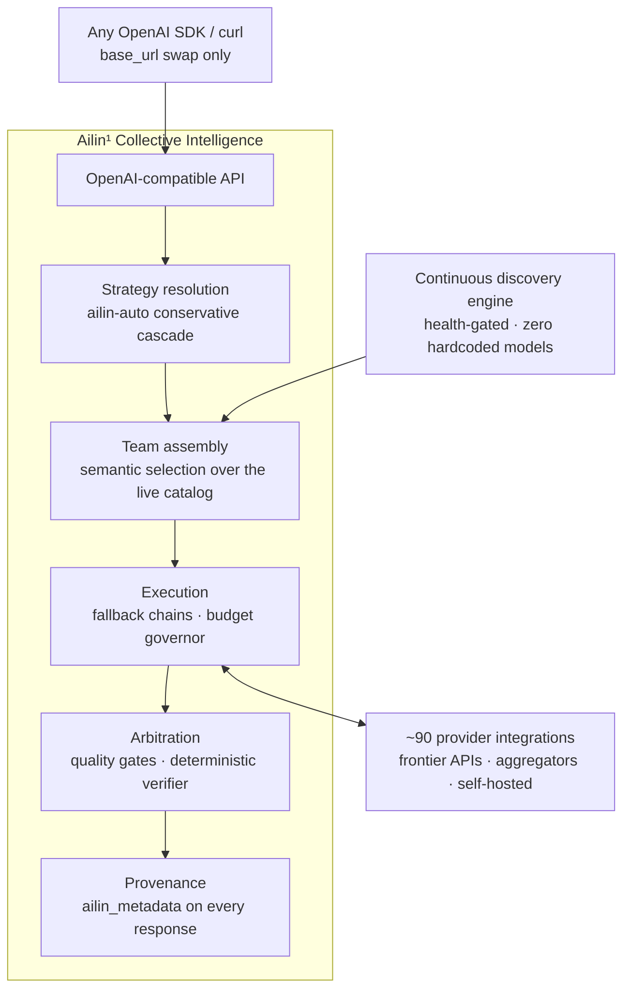
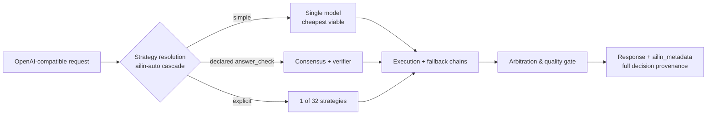

<!--
Copyright (C) 2026 Ailin One, Inc.

This file is part of Collective Intelligence Engine (ci).
Licensed under the GNU Affero General Public License v3.0 or later.
See LICENSE in the repository root, or <https://www.gnu.org/licenses/>.

SPDX-License-Identifier: AGPL-3.0-or-later
Source: https://github.com/ailinone/collective-intelligence
-->

<p align="center">
  
</p>

# Ailin¹ Collective Intelligence

<p align="center">
  <a href="https://github.com/ailinone/collective-intelligence"><b>⭐ リポジトリに Star を付けて、より集合的で協調的な AI の新しい時代を後押ししてください</b></a>
</p>

> 🌐 正式版(canonical)は英語版です。この翻訳はコミット 596a94e6 に対応しています。迷った場合は英語版 README([README.md](README.md))をお読みください。

<p align="center">
  <a href="README.md"></a>
  <a href="README.zh-CN.md"></a>
  <a href="README.pt-BR.md"></a>
  <a href="README.es.md"></a>
  <a href="README.ja.md"></a>
  <a href="README.ko.md"></a>
  <a href="README.fr.md"></a>
  <a href="README.de.md"></a>
  <a href="README.ru.md"></a>
</p>

> **TL;DR**: Ailin¹ は **76,636 個の AI モデル** をひとつのコレクティブ・モデルの中で協調させ、単一モデルへのルーティングではなく **32 の戦略** でオーケストレーションします。すべてのリクエストに構造化された多様性・独立した推論・完全な意思決定の監査証跡を付与し、単一モデル統合よりも信頼性・耐障害性・監査可能性に優れます。さらに[公開の場でフロンティアを相手に実証済み](#フロンティアを相手に公開の場で実証済み)。
>
> **→ [クイックスタート](#クイックスタート) · [エビデンスを見る](#フロンティアを相手に公開の場で実証済み) · [ドキュメント](https://ailin.guide)**

**数千のAIモデルが、ひとつのコレクティブ・モデルの中で協調する。**

構造化された多様性、独立した推論、そしてすべてのリクエストに付随する
完全な意思決定プロビナンス: 単一モデル統合よりも信頼性が高く、
耐障害性に優れ、監査可能なアウトプットを生み出すために設計されています。
毎日のように「最強」を掲げる新モデルが登場します。ここは、それらが
共に働くレイヤーです。完全なドキュメント: **[ailin.guide](https://ailin.guide)**。

[](https://github.com/ailinone/collective-intelligence/actions/workflows/ci.yml)
[](LICENSE)
[](https://github.com/ailinone/collective-intelligence/actions/workflows/license-compliance.yml)
[](https://github.com/ailinone/collective-intelligence/actions/workflows/dco.yml)
[](CODE_OF_CONDUCT.md)
[](https://github.com/ailinone/collective-intelligence/security/code-scanning)
[](https://ailin.guide/architecture/provider-ecosystem)
[](#数万のモデル常にフロンティアに)
[](#リクエストの流れ)
[](https://github.com/ailinone/collective-intelligence/stargazers)
[](https://github.com/ailinone/collective-intelligence/discussions)

[クイックスタート](#クイックスタート) · [次なるフロンティア](#コレクティブインテリジェンスaiの次なるフロンティア) ·
[なぜコレクティブか](#なぜコレクティブは最大の単一モデルに勝るのか) ·
[エビデンス](#フロンティアを相手に公開の場で実証済み) ·
[常にフロンティアに](#数万のモデル常にフロンティアに) ·
[仕組み](#アーキテクチャ概観) ·
[コントリビューション](#コントリビューションコレクティブインテリジェンスにはコレクティブが必要だ) · [ドキュメント](https://ailin.guide)

## コレクティブ・インテリジェンス：AIの次なるフロンティア

AI業界は、より大きな単一モデルを構築することに注力してきました。
Ailin¹ はそれを補完するアプローチを取ります: **76,636のAIモデル**
(2026-07時点の本番稼働数)からなるコレクティブが、協調し、討論し、
批評し、統合する。単一モデルがトレーニング・アーキテクチャ・バイアス・
障害それぞれの単一点となってしまう問題に対して、
[構造化された多様性](https://ailin.guide/architecture/cognitive-diversity)を適用します。

**これはマルチモデル・ルーティングではありません。APIゲートウェイでも
ありません。これはコレクティブ・インテリジェンスです**: フロンティア
API、オープンウェイトの挑戦者、そして自社モデルファミリーという、
あらゆる主要アーキテクチャのモデルが
[数十の戦略](https://ailin.guide/architecture/strategy-catalog)を通じて協調するシステム。
目指すのは、いかなる単一モデル統合よりも高い信頼性、広い評価カバレッジ、
そして完全な監査可能性です。

この原理は、コレクティブ・インテリジェンスと認知的多様性に関する研究に
根ざしています: Hong & Page の「diversity trumps ability(多様性は
能力に勝る)」という結果や、Woolley らによる集合的パフォーマンスの
研究(公開の[参考文献一覧](https://ailin.guide/reference/bibliography)を参照)。
Ailin¹ はその原理をエンジニアリング・プラットフォームとして実装します:
76,636のモデルをインデックスするディスカバリーエンジン、数十の協調戦略、
すべての協調上の意思決定を記録する
[監査基盤](https://ailin.guide/architecture/collective-intelligence)、
そしてクローズドループの学習パイプライン。これらのレイヤーには今日
すでに本番品質のものもあれば、まだ成熟途上のものもあります。
ドキュメントにはステータスバッジが付いており、何が提供済みで何が
ロードマップ上にあるのか、常に分かるようになっています。

## なぜコレクティブは最大の単一モデルに勝るのか

フロンティアモデルは大型化を続けており、その時々の最強単一モデルは
見事なものです。しかし単一モデルは常に、**トレーニングの単一点、
アーキテクチャの単一点、障害の単一点、そしてバイアスの単一点**です。
よく協調されたコレクティブは、スケールだけでは決して届かない形で、
これらの構造的限界の一つひとつに対処します。

| 単一モデルの構造的リスク | コレクティブによる対処 |
|---|---|
| **レジリエンス**: 単一モデルは単一の依存を意味し、そのプロバイダーが性能劣化・スロットリング・レート制限・誤った価格設定に見舞われれば、すべての呼び出しが影響を受ける | プロバイダー障害・劣化したモデル・局所的な失敗を人手の介入なしに迂回し、リクエストは完全なプロビナンス付きで成功し続ける([レジリエンス詳説](https://ailin.guide/architecture/why-collective-resilience)) |
| **評価の多様性**: モデルはそれぞれ異なるデータ・目的で訓練されており、単一モデルは自信満々に自らの誤りや盲点を繰り返す | 多数のモデルに問い出力を比較することで盲点をあぶり出し、意見の不一致をバグではなく品質のシグナルへと変える |
| **集中の回避**: ひとつのモデルへの依存は、組織をひとつのベンダーのロードマップ・価格・ポリシー判断に縛り付ける | 能力を特定のプロバイダーから切り離し、フロンティアが移り変わり個々のプロバイダーが台頭・衰退・価格改定しても、プラットフォームは動き続ける |
| **単一点バイアスの低減**: どのモデルも、訓練データ由来のバイアスや拒否パターン、文体上のデフォルトを抱えている | アーキテクチャの異なるモデルからなるコレクティブが特定のモデルの盲点の影響を拡散させる。独立した推論者たちの間での収束を要求する裁定戦略において、とりわけ顕著 |
| **動的スペシャライゼーション**: すべてにおいて最良の単一モデルは存在しない | 適切なスペシャリストを適切なタスクに割り当て(推論重視、コード重視、ビジョン、ロングコンテキスト、低レイテンシ)、各リクエストをそのタスクで強いモデルへとルーティングする |
| **より強固なガバナンス**: 単一モデル統合では、監査可能な意思決定・上限付きコスト・テナント分離・信頼できるフォールバックの構築がインテグレーター任せになる | 意思決定プロビナンス、コスト上限、クォータ分離、ポリシー強制をプラットフォーム層で強制し、すべてのリクエスト・戦略・モデルに適用する |

この効果は複利で効いてきます。これらは6つの独立した機能ではありません。
多数のモデルをうまく協調させるという、ひとつの構造的選択が持つ
6つの側面です。その結果は、より信頼でき、よりガバナンスが効き、より
持続的で、そして、正しさを客観的に検証できるタスクの拡大し続ける
領域においては、**私たちがテストしたすべてのフロンティア・
フラッグシップよりも測定可能なかたちで高精度**です
(97% vs 68–82%、証拠は下記)。

## フロンティアを相手に、公開の場で実証済み

私たちはこのテーゼを、自らを相手に、公開の場で、客観的な採点によって
検証しています: 固定されたジャッジ、タスクが許す限りの機械検証可能な
解答、そして実行単位の生データはこのリポジトリにコミット済みです
(**[完全レポート](reports/experiments/AILIN-COLLECTIVE-FRONTIER-BENCHMARK-2026-07.md)** ·
[生CSV + スクリプト](reports/experiments/) ·
[すべてのテーブルを自分で再生成](docs/experiments/REPRODUCING_THE_BENCHMARK.md))。

**✅ 検証済み: 検証可能なタスクにおいて、コレクティブはすべての
フロンティア・フラッグシップに勝利。**

- 決定論的な解答検証器を備えたコンセンサスは **97%の客観的正答率
  (37/38)** を記録。対する GPT-5.5-pro、Claude Opus 4.8、Gemini 3.1
  Pro、Grok 4.3 は、全3ランをプールして **68–82%**
- 全ランを通じて、**検証器が客観的に誤った解答を選んだことは
  一度もありません**
- **フロンティア未満のオープンウェイトモデル**のプールが、うまく
  協調することで、同一タスクにおいてすべてのフラッグシップを
  上回る解答を出した
  ([すべての n と注意点を記載したリーダーボード、§3](reports/experiments/AILIN-COLLECTIVE-FRONTIER-BENCHMARK-2026-07.md))

**このテーゼの現在のフロンティア**、誠実に測定し、ロードマップを
駆動しています:

| 軸 | 現在 | 私たちの対応 |
|---|---|---|
| 検証可能な正しさ | ✅ **コレクティブの勝利**(97% vs 68–82%) | 検証器のカバレッジをより多くのタスク形状へ拡大中(ツールコーリング・キャンペーンは 2026-07-18 に完了) |
| 自由記述の文章 | クリエイティブライティングとリファクタリングでは依然として単一モデルが勝つ | ディサイダーの選定が勝ちランと負けランを測定可能なかたちで分ける: 学習可能なレバー([ディサイダー選定、§7](reports/experiments/AILIN-COLLECTIVE-FRONTIER-BENCHMARK-2026-07.md)) |
| コスト | 記録の通りコレクティブにはプレミアムが乗る。**ただし**検証器のショートサーキットは例外で、発動時にはそれを ~100× 圧縮する([コスト内訳、§5](reports/experiments/AILIN-COLLECTIVE-FRONTIER-BENCHMARK-2026-07.md)) | ショートサーキット経路を拡大中; `ailin-auto` は実行可能な最安戦略をデフォルトとする |
| レイテンシ | マルチラウンド裁定: すべての戦略が最初のトークンからリアルタイムに進捗をストリーミングします | `ailin-auto` は、品質ゲートが実際に必要とする場合にのみ最も踏み込んだ戦略を温存します; レイテンシ重視のトラフィックは設計上 `single` にルーティングされます |

上記のすべての数値は、このリポジトリにコミットされた実行単位の生データと
再現可能なスクリプトに裏付けられています。ハーネスを自分自身の
ワークロードで実行し、私たちに同じ基準を突きつけてください。

## 数万のモデル、常にフロンティアに

Ailin¹ のコレクティブは、ハードコードされたモデルリストや手作業の
プロバイダー統合に依存しません。継続的なディスカバリーエンジンが
グローバルなAIエコシステムをスキャンし、新しいモデルがリリースされると
自動的に吸収します。

その結果: [~90のプロバイダー統合](https://ailin.guide/architecture/provider-ecosystem)にまたがる
**76,636モデル**のライブなコレクティブが、エコシステムの最新状態を
保ち続けます。発見済みのソースから新しいモデルが公開されると、
ディスカバリーエンジンはコード変更・設定・ダウンタイムなしにそれを
吸収します。

### セマンティック・ディスカバリー、ハードコードされたモデルはゼロ

ディスカバリーエンジンは数十のソースを並列にスキャンします:
- ネイティブのプロバイダーAPI
- クラウドハブ
- モデルアグリゲーター
- オープンモデルのリポジトリ
- プライベート推論エンドポイント

しかしソースそのものは本質ではありません。重要なのは
**モデルがどのように選ばれるか**です。

発見されたすべてのモデルは、**能力、パフォーマンスプロファイル、価格、
コンテキストウィンドウ、モダリティ、アーキテクチャ**によって分析・
分類・インデックスされます。手作業のマッピングや設定なしに、自動的に
推定されます。ルートはヘルスゲート付きです: モデルは、実際に稼働
していることが証明されてはじめて広告されます。

モデル選定は**完全にセマンティック**です。リクエストが到着したとき、
コレクティブは静的なリストから選ぶのではありません。タスクの要件、
選ばれた戦略、望ましいアウトカムプロファイル(最高品質、最良のコスト
対効果、最低コスト、最速応答)に基づいて、理想のモデルチームを
編成します。適切なモデルが、一つひとつのリクエストごとに、リアル
タイムで選出されるのです。明日「史上最強のモデル」が登場したとき、
コレクティブはそれと競争するのではなく、それを吸収します。

### 自社モデルも同じアリーナで

`ailin` モデルファミリーとその学習フライホイールは設計の一部です:
エンジン自身の協調トラフィックで訓練されたコーディネーター・
チェックポイントが、すべてのサードパーティモデルと同じプールで
競います。ルーティング上の特権は一切なし。**すべての協調上の意思決定を
捕捉する監査基盤は今日すでに提供されています; 本番のコーディネーター・
ウェイトが開発中の最先端です**
([誠実なステータス、常に最新](https://ailin.guide))。

### 反証可能な仮説としてのコレクティブ戦略

登録済みの32戦略(収束フロア付きコンセンサス、ブラインド討論、
エキスパートパネル、悪魔の代弁者コンセンサス、コストカスケード、
客観的検証付き best-of-N)、それぞれに誠実な到達可能性ラベル
(自動選択可 / 明示指定のみ / ロードマップ)が付き、それぞれがこの
リポジトリの実験ハーネスで反証可能です。**戦略はエビデンスによって
その地位を勝ち取り、あるいは失います。**

### マルチモーダル + 決定論的ファイル生成

マルチモーダル生成(画像・音声・動画)は能力ベースでルーティング
され、加えて、構造化出力に対応した任意のチャットモデルからの
決定論的なファイルレンダリング(DOCX、XLSX、PDF、PPTX、ZIP、コード)。
本番環境で実証済みです。

### エンタープライズが本当に必要とするガバナンス

| 統制 | 提供する内容 |
|---|---|
| 意思決定プロビナンス | `ailin_metadata`: 戦略、モデル、最終ディサイダー、サブコール単位のコスト、異論 |
| コストガバナンス | アドミッション時に強制されるリクエスト単位の `max_cost` |
| テナント分離 | アーキテクチャレベル(設定レベルにとどまらない) |
| AGPL §13準拠 | エンジン自身が提供する `/source`、`/license` エンドポイント |
| リリースプロビナンス | SPDX SBOM を伴う SLSA/Sigstore |

**私たちの主張を証明する監査証跡は、あなたの本番トラフィックを統治するのと同じものです**: ガバナンスはオーバーヘッドではなく[第一級の原則](https://ailin.guide/architecture/principles)です。

## アーキテクチャ概観

エンドツーエンドのシステム全体、ディスカバリーがチーム編成に情報を
供給し、あらゆる実行パスが同じプロビナンス生成裁定ステップへ収束し
ます:



*テキストで説明すると: リクエストは、OpenAI SDKやcurlクライアントから
(base_urlを差し替えるだけで)OpenAI互換APIに入ります。戦略解決が
`ailin-auto` の保守的なカスケードを適用し、チーム編成に引き継ぎます。
チーム編成は、ディスカバリーエンジンが継続的に供給する(ヘルスゲート
付き、ハードコードされたモデルはゼロの)ライブなモデルカタログに対して
セマンティックな選定を行います。編成されたチームは実行フェーズで動作
し、フォールバックチェーンとバジェットガバナーを管理しながら、~90の
プロバイダー統合と双方向にやり取りします。実行の出力は裁定に渡され、
品質ゲートと決定論的検証器が適用されて、完全なプロビナンス
(`ailin_metadata`)を伴う最終レスポンスが生成されます。*

## リクエストの流れ

ひとつのリクエストにズームインすると、上記の3つの経路のうちどれを
辿るか、そしてその理由は:



*テキストで説明すると: 戦略解決の `ailin-auto` カスケードは、
リクエストを3つの経路のいずれかへ振り分けます。単純なリクエストは、
最も安価で実行可能な単一モデルへ。`ailin_constraints.answer_check` を
宣言したリクエストはコンセンサス+決定論的検証器へ。戦略を明示的に
指定したリクエストは、登録済み32戦略のうちの1つへ。3つの経路はすべて
実行とそのフォールバックチェーンに合流し、続いて裁定と品質ゲートを
経て、完全な `ailin_metadata` プロビナンスを伴うレスポンスを生成
します。*

検証器は、リクエストが `ailin_constraints.answer_check` で機械検証
可能な解答を宣言したときに武装します。カスケードは保守的です。経済
設計はデフォルトで安価な経路を優先し、品質ゲートが要求するときにのみ
エスカレーションします。

**コレクティブが向かないケース**
([詳しいガイド](docs/use-cases/when-not-to-use-collective.md)、
[ailin.guideに掲載の同内容](https://ailin.guide/use-cases/when-not-to-use-collective)):
- 大量・低リスクのトラフィック
- 厳しいレイテンシSLA
- ドキュメント調の文章

この判断は哲学ではなく、運用の問題です。

## クイックスタート

> Compose v2 対応の Docker、~8 GB の空きRAM、空きポート
> 3000/5432/6379、`python3`(下記の登録レスポンスをパースするため)、
> そして `pip install openai`(Pythonクライアントの例で使用)が
> 必要です。Windows では、以下のブロックを **Git Bash または WSL**
> で実行してください(ヒアドキュメントと `openssl` を使用しています)。

### ステップ1: クローンとシークレットの設定

```bash
git clone https://github.com/ailinone/collective-intelligence.git
cd collective-intelligence/docker
cat > .env <<EOF
# strong JWT secrets are REQUIRED — the app refuses weak/default values
JWT_SECRET=$(openssl rand -base64 48)
AILIN_SHARED_JWT_SECRET=$(openssl rand -base64 48)
# local-first secrets: skip GCP Secret Manager entirely
SECRETS_PROVIDER_PRIMARY=env
# one provider key is the minimum — any of the ~90 works
OPENAI_API_KEY=sk-...
EOF
```

`.env` を編集して `sk-...` を実際のキーに置き換えてください(キーを
一切使わないことも可能です: 下記の Ollama オプションを参照)。設定
オプションの完全な一覧: [api/.env.example](api/.env.example)。その後:

### ステップ2: スタックを起動

```bash
docker compose up -d api postgres redis   # coord-serving also builds/boots automatically — expected
docker compose logs -f api    # watch first boot: DB migrations + provider/model discovery scan, ~1-5 min
curl http://localhost:3000/health
# → {"status":"ok","uptime":…,"version":"0.1.0"}
```

### ステップ3: 登録してトークンを取得

```bash
export TOKEN=$(curl -s -X POST http://localhost:3000/v1/auth/register \
  -H 'Content-Type: application/json' \
  -d '{"email":"you@example.com","password":"pick-a-strong-one","name":"You"}' \
  | python3 -c "import sys,json; print(json.load(sys.stdin)['tokens']['accessToken'])")
echo "token: ${TOKEN:0:12}..."   # non-empty confirms registration worked
```

### ステップ4: Pythonクライアントをインストール

```bash
pip install openai
```

### ステップ5: コレクティブを呼び出す

```python
# run in the same shell session as the export above (or re-export TOKEN first)
import os
from openai import OpenAI
client = OpenAI(base_url="http://localhost:3000/v1", api_key=os.environ["TOKEN"])

r = client.chat.completions.create(
    model="ailin-auto",   # or ailin-best / ailin-fast / ailin-economy / ailin-consensus
    messages=[{"role": "user", "content": "Why is the sky blue?"}],
)
print(r.choices[0].message.content)
# → The sky looks blue because of Rayleigh scattering...
print(r.model_extra["ailin_metadata"])  # strategy, models, costs, dissent — the receipts
# → {'strategy_used': 'single', 'models_used': ['...'], 'cost_actual': 0.0003, ...}
```

**うまく起動しない場合**: `Cannot connect to the Docker daemon` →
まず Docker Desktop(または docker サービス)を起動してください。
3000/5432/6379 で `bind: address already in use` → そのポートを
使っている別のプロセスを止めるか、`docker/docker-compose.override.yml`
でポートを付け替えてください。`docker compose logs -f api` が
`Secret retrieval failed` を延々と吐く →
[縮退ブートモード](docs/hardening/DEGRADED_BOOT_MODE.md)を参照して
ください。

外部APIキーが一切ない場合は、`docker/.env` に
`OLLAMA_URL=http://host.docker.internal:11434` を設定すると、エンジンは
セルフホストの縮退モードで起動します
([縮退ブートモードのドキュメント](docs/hardening/DEGRADED_BOOT_MODE.md))。
ネイティブLinux では、api サービスに
`extra_hosts: ["host.docker.internal:host-gateway"]` も追加してください
(またはブリッジIPを使用)。OpenAPI検証用のネイティブ(Dockerなし)開発
セットアップ: [インストールガイド](docs/getting-started/installation.md)。
ホステッドAPIのクイックスタート:
[ailin.guide/getting-started/quickstart](https://ailin.guide/getting-started/quickstart)。

次に: [戦略の選び方](docs/guides/strategy-selection.md) ·
[モデルエイリアスの解説](docs/guides/model-aliases-and-routing.md)。

## 現在提供中のもの vs. 開発中のもの

| 現在提供中 | 開発中 |
|---|---|
| OpenAI互換API(chat、responses、embeddings、images、files) | 訓練済みコーディネーター・ウェイト(設計 + 監査基盤は提供済み) |
| 32のオーケストレーション戦略(単一モデルのベースラインを含む)+ `ailin-auto` カスケード | 自社モデルファミリーの本番ウェイト(学習フライホイールは構築済み) |
| ディスカバリーエンジン、ヘルスゲート付きルーティング、フォールバックチェーン | 完全に監査されたコスト会計を伴う拡大ベンチマークキャンペーン |
| 完全な意思決定プロビナンス(`ailin_metadata`) | 独立評価のためのステップバイステップのキャンペーンガイド |
| マルチモーダル + 決定論的ファイル生成(DOCX/XLSX/PDF/PPTX/ZIP/コード) | |
| AGPL §13 エンドポイント(`/source`、`/license`)+ ライセンス・レスポンスヘッダー | |
| ブロードキャスト配信パイプライン(コードは `BROADCAST_FEATURE_ENABLED` の背後で提供、デフォルトはオフ; 本番検証は未了) | |

検証に関する誠実さはひとつの機能です。左の列にないものはすべて、
ここでのラベル付けと同じ方法で、ドキュメント内でもラベル付けされて
います。

## コントリビューション：コレクティブ・インテリジェンスにはコレクティブが必要だ

テーゼそのものがこれを予言しています: 多様で独立したコントリビューター
がうまく協調すれば、単独の努力では決して作れないものを作り上げる、と。
コードのコントリビューションは **DCO** のもとで歓迎します
(`git commit -s`、[DCO.md](DCO.md) と
[CONTRIBUTING.md](CONTRIBUTING.md) を参照): プロバイダーアダプター
(薄く自己完結したモジュール)、戦略実装、客観的タスクチェッカー、
[ailin.guide](https://ailin.guide) のドキュメント。

そしてこのプロジェクトには、ほとんどのプロジェクトにはない
コントリビューション面があります: **ベンチマークを自分で走らせ、
結果を公開してください、結果がどちらに転んでも。** まずは
[REPRODUCING_THE_BENCHMARK.md](docs/experiments/REPRODUCING_THE_BENCHMARK.md)
から: コミット済みの生データから公開済みのすべてのテーブルを再生成
するのに必要なのは、約2分と Python の標準ライブラリだけです。すべての
独立した再現は(検証するものであれ反証するものであれ)コレクティブを
より賢くします。それこそが核心です。

質問と結果の報告: [GitHub Discussions](https://github.com/ailinone/collective-intelligence/discussions)。
セキュリティ報告: **決して**公開Issueにしないでください。
[SECURITY.md](SECURITY.md) を参照。

## ライセンスとガバナンス

**AGPL-3.0-or-later。** 改変したバージョンをネットワークサービスとして
運用する場合、§13 はそのユーザーに対応するソースコードを提供することを
要求します。エンジンは `/source` と `/license` エンドポイントを提供し、
すべてのレスポンスに `X-License`/`X-Source-Code` ヘッダーを送信する
ため、遵守は容易です(`AGPL_SOURCE_URL` を*あなたの*改変ソースを指す
ように設定してください)。[COMPLIANCE.md](COMPLIANCE.md) を参照;
商用ライセンス: licensing@ailin.one。

| ガバナンス項目 | 参照先 |
|---|---|
| コントリビューターのサインオフ(DCO 1.1) | [DCO.md](DCO.md) |
| 行動規範(Contributor Covenant 2.1) | [CODE_OF_CONDUCT.md](CODE_OF_CONDUCT.md) |
| 商標("Ailin"、"Ailin One"、"ailin.one") | [TRADEMARKS.md](TRADEMARKS.md) |
| リリースプロビナンス(SLSA/Sigstore + SPDX SBOM) | [release-provenance.yml](.github/workflows/release-provenance.yml) |
| セキュリティポリシー | [SECURITY.md](SECURITY.md) |
| 変更履歴(v0.1.0) | [CHANGELOG.md](CHANGELOG.md) |
| 完全なドキュメント | [ailin.guide](https://ailin.guide) |

**Ailin One, Inc.** によって保守されています。AGPL がライセンスするのは
コードであり、商標ではありません。

## スター履歴とコントリビューター

<p align="center">
  <a href="https://github.com/ailinone/collective-intelligence"><b>⭐ リポジトリに Star を付けて、より集合的で協調的な AI の新しい時代を後押ししてください</b></a>
</p>

[](https://star-history.com/#ailinone/collective-intelligence&Date)

<a href="https://github.com/ailinone/collective-intelligence/graphs/contributors">
  
</a>

公開の場で検証され、証拠がリポジトリに揃った、このコレクティブ・
インテリジェンスのテーゼ。それがこの世界に存在してほしいものだと
思うなら、⭐ こそが、他の開発者に「これは10分を割く価値がある」と
伝える方法です。
</content>
