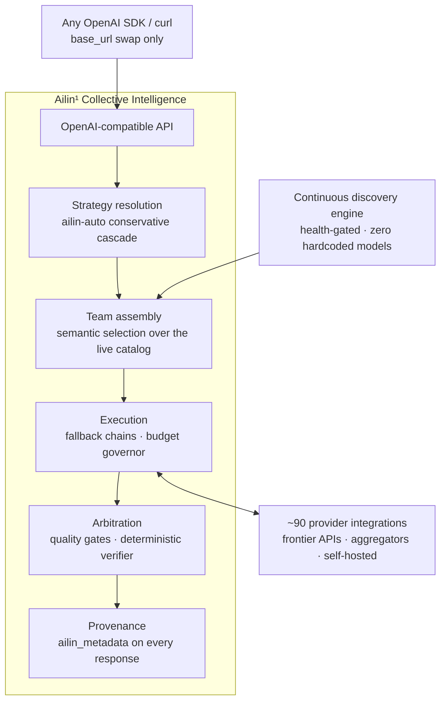
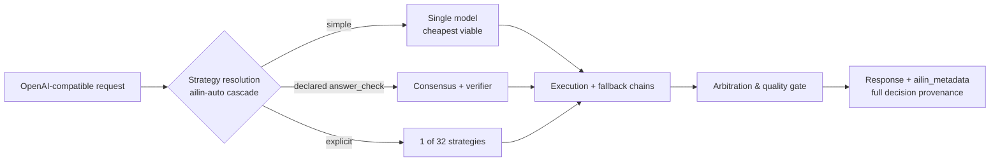

<!--
Copyright (C) 2026 Ailin One, Inc.

This file is part of Collective Intelligence Engine (ci).
Licensed under the GNU Affero General Public License v3.0 or later.
See LICENSE in the repository root, or <https://www.gnu.org/licenses/>.

SPDX-License-Identifier: AGPL-3.0-or-later
Source: https://github.com/ailinone/collective-intelligence
-->

<p align="center">
  
</p>

# Ailin¹ Collective Intelligence

> 🌐 영어판이 정본(canonical version)입니다. 이 번역은 커밋 596a94e6을 추적합니다. 확실하지 않은 부분이 있다면 영어 README([README.md](README.md))를 읽어주세요.

<p align="center">
  <a href="README.md"></a>
  <a href="README.zh-CN.md"></a>
  <a href="README.pt-BR.md"></a>
  <a href="README.es.md"></a>
  <a href="README.ja.md"></a>
  <a href="README.ko.md"></a>
  <a href="README.fr.md"></a>
  <a href="README.de.md"></a>
  <a href="README.ru.md"></a>
</p>

> **TL;DR:** Ailin¹ 은 **76,636 개의 AI 모델** 을 하나의 집단 모델 안에서 협력시키며, 단일 모델로 라우팅하는 대신 **32 가지 전략** 으로 오케스트레이션합니다. 모든 요청에 구조화된 다양성, 독립적 추론, 완전한 의사결정 감사 추적을 적용해 단일 모델 통합보다 더 신뢰할 수 있고 회복력 있으며 감사 가능합니다. 또한 [공개적으로 프런티어를 상대로 입증되었습니다](#프런티어를-상대로-공개적으로-입증).
>
> **→ [퀵스타트](#퀵스타트) · [증거 보기](#프런티어를-상대로-공개적으로-입증) · [문서](https://ailin.guide)**

<p align="center">
  <a href="https://github.com/ailinone/collective-intelligence"><b>⭐ 이 저장소에 Star를 눌러 더 집단적이고 협력적인 AI의 새로운 시대를 응원해 주세요. 모델이 혼자가 아니라 함께 이기는 시대입니다.</b></a>
</p>

**수천 개의 AI 모델이 하나의 집단 모델 안에서 협력합니다.**

모든 요청마다 구조화된 다양성, 독립적 추론, 그리고 완전한 의사결정
이력(provenance)을 적용해, 단일 모델 통합보다 더 신뢰할 수 있고, 더
회복력 있으며, 더 감사(audit) 가능한 출력을 내도록 설계되었습니다.
매일같이 "최고"를 자처하는 새 모델이 출시됩니다. 여기는 그 모델들이
함께 일하는 계층입니다. 전체 문서: **[ailin.guide](https://ailin.guide)**.

[](LICENSE)
[](https://github.com/ailinone/collective-intelligence/actions/workflows/ci.yml)
[](https://github.com/ailinone/collective-intelligence/actions/workflows/license-compliance.yml)
[](DCO.md)
[](https://ailin.guide/architecture/provider-ecosystem)
[](#수만-개의-모델-언제나-프런티어에)
[](#요청이-흐르는-방식)
[](https://github.com/ailinone/collective-intelligence/stargazers)
[](https://github.com/ailinone/collective-intelligence/discussions)

[퀵스타트](#퀵스타트) · [다음 프런티어](#집단-지성-ai의-다음-프런티어) ·
[왜 집단인가](#집단이-가장-큰-단일-모델을-이기는-이유) ·
[증거](#프런티어를-상대로-공개적으로-입증) ·
[언제나 프런티어에](#수만-개의-모델-언제나-프런티어에) ·
[작동 방식](#한눈에-보는-아키텍처) ·
[기여하기](#기여하기-집단-지성에는-집단이-필요합니다) · [문서](https://ailin.guide)

---

## 집단 지성: AI의 다음 프런티어

AI 업계는 지금까지 더 큰 단일 모델을 만드는 데 집중해 왔습니다.
Ailin¹은 이를 보완하는 접근을 취합니다: 서로 협업하고, 토론하고,
비판하고, 종합할 수 있는 **76,636개 AI 모델**의 집단(2026-07 기준
라이브 프로덕션 수치)이 [구조화된 다양성](https://ailin.guide/architecture/cognitive-diversity)을 적용해, 단일 모델이 곧
학습의 단일 지점이자 아키텍처·편향·장애의 단일 지점이 되는 문제들에
맞섭니다.

**이것은 멀티 모델 라우팅이 아닙니다. API 게이트웨이도 아닙니다.
이것은 집단 지성(Collective Intelligence)입니다**: 프런티어 API,
오픈 웨이트 도전자, 그리고 우리 자체 모델 패밀리까지, 모든 주요
아키텍처의 모델들이 [수십 가지 전략](https://ailin.guide/architecture/strategy-catalog)을 통해 조율되며, 어떤
단일 모델 통합이 제공하는 것보다 더 높은 신뢰성, 더 넓은 평가
커버리지, 더 완전한 감사 가능성을 목표로 하는 시스템입니다.

이 원리는 집단 지성과 인지 다양성 연구에 뿌리를 두고 있습니다:
Hong & Page의 "다양성이 능력을 이긴다(diversity trumps ability)"
결과와 Woolley 등의 집단 성과 연구가 그것입니다(공개
[참고문헌](https://ailin.guide/reference/bibliography) 참조). Ailin¹은
그 원리를 엔지니어링 플랫폼으로 구현합니다: 76,636개 모델을
인덱싱하는 디스커버리 엔진, 수십 가지 조율 전략, 모든 조율 결정을
기록하는 [감사 기반(audit substrate)](https://ailin.guide/architecture/collective-intelligence), 그리고
폐루프(closed-loop) 학습 파이프라인. 이 계층들 중 일부는 오늘 이미
프로덕션급이고 일부는 아직 성숙 중입니다. 문서에는 상태 배지가 붙어
있어, 무엇이 출시되어 있고 무엇이 로드맵에 있는지 언제나 알 수
있습니다.

## 집단이 가장 큰 단일 모델을 이기는 이유

프런티어 모델은 계속 커지고 있고, 어느 시점에서든 가장 강한 단일
모델은 경이롭습니다. 하지만 단일 모델은 언제나 학습의 단일 지점이고,
아키텍처의 단일 지점이며, 장애의 단일 지점이고, 편향의 단일
지점입니다. 잘 조율된 집단은 이 구조적 한계 하나하나를, 규모만으로는
불가능한 방식으로 해결합니다.

- **회복탄력성(Resilience).** 단일 모델은 곧 단일 의존성입니다. 그
  제공자가 어느 날 성능 저하, 스로틀링, 레이트 리밋, 가격 오류를
  겪으면 모든 호출이 영향을 받습니다. 집단은 제공자 장애, 성능이
  저하된 모델, 국소적 실패를 개입 없이 우회합니다: 요청은 여전히
  성공하고, 완전한 이력이 남습니다
  ([회복탄력성 심층 분석](https://ailin.guide/architecture/why-collective-resilience)).
- **평가 다양성.** 모델마다 서로 다른 데이터로, 서로 다른 목표를 갖고
  학습됩니다. 여러 모델에게 묻고 출력을 비교하면, 아무리 큰 단일
  모델이라도 확신에 차서 반복했을 오류와 사각지대가 드러납니다.
  집단은 불일치를 버그가 아니라 품질의 신호로 바꿉니다.
- **집중 방지(Anti-concentration).** 하나의 모델에 의존하는 조직은 한
  벤더의 로드맵, 가격, 정책 결정에 묶입니다. 집단은 역량을 특정
  제공자로부터 분리합니다: 프런티어가 이동해도, 특정 제공자가
  부상하거나 몰락하거나 가격을 바꿔도 플랫폼은 계속 동작합니다.
- **단일 지점 편향 완화.** 모든 모델은 학습 데이터의 편향, 거부 패턴,
  문체적 기본값을 지니고 있습니다. 아키텍처가 서로 다른 모델들의
  집단은 어느 한 모델의 사각지대가 미치는 영향을 희석합니다, 특히
  독립적인 추론자들 간의 수렴을 요구하는 중재(arbitration) 전략에서
  그렇습니다.
- **동적 전문화.** 모든 것에 최고인 단일 모델은 없습니다. 집단은
  올바른 전문가를 올바른 과제에 배정할 수 있습니다(추론 집약, 코드
  집약, 비전, 롱 컨텍스트, 저지연), 그리고 각 요청을, 그 과제가
  강함을 요구하는 바로 그 지점에서 강한 모델들로 라우팅합니다.
- **더 강한 거버넌스.** 엔터프라이즈 워크로드에는 감사 가능한
  의사결정, 상한이 있는 비용, 테넌트 격리, 신뢰할 수 있는 폴백이
  필요합니다. 단일 모델 통합은 그 통제 장치들을 통합하는 쪽이 직접
  만들도록 떠넘깁니다. 집단은 거버넌스를 플랫폼 계층에서 강제합니다:
  의사결정 이력, 비용 상한, 쿼터 격리, 정책 집행이 모든 요청, 모든
  전략, 모든 모델에 적용됩니다.

효과는 복리로 쌓입니다. 이것은 여섯 개의 독립적인 기능이 아니라,
하나의 구조적 선택이 가진 여섯 개의 면입니다: 많은 모델을 잘 조율하면
그 결과는 더 신뢰할 수 있고, 더 통제 가능하고, 더 오래갑니다,
그리고 정답을 객관적으로 검증할 수 있는, 점점 넓어지는 과제
집합에서는 **우리가 테스트한 모든 프런티어 플래그십보다 측정 가능하게
더 정확합니다** (97% vs 68–82%, 증빙은 아래에).

## 프런티어를 상대로, 공개적으로 입증

우리는 이 명제를 우리 자신을 상대로, 공개적으로, 객관적 채점으로
검증합니다: 고정된(pinned) 심판, 과제가 허용하는 한 기계 검증 가능한
정답, 그리고 이 저장소에 커밋된 실행 단위 원시 데이터
(**[전체 리포트](reports/experiments/AILIN-COLLECTIVE-FRONTIER-BENCHMARK-2026-07.md)** ·
[원시 CSV + 스크립트](reports/experiments/) ·
[모든 표를 직접 재생성하기](docs/experiments/REPRODUCING_THE_BENCHMARK.md)).

**✅ 검증 완료: 검증 가능한 과제에서 집단이 모든 프런티어
플래그십을 이깁니다.** 결정론적 정답 검증기(verifier)로 무장한
합의(consensus) 전략은 **객관적 정확도 97% (37/38)**를 기록했고,
GPT-5.5-pro, Claude Opus 4.8, Gemini 3.1 Pro, Grok 4.3은 세 차례 실행
전체를 합산해 **68–82%**에 그쳤습니다, 그리고 모든 실행에 걸쳐
**검증기는 단 한 번도 객관적으로 틀린 답을 선택하지 않았습니다**.
프런티어 이하(sub-frontier)의 오픈 웨이트 모델 풀이, 잘 조율되기만
하면, 같은 과제에서 모든 플래그십보다 더 정확히 답했습니다
([모든 n과 단서 조항이 담긴 리더보드, §3](reports/experiments/AILIN-COLLECTIVE-FRONTIER-BENCHMARK-2026-07.md)).

**이 명제의 현재 프런티어**, 정직하게 측정되고, 로드맵을 이끕니다:

| 축 | 현재 | 우리가 하고 있는 일 |
|---|---|---|
| 검증 가능한 정확성 | ✅ **집단 승리** (97% vs 68–82%) | 더 많은 과제 유형으로 검증기 커버리지 확장 중 (툴 콜링 캠페인 2026-07-18 완료) |
| 자유형 산문 | 창의적 글쓰기와 리팩토링은 아직 단일 모델이 우세 | 결정자(decider) 선택이 승리한 실행과 패배한 실행을 측정 가능하게 가릅니다: 학습 가능한 레버 ([§7](reports/experiments/AILIN-COLLECTIVE-FRONTIER-BENCHMARK-2026-07.md)) |
| 비용 | 기록된 그대로의 집단 프리미엄 존재. **단**, 검증기 쇼트서킷이 발동하는 순간 프리미엄이 약 ~100× 규모로 붕괴합니다 ([§5](reports/experiments/AILIN-COLLECTIVE-FRONTIER-BENCHMARK-2026-07.md)) | 쇼트서킷 경로 확대 중; `ailin-auto`는 실행 가능한 가장 저렴한 전략을 기본값으로 사용 |
| 지연 시간 | 다회전 중재(arbitration)는 모든 전략이 첫 토큰부터 실시간 진행 상황을 스트리밍합니다 | `ailin-auto`는 품질 게이트가 실제로 요구할 때만 가장 깊은 전략을 사용하도록 예약해 두며, 지연에 민감한 트래픽은 설계상 `single`로 라우팅됩니다 |

위 모든 수치는 이 저장소에 커밋된 실행 단위 원시 데이터와 재현
가능한 스크립트로 뒷받침됩니다. 여러분의 워크로드로 직접 하네스를
실행해 보고, 그 결과로 저희에게 책임을 물어 주세요.

## 수만 개의 모델, 언제나 프런티어에

Ailin¹ 집단은 하드코딩된 모델 목록이나 수동 제공자 통합에 의존하지
않습니다. 연속 디스커버리 엔진이 전 세계 AI 생태계를 스캔하고, 새
모델이 출시되는 즉시 자동으로 흡수합니다.

그 결과: [~90개 제공자
통합](https://ailin.guide/architecture/provider-ecosystem)에 걸친 **76,636개 모델**의 라이브 집단이 생태계와
함께 최신 상태를 유지합니다. 발견된 소스에서 새 모델이 공개되면,
디스커버리 엔진은 코드 변경도, 설정도, 다운타임도 없이 그것을
흡수합니다.

### 시맨틱 디스커버리, 하드코딩된 모델 제로

디스커버리 엔진은 수십 개의 소스를 병렬로 스캔합니다: 네이티브
제공자 API, 클라우드 허브, 모델 애그리게이터, 오픈 모델 저장소,
프라이빗 추론 엔드포인트. 하지만 소스 자체가 핵심이 아닙니다. 중요한
것은 모델이 선택되는 방식입니다.

발견된 모든 모델은 능력, 성능 프로필, 가격, 컨텍스트 윈도, 모달리티,
아키텍처 기준으로 분석·분류·인덱싱됩니다: 수동 매핑이나 설정 없이
자동으로 추론됩니다. 라우트는 헬스 게이트를 거칩니다: 모델은 실제로
살아 있음이 증명된 뒤에야 광고됩니다.

모델 선택은 **완전히 시맨틱**합니다. 요청이 도착하면 집단은 정적
목록에서 고르지 않습니다. 과제의 요구 사항, 선택된 전략, 원하는 결과
프로필(최고 품질, 최적 가성비, 최저 비용, 최고 속도)에 따라 이상적인
모델 팀을 구성합니다. 올바른 모델들이 매 요청마다, 실시간으로
선출됩니다. 내일 "역대 최고의 모델"이 출시되면, 집단은 그것과
경쟁하지 않습니다: 그것을 흡수합니다.

### 같은 경기장에 서는 자체 모델

`ailin` 모델 패밀리와 그 학습 플라이휠은 설계의 일부입니다: 엔진
자신의 조율 트래픽으로 학습되는 코디네이터 체크포인트가, 모든
서드파티 모델과 같은 풀에서 경쟁합니다. 라우팅 특혜는 없습니다.
모든 조율 결정을 포착하는 감사 기반은 오늘 이미 출시되어 있고,
프로덕션 코디네이터 가중치는 개발 중인 최전선입니다
([정직한 상태, 항상 최신](https://ailin.guide)).

### 반증 가능한 가설로서의 집단 전략

등록된 32개 전략(수렴 하한선을 갖춘 합의, 블라인드 토론, 전문가
패널, 악마의 변호인 합의, 비용 캐스케이드, 객관적 검증을 갖춘
best-of-N) 각각은 정직한 도달 가능성(자동 선택 가능 / 명시적 전용 /
로드맵)으로 라벨링되어 있고, 각각은 이 저장소의 실험 하네스로 반증
가능합니다. 전략은 증거로 자리를 얻고, 증거로 자리를 잃습니다.

### 멀티모달 + 결정론적 파일 생성

멀티모달 생성(이미지, 오디오, 비디오)은 능력(capability) 기준으로
라우팅되며, 여기에 구조화 출력을 지원하는 어떤 챗 모델로부터든
결정론적 파일 렌더링(DOCX, XLSX, PDF, PPTX, ZIP, 코드)이 더해집니다.
프로덕션에서 입증되었습니다.

### 엔터프라이즈에 실제로 필요한 거버넌스

완전한 의사결정 이력(`ailin_metadata`: 전략, 모델, 최종 결정자,
서브콜별 비용, 반대 의견), 접수 시점에 강제되는 요청별 `max_cost`,
아키텍처 수준의 테넌트 격리, 엔진 자체가 서빙하는 AGPL §13
엔드포인트(`/source`, `/license`), SPDX SBOM을 갖춘 SLSA/Sigstore
릴리스 이력. 우리의 주장을 증명하는 감사 추적이 곧 여러분의 트래픽을
통제하는 감사 추적입니다: 거버넌스는 오버헤드가 아니라
[일급 원칙](https://ailin.guide/architecture/principles)입니다.

## 한눈에 보는 아키텍처

시스템을 처음부터 끝까지 보면, 디스커버리가 팀 구성에 정보를 공급하고,
모든 실행 경로는 이력을 생성하는 동일한 중재 단계로 수렴합니다:



## 요청이 흐르는 방식

한 건의 요청을 확대해서 보면, 위 세 경로 중 어떤 것을 타는지, 그리고
그 이유는:



검증기는 요청이 `ailin_constraints.answer_check`를 통해 기계 검증
가능한 정답을 선언할 때 무장(arm)됩니다. 캐스케이드는 보수적입니다:
경제 구조는 기본적으로 저렴한 경로를 선호하도록 설계되었고, 품질
게이팅이 요구할 때만 상승합니다. 그리고 조율은 공짜가 아니기에,
엔진의 문서 스스로가
[단일 모델이 옳은 선택인 경우](docs/use-cases/when-not-to-use-collective.md)
([가이드에서도 확인 가능](https://ailin.guide/use-cases/when-not-to-use-collective))를 솔직하게 알려줍니다: 대량·저위험 트래픽, 빡빡한 지연 SLA,
문서 스타일 산문이 그런 경우입니다. 이 결정은 철학이 아니라 운영의
문제입니다.

## 퀵스타트

> Docker(Compose v2 포함), 여유 RAM 약 8 GB, 사용 가능한 포트
> 3000/5432/6379가 필요합니다. Windows에서는 아래 블록을 **Git Bash
> 또는 WSL**에서 실행하세요(heredoc과 `openssl`을 사용합니다).

```bash
git clone https://github.com/ailinone/collective-intelligence.git
cd collective-intelligence/docker
cat > .env <<EOF
# strong JWT secrets are REQUIRED — the app refuses weak/default values
JWT_SECRET=$(openssl rand -base64 48)
AILIN_SHARED_JWT_SECRET=$(openssl rand -base64 48)
# local-first secrets: skip GCP Secret Manager entirely
SECRETS_PROVIDER_PRIMARY=env
# one provider key is the minimum — any of the ~90 works
OPENAI_API_KEY=sk-...
EOF
```

`.env`를 편집해 `sk-...`를 실제 키로 바꾸세요(키를 아예 건너뛰어도
됩니다, 아래 Ollama 옵션 참조). 그다음:

```bash
docker compose up -d api postgres redis
docker compose logs -f api    # watch first boot: migrations + discovery, ~1-5 min
curl http://localhost:3000/health
# → {"status":"ok","uptime":…,"version":"0.1.0"}
```

(코디네이터의 서빙 표면인 `coord-serving`이 API와 함께 빌드되고
부팅됩니다. 정상입니다.) 로컬 계정을 만들고 집단을 호출하세요:

```bash
TOKEN=$(curl -s -X POST http://localhost:3000/v1/auth/register \
  -H 'Content-Type: application/json' \
  -d '{"email":"you@example.com","password":"pick-a-strong-one","name":"You"}' \
  | python3 -c "import sys,json; print(json.load(sys.stdin)['tokens']['accessToken'])")
```

```python
from openai import OpenAI
client = OpenAI(base_url="http://localhost:3000/v1", api_key=TOKEN)

r = client.chat.completions.create(
    model="ailin-auto",   # or ailin-best / ailin-fast / ailin-economy / ailin-consensus
    messages=[{"role": "user", "content": "Why is the sky blue?"}],
)
print(r.choices[0].message.content)
print(r.model_extra["ailin_metadata"])  # strategy, models, costs, dissent — the receipts
```

외부 API 키가 전혀 없다면? `docker/.env`에
`OLLAMA_URL=http://host.docker.internal:11434`를 설정하면 엔진이 성능
축소(degraded) 셀프 호스티드 모드로 부팅합니다
([문서](docs/hardening/DEGRADED_BOOT_MODE.md)). 네이티브 Linux에서는
api 서비스에 `extra_hosts: ["host.docker.internal:host-gateway"]`도
추가하세요(또는 브리지 IP를 사용하세요). 전체 로컬 설정:
[설치 가이드](docs/getting-started/installation.md). 호스티드 API
퀵스타트: [ailin.guide/getting-started/quickstart](https://ailin.guide/getting-started/quickstart).

## 오늘 출시된 것 vs. 개발 중인 것

| 오늘 출시됨 | 개발 중 |
|---|---|
| OpenAI 호환 API (chat, responses, embeddings, images, files) | 학습된 코디네이터 가중치 (설계 + 감사 기반은 지금 출시됨) |
| 32개 오케스트레이션 전략 (단일 모델 베이스라인 포함) + `ailin-auto` 캐스케이드 | 자체 모델 패밀리 프로덕션 가중치 (학습 플라이휠 구축 완료) |
| 디스커버리 엔진, 헬스 게이트 라우팅, 폴백 체인 | 완전히 감사된 비용 회계를 갖춘 확장된 벤치마크 캠페인 |
| 완전한 의사결정 이력 (`ailin_metadata`) | 독립 평가를 위한 단계별 캠페인 가이드 |
| 멀티모달 + 결정론적 파일 생성 (DOCX/XLSX/PDF/PPTX/ZIP/코드) | |
| AGPL §13 엔드포인트 (`/source`, `/license`) + 라이선스 응답 헤더 | |
| 브로드캐스트 전송 파이프라인 (`BROADCAST_FEATURE_ENABLED` 뒤에서 코드 출시됨, 기본 비활성; 아직 프로덕션 검증 전) | |

검증에 대한 정직함은 하나의 기능입니다: 왼쪽 열에 없는 것은
무엇이든, 여기 라벨링된 방식 그대로 문서에도 라벨링되어 있습니다.

## 기여하기: 집단 지성에는 집단이 필요합니다

명제 자체가 이것을 예측합니다: 다양하고 독립적인 기여자들이 잘
조율되면, 어떤 단독 작업도 만들 수 없는 것을 만들어 냅니다. 코드
기여는 **DCO** 하에 환영합니다(`git commit -s`, [DCO.md](DCO.md)와
[CONTRIBUTING.md](CONTRIBUTING.md) 참조): 제공자 어댑터(얇고 자기
완결적인 모듈), 전략 구현, 객관적 과제 체커,
[ailin.guide](https://ailin.guide) 문서.

그리고 이 프로젝트에는 대부분의 프로젝트에 없는 기여 표면이 있습니다:
**벤치마크를 직접 실행하고 그 결과를 공개하세요, 결과가 어느 쪽으로
나오든.**
[REPRODUCING_THE_BENCHMARK.md](docs/experiments/REPRODUCING_THE_BENCHMARK.md)에서
시작하세요: 커밋된 원시 데이터로부터 공개된 모든 표를 재생성하는 데는
약 2분과 Python 표준 라이브러리면 충분합니다. 모든 독립적인 재현은,
검증이든 반증이든, 집단을 더 똑똑하게 만듭니다. 그것이 바로
핵심입니다.

질문과 결과: [GitHub Discussions](https://github.com/ailinone/collective-intelligence/discussions).
보안 신고: **절대** 공개 이슈로 올리지 마세요. [SECURITY.md](SECURITY.md)를 참조하세요.

## 라이선스 & 거버넌스

**AGPL-3.0-or-later.** 수정된 버전을 네트워크 서비스로 운영한다면,
§13에 따라 그 서비스의 사용자들에게 해당 소스를 제공해야 합니다.
엔진은 준수를 쉽게 만들기 위해 `/source`와 `/license` 엔드포인트를
서빙하고 모든 응답에 `X-License`/`X-Source-Code` 헤더를
보냅니다(`AGPL_SOURCE_URL`을 *여러분의* 수정된 소스를 가리키도록
설정하세요). [COMPLIANCE.md](COMPLIANCE.md) 참조; 상업 라이선스:
licensing@ailin.one.

| | |
|---|---|
| 기여자 서명 (DCO 1.1) | [DCO.md](DCO.md) |
| 행동 강령 (Contributor Covenant 2.1) | [CODE_OF_CONDUCT.md](CODE_OF_CONDUCT.md) |
| 상표 ("Ailin", "Ailin One", "ailin.one") | [TRADEMARKS.md](TRADEMARKS.md) |
| 릴리스 이력 (SLSA/Sigstore + SPDX SBOM) | [release-provenance.yml](.github/workflows/release-provenance.yml) |
| 보안 정책 | [SECURITY.md](SECURITY.md) |
| 체인지로그 (v0.1.0) | [CHANGELOG.md](CHANGELOG.md) |
| 전체 문서 | [ailin.guide](https://ailin.guide) |

**Ailin One, Inc.**가 관리합니다. AGPL은 코드에 대한 라이선스이며,
상표에는 적용되지 않습니다.

## 스타 히스토리 & 컨트리뷰터

[](https://star-history.com/#ailinone/collective-intelligence&Date)

<a href="https://github.com/ailinone/collective-intelligence/graphs/contributors">
  
</a>

공개적으로 검증되고, 증빙이 저장소에 담긴 집단 지성 명제, 이것이
세상에 존재하기를 바란다면, ⭐ 하나가 다른 개발자들에게 이 프로젝트가
그들의 10분을 들일 가치가 있음을 알리는 방법입니다.
