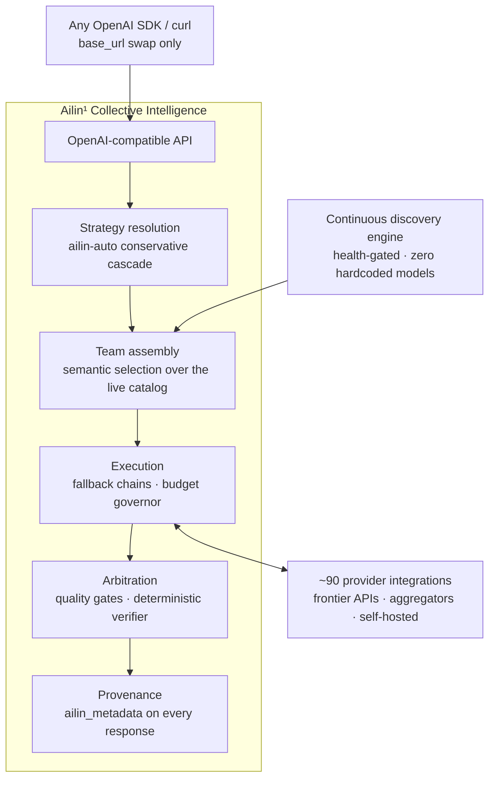
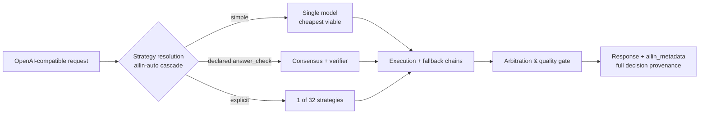

<!--
Copyright (C) 2026 Ailin One, Inc.

This file is part of Collective Intelligence Engine (ci).
Licensed under the GNU Affero General Public License v3.0 or later.
See LICENSE in the repository root, or <https://www.gnu.org/licenses/>.

SPDX-License-Identifier: AGPL-3.0-or-later
Source: https://github.com/ailinone/collective-intelligence
-->

<p align="center">
  
</p>

# Ailin¹ Collective Intelligence

<p align="center">
  <a href="https://github.com/ailinone/collective-intelligence"><b>⭐ Star the repo and back a new, more collective and collaborative era of AI</b></a>
</p>

<p align="center">
  <a href="README.md"></a>
  <a href="README.zh-CN.md"></a>
  <a href="README.pt-BR.md"></a>
  <a href="README.es.md"></a>
  <a href="README.ja.md"></a>
  <a href="README.ko.md"></a>
  <a href="README.fr.md"></a>
  <a href="README.de.md"></a>
  <a href="README.ru.md"></a>
</p>

> **TL;DR**: Ailin¹ makes **76,636 AI models** collaborate inside one collective model, coordinated through **32 strategies** instead of routed to a single one. Structured diversity, independent reasoning, and a full decision audit trail on every request: more reliable, resilient, and auditable than any single-model integration, and [proven against the frontier in the open](#proven-against-the-frontier-in-the-open).
>
> **→ [Quickstart](#quickstart) · [See the evidence](#proven-against-the-frontier-in-the-open) · [Full docs](https://ailin.guide)**

**Thousands of AI models coordinate inside one collective model.**

Structured diversity, independent reasoning, and full decision provenance
on every request, designed to make outputs more reliable, more resilient,
and more auditable than a single-model integration. Every day a new model
launches claiming to be the best. This is the layer where they work
together. Full documentation: **[ailin.guide](https://ailin.guide)**.

[](https://github.com/ailinone/collective-intelligence/actions/workflows/ci.yml)
[](LICENSE)
[](https://github.com/ailinone/collective-intelligence/actions/workflows/license-compliance.yml)
[](https://github.com/ailinone/collective-intelligence/actions/workflows/dco.yml)
[](CODE_OF_CONDUCT.md)
[](https://github.com/ailinone/collective-intelligence/security/code-scanning)
[](https://ailin.guide/architecture/provider-ecosystem)
[](#tens-of-thousands-of-models-always-at-the-frontier)
[](#how-a-request-flows)
[](https://github.com/ailinone/collective-intelligence/stargazers)
[](https://github.com/ailinone/collective-intelligence/discussions)

[Quickstart](#quickstart) · [The next frontier](#collective-intelligence-the-next-frontier-of-ai) ·
[Why a collective](#why-a-collective-beats-the-biggest-single-model) ·
[The evidence](#proven-against-the-frontier-in-the-open) ·
[Always at the frontier](#tens-of-thousands-of-models-always-at-the-frontier) ·
[How it works](#architecture-at-a-glance) ·
[Contributing](#contributing-collective-intelligence-needs-a-collective) · [Docs](https://ailin.guide)

## Collective intelligence: the next frontier of AI

The AI industry has been focused on building bigger individual models.
Ailin¹ takes a complementary approach: a collective of **76,636 AI models**
(live production count, 2026-07) that can collaborate, debate, critique,
and synthesize together, applying [structured diversity](https://ailin.guide/architecture/cognitive-diversity) to problems where a
single model is a single point of training, architecture, bias, and
failure.

**This is not multi-model routing. This is not an API gateway. This is
Collective Intelligence**: a system where models from every major
architecture (frontier APIs, open-weight challengers, and our own model
family) coordinate through [dozens of strategies](https://ailin.guide/architecture/strategy-catalog), with the goal of higher
reliability, broader evaluation coverage, and fuller auditability than any
single-model integration provides.

The principle is grounded in research on collective intelligence and
cognitive diversity: Hong & Page's "diversity trumps ability" result and
Woolley et al.'s work on collective performance (see the public
[Bibliography](https://ailin.guide/reference/bibliography)). Ailin¹ applies
that principle as an engineering platform: a discovery engine that indexes
76,636 models, dozens of coordination strategies, an [audit substrate](https://ailin.guide/architecture/collective-intelligence) that
records every coordination decision, and a closed-loop training pipeline.
Some of these layers are production-grade today and others are still
maturing; the docs carry status badges so you always know what is
shipping versus what is on the roadmap.

## Why a collective beats the biggest single model

Frontier models keep getting bigger, and the strongest single model at any
moment is remarkable. But a single model is always **a single point of
training, architecture, failure, and bias**. A well-coordinated collective
addresses each of those structural limits in a way that scale alone cannot.

| Structural risk of a single model | How the collective addresses it |
|---|---|
| **Resilience**: one dependency; provider outage/throttling/mispricing stalls every call | Routes around outages, degraded models, and local failures automatically; the request still succeeds, with full provenance ([resilience deep-dive](https://ailin.guide/architecture/why-collective-resilience)) |
| **Evaluation diversity**: one model confidently repeats its own blind spots | Compares outputs across differently-trained models; disagreement becomes a quality signal, not a bug |
| **Anti-concentration**: locked to one vendor's roadmap, pricing, and policy | Decouples capability from any single provider; keeps working as the frontier shifts |
| **Single-point bias**: one model's training bias and refusal patterns dominate | Diffuses influence across architecturally different models, especially in arbitration strategies requiring convergence |
| **Specialization**: no model is best at everything | Routes each request to the specialist strong for that task (reasoning, code, vision, long-context, latency) |
| **Governance**: integrator must build audit/cost/isolation controls themselves | Enforces provenance, cost caps, quota isolation, and policy at the platform layer, for every request/strategy/model |

The effect compounds. These are not six independent features; they are
six facets of a single structural choice: coordinate many models well,
and the result is more reliable, more governable, more durable, and, on
the expanding set of tasks where correctness can be objectively verified,
**measurably more accurate than every frontier flagship we tested**
(97% vs 68–82%, receipts below).

## Proven against the frontier, in the open

We test the thesis against ourselves, publicly, with objective grading:
pinned judges, machine-checkable answers wherever a task allows one, and
the raw per-execution data committed to this repository
(**[full report](reports/experiments/AILIN-COLLECTIVE-FRONTIER-BENCHMARK-2026-07.md)** ·
[raw CSVs + scripts](reports/experiments/) ·
[regenerate every table yourself](docs/experiments/REPRODUCING_THE_BENCHMARK.md)).

**✅ Validated: the collective beats every frontier flagship on verifiable tasks.**
- **97% objective accuracy (37/38)** vs. **68–82%** pooled for GPT-5.5-pro, Claude Opus 4.8, Gemini 3.1 Pro, and Grok 4.3
- Across every run, **the verifier never selected an objectively wrong answer**
- A pool of **sub-frontier open-weight models**, coordinated well, out-answered every flagship on the same tasks ([leaderboard with every n and caveat, §3](reports/experiments/AILIN-COLLECTIVE-FRONTIER-BENCHMARK-2026-07.md))

**The current frontier of the thesis** (measured honestly, driving the
roadmap):

| Axis | Today | What we're doing about it |
|---|---|---|
| Verifiable correctness | ✅ **Collective wins** (97% vs 68–82%) | Expanding verifier coverage to more task shapes (tool-calling campaign completed 2026-07-18) |
| Open-ended prose | Singles still win creative writing & refactoring | Decider selection measurably separates winning from losing runs: a learnable lever ([decider selection, §7](reports/experiments/AILIN-COLLECTIVE-FRONTIER-BENCHMARK-2026-07.md)) |
| Cost | Collective premium as recorded, **except** the verifier short-circuit, which collapses it ~100× when it fires ([cost breakdown, §5](reports/experiments/AILIN-COLLECTIVE-FRONTIER-BENCHMARK-2026-07.md)) | Widening the short-circuit path; `ailin-auto` defaults to the cheapest viable strategy |
| Latency | Multi-round arbitration, with every strategy streaming real-time progress from the first token | `ailin-auto` reserves the deepest strategies for when the quality gate actually demands them; latency-critical traffic routes `single` by design |

Every number above is backed by the raw per-execution data and
reproducible scripts committed in this repository: run the harness
yourself, on your own workload, and hold us to it.

## Tens of thousands of models, always at the frontier

The Ailin¹ collective does not depend on hardcoded model lists or manual
provider integrations. A continuous discovery engine scans the global AI
ecosystem and automatically absorbs new models as they are released.

The result: a live collective of **76,636 models** across [~90 provider
integrations](https://ailin.guide/architecture/provider-ecosystem) that stays current with the ecosystem. When a new model is
published by a discovered source, the discovery engine absorbs it without
code changes, configuration, or downtime.

### Semantic discovery, zero hardcoded models

The discovery engine scans dozens of sources in parallel:
- Native provider APIs
- Cloud hubs
- Model aggregators
- Open-model repositories
- Private inference endpoints

But the sources aren't the point, **how models are selected** is.

Every discovered model is analyzed and indexed automatically (no manual mapping) across: **capabilities, performance profile, pricing, context window, modalities, architecture.** Routes are health-gated, a model is advertised only after being proven live.

Model selection is **fully semantic**. When a request arrives, the
collective does not pick from a static list. It assembles the ideal team
of models based on the task's requirements, the chosen strategy, and the
desired outcome profile (maximum quality, best cost-benefit, lowest cost,
fastest response). The right models are elected in real time, for every
single request. When tomorrow's "best model ever" launches, the collective
absorbs it; it doesn't compete with it.

### Own models in the same arena

The `ailin` model family and its training flywheel are part of the design:
coordinator checkpoints trained on the engine's own coordination traffic,
competing in the same pool as every third-party model, no routing
privilege. **The audit substrate ships today; production coordinator
weights are still in development** ([honest status, always current](https://ailin.guide)).

### Collective strategies as falsifiable hypotheses

32 registered strategies (consensus with convergence floors, blind
debate, expert panels, devil's-advocate consensus, cost-cascade, best-of-N
with objective verification), each labeled with honest reachability
(auto-selectable / explicit-only / roadmap), each falsifiable by the
experiment harness in this repo. **Strategies earn their place with
evidence, or lose it.**

### Multimodal + deterministic file generation

Multimodal generation (images, audio, video) routed by capability, plus
deterministic file rendering (DOCX, XLSX, PDF, PPTX, ZIP, code) from any
structured-output chat model, proven in production.

### Governance that enterprises actually need

| Control | What it delivers |
|---|---|
| Decision provenance | `ailin_metadata`: strategy, models, final decider, per-subcall cost, dissent |
| Cost governance | Per-request `max_cost` enforced at admission |
| Tenant isolation | Architectural, not just config-level |
| AGPL §13 compliance | `/source`, `/license` endpoints served by the engine itself |
| Release provenance | SLSA/Sigstore + SPDX SBOM |

**The same audit trail that proves our benchmark claims governs your production traffic**: governance as [first-class principle](https://ailin.guide/architecture/principles), not overhead.

## Architecture at a glance

The system, end to end. Discovery feeds team assembly, every execution
path converges on the same provenance-generating arbitration step:



*In text: a request enters through the OpenAI-compatible API from any OpenAI SDK or curl client (only the base_url changes). Strategy resolution applies the `ailin-auto` conservative cascade and hands off to team assembly, which does semantic selection over the live model catalog fed continuously by the discovery engine (health-gated, zero hardcoded models). The assembled team runs in execution, which manages fallback chains and a budget governor, talking bidirectionally to ~90 provider integrations. Execution's output goes to arbitration, which applies quality gates and the deterministic verifier, producing the final response with full provenance (`ailin_metadata`).*

## How a request flows

Zoomed in on one request, which of the three paths above it takes, and
why:



*In text: strategy resolution's `ailin-auto` cascade sends a request down one of three paths, a simple request goes to a single, cheapest-viable model; a request that declares `ailin_constraints.answer_check` goes to consensus plus the deterministic verifier; a request that names a strategy explicitly uses that one of the 32 registered strategies. All three paths converge on execution and its fallback chains, then arbitration and its quality gate, producing the response with full `ailin_metadata` provenance.*

The verifier arms when the request declares a machine-checkable answer via
`ailin_constraints.answer_check`. The cascade is conservative: the
economics are designed to favor the cheap path by default, escalating only
when quality-gating demands it.

**Not a fit for the collective** ([full guidance](docs/use-cases/when-not-to-use-collective.md), [the same guidance on ailin.guide](https://ailin.guide/use-cases/when-not-to-use-collective)):
- High-volume, low-stakes traffic
- Tight latency SLAs
- Documentation-style prose

The decision is operational, not philosophical.

## Quickstart

> Requires Docker with Compose v2, ~8 GB free RAM, free ports
> 3000/5432/6379, `python3` (to parse the register response below), and
> `pip install openai` (for the Python client example). On Windows, run
> the block below in **Git Bash or WSL** (it uses a heredoc and `openssl`).

### Step 1: Clone and configure secrets

```bash
git clone https://github.com/ailinone/collective-intelligence.git
cd collective-intelligence/docker
cat > .env <<EOF
# strong JWT secrets are REQUIRED — the app refuses weak/default values
JWT_SECRET=$(openssl rand -base64 48)
AILIN_SHARED_JWT_SECRET=$(openssl rand -base64 48)
# local-first secrets: skip GCP Secret Manager entirely
SECRETS_PROVIDER_PRIMARY=env
# one provider key is the minimum — any of the ~90 works
OPENAI_API_KEY=sk-...
EOF
```

Edit `.env` and replace `sk-...` with a real key (or skip keys entirely:
see the Ollama option below). Full list of configuration options:
[api/.env.example](api/.env.example). Then:

### Step 2: Start the stack

```bash
docker compose up -d api postgres redis   # coord-serving also builds/boots automatically — expected
docker compose logs -f api    # watch first boot: DB migrations + provider/model discovery scan, ~1-5 min
curl http://localhost:3000/health
# → {"status":"ok","uptime":…,"version":"0.1.0"}
```

### Step 3: Register and get a token

```bash
export TOKEN=$(curl -s -X POST http://localhost:3000/v1/auth/register \
  -H 'Content-Type: application/json' \
  -d '{"email":"you@example.com","password":"pick-a-strong-one","name":"You"}' \
  | python3 -c "import sys,json; print(json.load(sys.stdin)['tokens']['accessToken'])")
echo "token: ${TOKEN:0:12}..."   # non-empty confirms registration worked
```

### Step 4: Install the Python client

```bash
pip install openai
```

### Step 5: Call the collective

```python
# run in the same shell session as the export above (or re-export TOKEN first)
import os
from openai import OpenAI
client = OpenAI(base_url="http://localhost:3000/v1", api_key=os.environ["TOKEN"])

r = client.chat.completions.create(
    model="ailin-auto",   # or ailin-best / ailin-fast / ailin-economy / ailin-consensus
    messages=[{"role": "user", "content": "Why is the sky blue?"}],
)
print(r.choices[0].message.content)
# → The sky looks blue because of Rayleigh scattering...
print(r.model_extra["ailin_metadata"])  # strategy, models, costs, dissent — the receipts
# → {'strategy_used': 'single', 'models_used': ['...'], 'cost_actual': 0.0003, ...}
```

**If it doesn't come up**: `Cannot connect to the Docker daemon` → start Docker Desktop/the docker service first. `bind: address already in use` on 3000/5432/6379 → stop whatever else is using that port or remap it in `docker/docker-compose.override.yml`. `docker compose logs -f api` spamming `Secret retrieval failed` → see [Degraded Boot Mode](docs/hardening/DEGRADED_BOOT_MODE.md).

No external API key at all? Set `OLLAMA_URL=http://host.docker.internal:11434`
in `docker/.env` and the engine boots in degraded self-hosted mode
([degraded boot mode docs](docs/hardening/DEGRADED_BOOT_MODE.md)). On native Linux, also add
`extra_hosts: ["host.docker.internal:host-gateway"]` to the api service (or
use your bridge IP). Native (no-Docker) dev setup for OpenAPI validation:
[installation guide](docs/getting-started/installation.md). Hosted-API
quickstart: [ailin.guide/getting-started/quickstart](https://ailin.guide/getting-started/quickstart).

Next: [choosing a strategy](docs/guides/strategy-selection.md) · [model aliases explained](docs/guides/model-aliases-and-routing.md).

## What ships today vs. what is in development

| Ships today | In development |
|---|---|
| OpenAI-compatible API (chat, responses, embeddings, images, files) | Trained coordinator weights (design + audit substrate ship now) |
| 32 orchestration strategies (incl. single-model baselines) + `ailin-auto` cascade | Proprietary model family production weights (training flywheel built) |
| Discovery engine, health-gated routing, fallback chains | Expanded benchmark campaign with fully audited cost accounting |
| Full decision provenance (`ailin_metadata`) | Step-by-step campaign guide for independent evaluations |
| Multimodal + deterministic file generation (DOCX/XLSX/PDF/PPTX/ZIP/code) | |
| AGPL §13 endpoints (`/source`, `/license`) + license response headers | |
| Broadcast delivery pipeline (code shipped behind `BROADCAST_FEATURE_ENABLED`, off by default; not yet production-validated) | |

Honesty about validation is a feature: anything not on the left column is
labeled in the docs the same way it is labeled here.

## Contributing: collective intelligence needs a collective

The thesis itself predicts it: diverse, independent contributors,
coordinated well, build something no solo effort can. Code contributions
are welcome under the **DCO** (`git commit -s`, see [DCO.md](DCO.md) and
[CONTRIBUTING.md](CONTRIBUTING.md)): provider adapters (thin,
self-contained modules), strategy implementations, objective task checkers,
docs at [ailin.guide](https://ailin.guide).

And this project has a contribution surface most projects don't: **run the
benchmark yourself and publish the result, whichever way it goes.** Start
with [REPRODUCING_THE_BENCHMARK.md](docs/experiments/REPRODUCING_THE_BENCHMARK.md):
regenerating every published table from the committed raw data takes about
two minutes and Python's stdlib. Every independent replication
(validating or invalidating) makes the collective smarter. That's the
whole point.

Questions and results: [GitHub Discussions](https://github.com/ailinone/collective-intelligence/discussions).
Security reports: **never** a public issue; see [SECURITY.md](SECURITY.md).

## License & governance

**AGPL-3.0-or-later.** If you run a modified version as a network service,
§13 requires offering its users the corresponding source: the engine
serves `/source` and `/license` endpoints and sends
`X-License`/`X-Source-Code` headers on every response to make complying
easy (set `AGPL_SOURCE_URL` to point at *your* modified source). See
[COMPLIANCE.md](COMPLIANCE.md); commercial licensing: licensing@ailin.one.

| Governance topic | Reference |
|---|---|
| Contributor sign-off (DCO 1.1) | [DCO.md](DCO.md) |
| Code of conduct (Contributor Covenant 2.1) | [CODE_OF_CONDUCT.md](CODE_OF_CONDUCT.md) |
| Trademarks ("Ailin", "Ailin One", "ailin.one") | [TRADEMARKS.md](TRADEMARKS.md) |
| Release provenance (SLSA/Sigstore + SPDX SBOM) | [release-provenance.yml](.github/workflows/release-provenance.yml) |
| Security policy | [SECURITY.md](SECURITY.md) |
| Changelog (v0.1.0) | [CHANGELOG.md](CHANGELOG.md) |
| Full documentation | [ailin.guide](https://ailin.guide) |

Maintained by **Ailin One, Inc.** The AGPL licenses the code, not the marks.

## Star history & contributors

<p align="center">
  <a href="https://github.com/ailinone/collective-intelligence"><b>⭐ Star the repo and back a new, more collective and collaborative era of AI</b></a>
</p>

[](https://star-history.com/#ailinone/collective-intelligence&Date)

<a href="https://github.com/ailinone/collective-intelligence/graphs/contributors">
  
</a>

If the collective-intelligence thesis (tested in the open, receipts in
the repo) is something you want to exist in the world, a ⭐ is how you
tell other developers it's worth their ten minutes.
