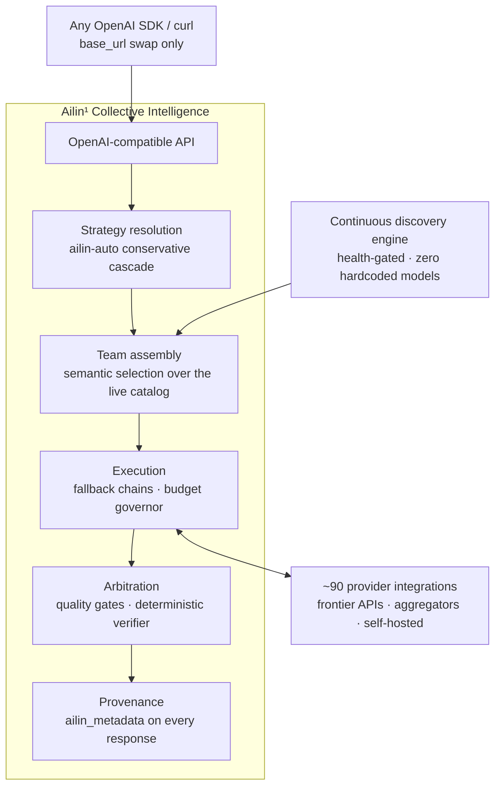
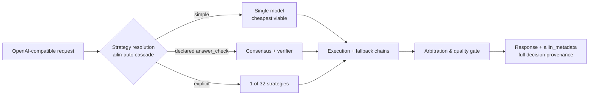

<!--
Copyright (C) 2026 Ailin One, Inc.

This file is part of Collective Intelligence Engine (ci).
Licensed under the GNU Affero General Public License v3.0 or later.
See LICENSE in the repository root, or <https://www.gnu.org/licenses/>.

SPDX-License-Identifier: AGPL-3.0-or-later
Source: https://github.com/ailinone/collective-intelligence
-->

<p align="center">
  
</p>

# Ailin¹ Collective Intelligence

<p align="center">
  <a href="https://github.com/ailinone/collective-intelligence"><b>⭐ Estrele o repositório e apoie uma nova era da IA, mais coletiva e colaborativa</b></a>
</p>

> 🌐 A versão em inglês é a canônica. Esta tradução acompanha o commit 596a94e6. Em caso de dúvida, leia o README em inglês ([README.md](README.md)).

<p align="center">
  <a href="README.md"></a>
  <a href="README.zh-CN.md"></a>
  <a href="README.pt-BR.md"></a>
  <a href="README.es.md"></a>
  <a href="README.ja.md"></a>
  <a href="README.ko.md"></a>
  <a href="README.fr.md"></a>
  <a href="README.de.md"></a>
  <a href="README.ru.md"></a>
</p>

> **TL;DR:** O Ailin¹ faz **76,636 modelos de IA** colaborarem dentro de um único modelo coletivo, coordenados por **32 estratégias** em vez de roteados para um só. Diversidade estruturada, raciocínio independente e proveniência completa de decisão em cada requisição, mais confiável, resiliente e auditável do que qualquer integração de modelo único, e [provado contra a fronteira, às claras](#provado-contra-a-fronteira-às-claras).
>
> **→ [Início rápido](#início-rápido) · [Veja as provas](#provado-contra-a-fronteira-às-claras) · [Docs](https://ailin.guide)**

**Milhares de modelos de IA se coordenam dentro de um único modelo coletivo.**

Diversidade estruturada, raciocínio independente e proveniência completa
de decisão em cada requisição, projetados para tornar as saídas mais
confiáveis, mais resilientes e mais auditáveis do que uma integração de
modelo único. Todo dia é lançado um novo modelo alegando ser o melhor.
Esta é a camada onde eles trabalham juntos. Documentação completa:
**[ailin.guide](https://ailin.guide)**.

[](https://github.com/ailinone/collective-intelligence/actions/workflows/ci.yml)
[](LICENSE)
[](https://github.com/ailinone/collective-intelligence/actions/workflows/license-compliance.yml)
[](https://github.com/ailinone/collective-intelligence/actions/workflows/dco.yml)
[](CODE_OF_CONDUCT.md)
[](https://github.com/ailinone/collective-intelligence/security/code-scanning)
[](https://ailin.guide/architecture/provider-ecosystem)
[](#dezenas-de-milhares-de-modelos-sempre-na-fronteira)
[](#como-uma-requisição-flui)
[](https://github.com/ailinone/collective-intelligence/stargazers)
[](https://github.com/ailinone/collective-intelligence/discussions)

[Início rápido](#início-rápido) · [A próxima fronteira](#inteligência-coletiva-a-próxima-fronteira-da-ia) ·
[Por que um coletivo](#por-que-um-coletivo-vence-o-maior-modelo-único) ·
[As provas](#provado-contra-a-fronteira-às-claras) ·
[Sempre na fronteira](#dezenas-de-milhares-de-modelos-sempre-na-fronteira) ·
[Como funciona](#visão-geral-da-arquitetura) ·
[Contribuindo](#contribuindo-inteligência-coletiva-precisa-de-um-coletivo) · [Docs](https://ailin.guide)

## Inteligência coletiva: a próxima fronteira da IA

A indústria de IA tem se concentrado em construir modelos individuais cada
vez maiores. A Ailin¹ segue uma abordagem complementar: um coletivo de
**76,636 modelos de IA** (contagem viva de produção, 2026-07) capazes de
colaborar, debater, criticar e sintetizar juntos, aplicando
[diversidade estruturada](https://ailin.guide/architecture/cognitive-diversity) a problemas em que um
modelo único é um ponto único de treinamento, de arquitetura, de viés e
de falha.

**Isto não é roteamento multi-modelo. Isto não é um gateway de API. Isto é
Inteligência Coletiva**: um sistema em que modelos de todas as grandes
arquiteturas (APIs de fronteira, desafiantes open-weight e nossa própria
família de modelos) se coordenam por meio de [dezenas de estratégias](https://ailin.guide/architecture/strategy-catalog), com o objetivo de mais
confiabilidade, cobertura de avaliação mais ampla e auditabilidade mais
completa do que qualquer integração de modelo único oferece.

O princípio está ancorado na pesquisa sobre inteligência coletiva e
diversidade cognitiva: o resultado "diversity trumps ability" ("a
diversidade supera a habilidade") de Hong & Page e o trabalho de
Woolley et al. sobre desempenho coletivo (veja a
[Bibliografia](https://ailin.guide/reference/bibliography) pública). A Ailin¹ aplica
esse princípio como plataforma de engenharia: um motor de descoberta que
indexa 76,636 modelos, dezenas de estratégias de coordenação, um [substrato de auditoria](https://ailin.guide/architecture/collective-intelligence) que
registra cada decisão de coordenação e um pipeline de treinamento em
circuito fechado. Algumas dessas camadas já são production-grade hoje e
outras ainda estão amadurecendo; a documentação carrega badges de status
para você sempre saber o que já está entregue versus o que está no
roadmap.

## Por que um coletivo vence o maior modelo único

Os modelos de fronteira continuam crescendo, e o modelo único mais forte
de cada momento é notável. Mas um modelo único é sempre **um ponto único
de treinamento, um ponto único de arquitetura, um ponto único de falha e
um ponto único de viés**. Um coletivo bem coordenado ataca cada um desses
limites estruturais de um jeito que a escala, sozinha, não consegue.

| Risco estrutural de um modelo único | Como o coletivo resolve isso |
|---|---|
| **Resiliência**: um modelo único significa uma dependência única; se o provedor dele estiver degradado, sob throttling, sob rate limit ou com preço errado num dado dia, toda chamada é afetada | O coletivo contorna quedas de provedor, modelos degradados e falhas locais sem intervenção: a requisição ainda assim é atendida, com proveniência completa ([aprofundamento em resiliência](https://ailin.guide/architecture/why-collective-resilience)) |
| **Diversidade de avaliação**: um modelo único, por maior que seja, repete seus próprios pontos cegos com toda a confiança | Compara as saídas entre modelos treinados de forma diferente, com objetivos diferentes; a discordância vira sinal de qualidade, não bug |
| **Anticoncentração**: depender de um único modelo prende a organização ao roadmap, à precificação e às decisões de política de um único fornecedor | Desacopla capacidade de qualquer provedor específico: a plataforma continua funcionando conforme a fronteira se move e conforme provedores específicos sobem, caem ou reprecificam |
| **Menos viés de ponto único**: todo modelo carrega os vieses dos seus dados de treinamento, seus padrões de recusa e seus defaults estilísticos | Dilui a influência dos pontos cegos de qualquer modelo isolado entre modelos arquiteturalmente diferentes, especialmente em estratégias de arbitragem que exigem convergência entre raciocinadores independentes |
| **Especialização dinâmica**: nenhum modelo único é o melhor em tudo | Roteia cada requisição para o especialista certo para a tarefa (pesada em raciocínio, pesada em código, visão, contexto longo, baixa latência), forte exatamente onde a tarefa exige força |
| **Governança mais forte**: uma integração de modelo único deixa a construção de decisões auditáveis, custo delimitado, isolamento de tenant e fallback confiável nas mãos do integrador | O coletivo impõe proveniência de decisão, tetos de custo, isolamento de cota e aplicação de políticas na camada da plataforma, para cada requisição, cada estratégia, cada modelo |

O efeito se compõe. Não são seis features independentes, são seis
facetas de uma única escolha estrutural: coordene muitos modelos bem, e o
resultado é mais confiável, mais governável, mais durável e, no conjunto
crescente de tarefas em que a correção pode ser verificada objetivamente,
**mensuravelmente mais preciso que todos os flagships de fronteira que
testamos** (97% vs 68–82%, com os recibos abaixo).

## Provado contra a fronteira, às claras

Testamos a tese contra nós mesmos, publicamente, com correção objetiva:
juízes fixados (pinned), respostas verificáveis por máquina sempre que a
tarefa permite, e os dados brutos por execução commitados neste
repositório
(**[relatório completo](reports/experiments/AILIN-COLLECTIVE-FRONTIER-BENCHMARK-2026-07.md)** ·
[CSVs brutos + scripts](reports/experiments/) ·
[regenere cada tabela você mesmo](docs/experiments/REPRODUCING_THE_BENCHMARK.md)).

**✅ Validado: o coletivo vence todos os flagships de fronteira em tarefas verificáveis.**
- **97% de acurácia objetiva (37/38)** contra **68–82%** agregados de GPT-5.5-pro, Claude Opus 4.8, Gemini 3.1 Pro e Grok 4.3
- Em todas as execuções, **o verificador nunca selecionou uma resposta objetivamente errada**
- Um pool de modelos **open-weight abaixo da fronteira**, bem coordenado, respondeu melhor que todos os flagships nas mesmas tarefas ([leaderboard com cada n e cada ressalva, §3](reports/experiments/AILIN-COLLECTIVE-FRONTIER-BENCHMARK-2026-07.md))

**A fronteira atual da tese**, medida com honestidade, guiando o
roadmap:

| Eixo | Hoje | O que estamos fazendo a respeito |
|---|---|---|
| Correção verificável | ✅ **O coletivo vence** (97% vs 68–82%) | Expandindo a cobertura do verificador para mais formatos de tarefa (campanha de tool-calling concluída em 2026-07-18) |
| Prosa aberta | Modelos únicos ainda vencem em escrita criativa e refactoring | A seleção do decisor separa de forma mensurável runs vencedoras de perdedoras, uma alavanca aprendível ([seleção do decisor, §7](reports/experiments/AILIN-COLLECTIVE-FRONTIER-BENCHMARK-2026-07.md)) |
| Custo | Prêmio de custo do coletivo conforme registrado, **exceto** o short-circuit do verificador, que o colapsa ~100× quando dispara ([detalhamento de custo, §5](reports/experiments/AILIN-COLLECTIVE-FRONTIER-BENCHMARK-2026-07.md)) | Ampliando o caminho do short-circuit; `ailin-auto` assume por padrão a estratégia viável mais barata |
| Latência | Arbitragem multi-rodada, com toda estratégia transmitindo progresso em tempo real desde o primeiro token | O `ailin-auto` reserva as estratégias mais profundas para quando o gate de qualidade realmente exige; tráfego crítico em latência roteia como `single` por design |

Todo número acima é respaldado pelos dados brutos por execução e pelos
scripts reproduzíveis commitados neste repositório: rode o harness você
mesmo, na sua própria carga de trabalho, e nos cobre por isso.

## Dezenas de milhares de modelos, sempre na fronteira

O coletivo Ailin¹ não depende de listas de modelos hardcoded nem de
integrações manuais de provedores. Um motor de descoberta contínua varre o
ecossistema global de IA e absorve automaticamente novos modelos à medida
que são lançados.

O resultado: um coletivo vivo de **76,636 modelos** em [~90 integrações
de provedores](https://ailin.guide/architecture/provider-ecosystem) que se mantém atualizado com o ecossistema. Quando um novo
modelo é publicado por uma fonte descoberta, o motor de descoberta o
absorve sem mudanças de código, configuração ou downtime.

### Descoberta semântica, zero modelos hardcoded

O motor de descoberta varre dezenas de fontes em paralelo:
- APIs nativas de provedores
- Hubs de nuvem
- Agregadores de modelos
- Repositórios de modelos abertos
- Endpoints privados de inferência

Mas as fontes não são o ponto, o que importa é como os modelos são selecionados.

Cada modelo descoberto é analisado, classificado e indexado por
**capacidades, perfil de desempenho, preço, janela de contexto,
modalidades e arquitetura**, tudo inferido automaticamente, sem
mapeamento manual nem configuração. As rotas são health-gated: um modelo
só é anunciado depois de provado vivo.

A seleção de modelos é **totalmente semântica**. Quando uma requisição
chega, o coletivo não escolhe de uma lista estática. Ele monta o time
ideal de modelos com base nos requisitos da tarefa, na estratégia
escolhida e no perfil de resultado desejado (qualidade máxima, melhor
custo-benefício, menor custo, resposta mais rápida). Os modelos certos são
eleitos em tempo real, para cada requisição individual. Quando o "melhor
modelo de todos os tempos" de amanhã for lançado, o coletivo o absorve,
não compete com ele.

### Modelos próprios na mesma arena

A família de modelos `ailin` e seu flywheel de treinamento fazem parte do
design: checkpoints de coordenador treinados no próprio tráfego de
coordenação do motor, competindo no mesmo pool que todo modelo de
terceiros, sem privilégio de roteamento. **O substrato de auditoria que
captura cada decisão de coordenação já é entregue hoje; os pesos de
coordenador de produção são a ponta em desenvolvimento**
([status honesto, sempre atual](https://ailin.guide)).

### Estratégias coletivas como hipóteses falseáveis

32 estratégias registradas: consenso com pisos de convergência, debate
cego, painéis de especialistas, consenso com advogado do diabo, cascata de
custo, best-of-N com verificação objetiva. Cada uma rotulada com
alcançabilidade honesta (auto-selecionável / somente explícita / roadmap),
cada uma falseável pelo harness de experimentos deste repositório.
**Estratégias ganham seu lugar com evidência, ou o perdem.**

### Multimodal + geração determinística de arquivos

Geração multimodal (imagens, áudio, vídeo) roteada por capacidade, mais
renderização determinística de arquivos (DOCX, XLSX, PDF, PPTX, ZIP,
código) a partir de qualquer modelo de chat com saída estruturada, provada
em produção.

### Governança de que as empresas realmente precisam

| Controle | O que ele entrega |
|---|---|
| Proveniência de decisão | `ailin_metadata`: estratégia, modelos, decisor final, custo por subchamada, dissenso |
| Governança de custo | `max_cost` por requisição imposto na admissão |
| Isolamento de tenant | Arquitetural, não apenas de configuração |
| Conformidade com AGPL §13 | Endpoints `/source`, `/license` servidos pelo próprio motor |
| Proveniência de release | SLSA/Sigstore + SBOM SPDX |

**A mesma trilha de auditoria que prova nossas alegações de benchmark governa o seu tráfego de produção**: governança como [princípio de primeira classe](https://ailin.guide/architecture/principles), não como sobrecusto.

## Visão geral da arquitetura

O sistema, de ponta a ponta (a descoberta alimenta a montagem do time, e
todo caminho de execução converge para a mesma etapa de arbitragem
geradora de proveniência):



*Em texto: a requisição entra pela API compatível com OpenAI, vinda de
qualquer SDK OpenAI ou de um cliente curl (só o `base_url` muda). A
resolução de estratégia aplica a cascata conservadora do `ailin-auto` e
passa para a montagem do time, que faz seleção semântica sobre o catálogo
de modelos vivo, alimentado continuamente pelo motor de descoberta
(health-gated, zero modelos hardcoded). O time montado roda na execução,
que administra cadeias de fallback e um governor de orçamento,
conversando nos dois sentidos com ~90 integrações de provedores. A saída
da execução vai para a arbitragem, que aplica os gates de qualidade e o
verificador determinístico, produzindo a resposta final com proveniência
completa (`ailin_metadata`).*

## Como uma requisição flui

Em zoom sobre uma única requisição (qual dos três caminhos acima ela
percorre, e por quê):



*Em texto: a cascata de resolução de estratégia do `ailin-auto` manda a
requisição por um de três caminhos. Uma requisição simples vai para um
único modelo, o mais barato viável. Uma requisição que declara
`ailin_constraints.answer_check` vai para consenso mais o verificador
determinístico. Uma requisição que nomeia uma estratégia explicitamente
usa uma das 32 estratégias registradas. Os três caminhos convergem na
execução e suas cadeias de fallback, depois na arbitragem e seu gate de
qualidade, produzindo a resposta com proveniência completa via
`ailin_metadata`.*

O verificador é armado quando a requisição declara uma resposta
verificável por máquina via `ailin_constraints.answer_check`. A cascata é
conservadora: a economia foi desenhada para favorecer o caminho barato
por padrão, escalando apenas quando o gate de qualidade exige.

**Não é uma boa opção para o coletivo**
([orientação completa](docs/use-cases/when-not-to-use-collective.md),
[a mesma orientação no ailin.guide](https://ailin.guide/use-cases/when-not-to-use-collective)):
- Tráfego de alto volume e baixo risco
- SLAs de latência apertados
- Prosa estilo documentação

A decisão é operacional, não filosófica.

## Início rápido

> Requer Docker com Compose v2, ~8 GB de RAM livre, as portas
> 3000/5432/6379 livres, `python3` (para interpretar a resposta do
> registro abaixo) e `pip install openai` (para o exemplo do cliente
> Python). No Windows, rode o bloco abaixo no **Git Bash ou WSL** (ele usa
> heredoc e `openssl`).

### Etapa 1: Clone e configure os segredos

```bash
git clone https://github.com/ailinone/collective-intelligence.git
cd collective-intelligence/docker
cat > .env <<EOF
# strong JWT secrets are REQUIRED — the app refuses weak/default values
JWT_SECRET=$(openssl rand -base64 48)
AILIN_SHARED_JWT_SECRET=$(openssl rand -base64 48)
# local-first secrets: skip GCP Secret Manager entirely
SECRETS_PROVIDER_PRIMARY=env
# one provider key is the minimum — any of the ~90 works
OPENAI_API_KEY=sk-...
EOF
```

Edite o `.env` e substitua `sk-...` por uma chave real (ou dispense chaves
por completo, veja a opção Ollama abaixo). Lista completa de opções de
configuração: [api/.env.example](api/.env.example). Depois:

### Etapa 2: Suba a stack

```bash
docker compose up -d api postgres redis   # coord-serving also builds/boots automatically — expected
docker compose logs -f api    # watch first boot: DB migrations + provider/model discovery scan, ~1-5 min
curl http://localhost:3000/health
# → {"status":"ok","uptime":…,"version":"0.1.0"}
```

### Etapa 3: Registre-se e obtenha um token

```bash
export TOKEN=$(curl -s -X POST http://localhost:3000/v1/auth/register \
  -H 'Content-Type: application/json' \
  -d '{"email":"you@example.com","password":"pick-a-strong-one","name":"You"}' \
  | python3 -c "import sys,json; print(json.load(sys.stdin)['tokens']['accessToken'])")
echo "token: ${TOKEN:0:12}..."   # non-empty confirms registration worked
```

### Etapa 4: Instale o cliente Python

```bash
pip install openai
```

### Etapa 5: Chame o coletivo

```python
# run in the same shell session as the export above (or re-export TOKEN first)
import os
from openai import OpenAI
client = OpenAI(base_url="http://localhost:3000/v1", api_key=os.environ["TOKEN"])

r = client.chat.completions.create(
    model="ailin-auto",   # or ailin-best / ailin-fast / ailin-economy / ailin-consensus
    messages=[{"role": "user", "content": "Why is the sky blue?"}],
)
print(r.choices[0].message.content)
# → The sky looks blue because of Rayleigh scattering...
print(r.model_extra["ailin_metadata"])  # strategy, models, costs, dissent — the receipts
# → {'strategy_used': 'single', 'models_used': ['...'], 'cost_actual': 0.0003, ...}
```

**Se não subir**: `Cannot connect to the Docker daemon` → suba o Docker
Desktop/o serviço docker primeiro. `bind: address already in use` nas
portas 3000/5432/6379 → pare o que estiver usando a porta ou remapeie em
`docker/docker-compose.override.yml`. `docker compose logs -f api` cheio
de `Secret retrieval failed` → veja
[Modo de Boot Degradado](docs/hardening/DEGRADED_BOOT_MODE.md).

Nenhuma chave de API externa? Defina `OLLAMA_URL=http://host.docker.internal:11434`
no `docker/.env` e o motor sobe em modo self-hosted degradado
([docs de modo de boot degradado](docs/hardening/DEGRADED_BOOT_MODE.md)). No Linux nativo, adicione
também `extra_hosts: ["host.docker.internal:host-gateway"]` ao serviço api
(ou use o IP da sua bridge). Setup nativo (sem Docker) para validação do
OpenAPI: [guia de instalação](docs/getting-started/installation.md).
Início rápido com a API hospedada:
[ailin.guide/getting-started/quickstart](https://ailin.guide/getting-started/quickstart).

Próximo: [como escolher uma estratégia](docs/guides/strategy-selection.md) · [aliases de modelo explicados](docs/guides/model-aliases-and-routing.md).

## O que já é entregue hoje vs. o que está em desenvolvimento

| Já entregue hoje | Em desenvolvimento |
|---|---|
| API compatível com OpenAI (chat, responses, embeddings, imagens, arquivos) | Pesos treinados do coordenador (o design + substrato de auditoria já são entregues) |
| 32 estratégias de orquestração (incl. baselines de modelo único) + cascata `ailin-auto` | Pesos de produção da família proprietária de modelos (flywheel de treinamento construído) |
| Motor de descoberta, roteamento health-gated, cadeias de fallback | Campanha de benchmark expandida com contabilidade de custo totalmente auditada |
| Proveniência completa de decisão (`ailin_metadata`) | Guia passo a passo de campanha para avaliações independentes |
| Multimodal + geração determinística de arquivos (DOCX/XLSX/PDF/PPTX/ZIP/código) | |
| Endpoints AGPL §13 (`/source`, `/license`) + headers de licença nas respostas | |
| Pipeline de entrega de broadcast (código entregue atrás de `BROADCAST_FEATURE_ENABLED`, desligado por padrão; ainda não validado em produção) | |

Honestidade sobre validação é uma feature: tudo que não está na coluna da
esquerda é rotulado na documentação do mesmo jeito que é rotulado aqui.

## Contribuindo: inteligência coletiva precisa de um coletivo

A própria tese prevê isso: contribuidores diversos e independentes, bem
coordenados, constroem algo que nenhum esforço solo consegue.
Contribuições de código são bem-vindas sob o **DCO** (`git commit -s`,
veja [DCO.md](DCO.md) e [CONTRIBUTING.md](CONTRIBUTING.md)): adaptadores
de provedor (módulos finos e autocontidos), implementações de estratégia,
checadores objetivos de tarefas, docs no [ailin.guide](https://ailin.guide).

E este projeto tem uma superfície de contribuição que a maioria dos
projetos não tem: **rode o benchmark você mesmo e publique o resultado,
dê no que der.** Comece por
[REPRODUCING_THE_BENCHMARK.md](docs/experiments/REPRODUCING_THE_BENCHMARK.md):
regenerar cada tabela publicada a partir dos dados brutos commitados leva
cerca de dois minutos e a stdlib do Python. Cada replicação independente,
validando ou invalidando, torna o coletivo mais inteligente. Esse é o
ponto todo.

Perguntas e resultados: [GitHub Discussions](https://github.com/ailinone/collective-intelligence/discussions).
Reportes de segurança: **nunca** em issue pública; veja [SECURITY.md](SECURITY.md).

## Licença e governança

**AGPL-3.0-or-later.** Se você roda uma versão modificada como serviço de
rede, o §13 exige oferecer aos usuários dela o código-fonte
correspondente: o motor serve os endpoints `/source` e `/license` e envia
os headers `X-License`/`X-Source-Code` em cada resposta para facilitar a
conformidade (defina `AGPL_SOURCE_URL` apontando para o *seu* código-fonte
modificado). Veja [COMPLIANCE.md](COMPLIANCE.md); licenciamento comercial:
licensing@ailin.one.

| Tópico de governança | Referência |
|---|---|
| Sign-off de contribuidor (DCO 1.1) | [DCO.md](DCO.md) |
| Código de conduta (Contributor Covenant 2.1) | [CODE_OF_CONDUCT.md](CODE_OF_CONDUCT.md) |
| Marcas ("Ailin", "Ailin One", "ailin.one") | [TRADEMARKS.md](TRADEMARKS.md) |
| Proveniência de release (SLSA/Sigstore + SBOM SPDX) | [release-provenance.yml](.github/workflows/release-provenance.yml) |
| Política de segurança | [SECURITY.md](SECURITY.md) |
| Changelog (v0.1.0) | [CHANGELOG.md](CHANGELOG.md) |
| Documentação completa | [ailin.guide](https://ailin.guide) |

Mantido pela **Ailin One, Inc.** A AGPL licencia o código, não as marcas.

## Histórico de estrelas e contribuidores

<p align="center">
  <a href="https://github.com/ailinone/collective-intelligence"><b>⭐ Estrele o repositório e apoie uma nova era da IA, mais coletiva e colaborativa</b></a>
</p>

[](https://star-history.com/#ailinone/collective-intelligence&Date)

<a href="https://github.com/ailinone/collective-intelligence/graphs/contributors">
  
</a>

Se a tese da inteligência coletiva (testada às claras, com os recibos no
repositório) é algo que você quer que exista no mundo, uma ⭐ é como você
diz a outros desenvolvedores que ela vale os dez minutos deles.
</content>
