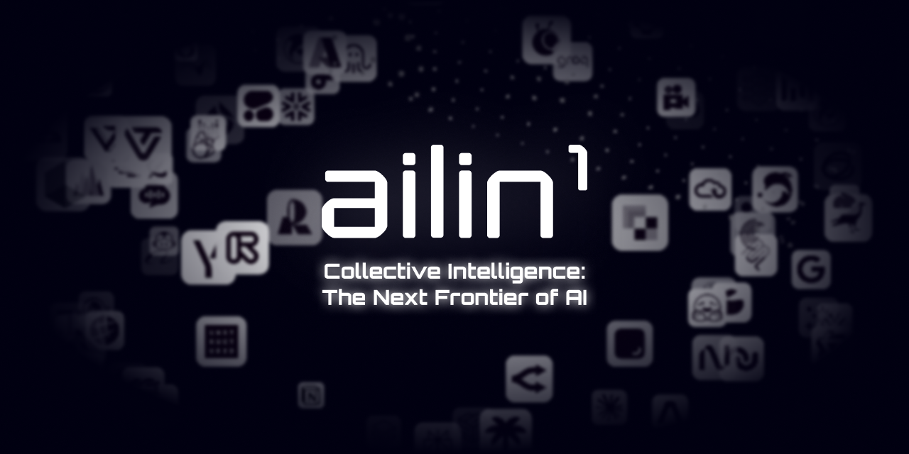
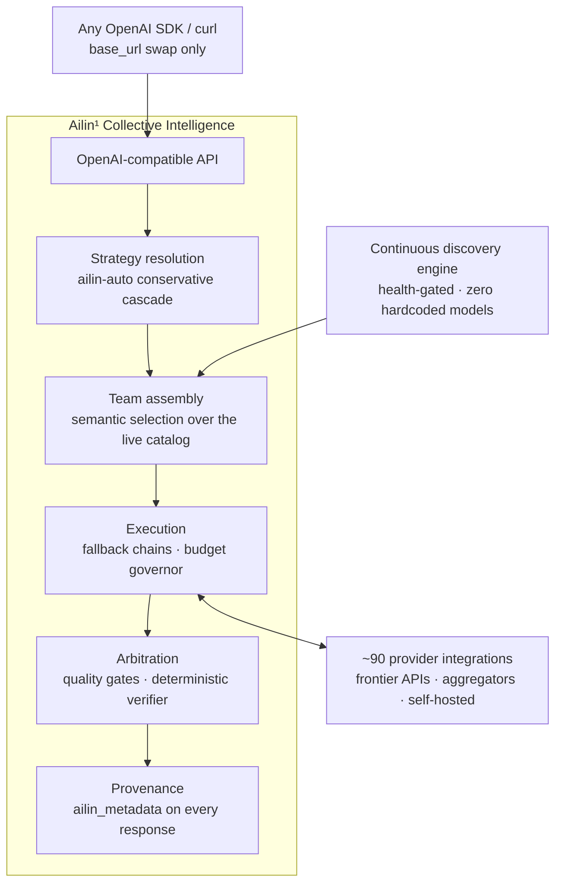
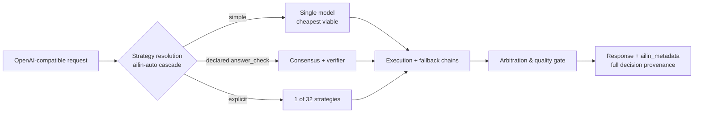

<!--
Copyright (C) 2026 Ailin One, Inc.

This file is part of Collective Intelligence Engine (ci).
Licensed under the GNU Affero General Public License v3.0 or later.
See LICENSE in the repository root, or <https://www.gnu.org/licenses/>.

SPDX-License-Identifier: AGPL-3.0-or-later
Source: https://github.com/ailinone/collective-intelligence
-->

<p align="center">
  
</p>

# Ailin¹ Collective Intelligence

> 🌐 Каноническая версия: английская. Этот перевод соответствует коммиту 596a94e6. Если сомневаетесь, читайте английский README ([README.md](README.md)).

<p align="center">
  <a href="README.md"></a>
  <a href="README.zh-CN.md"></a>
  <a href="README.pt-BR.md"></a>
  <a href="README.es.md"></a>
  <a href="README.ja.md"></a>
  <a href="README.ko.md"></a>
  <a href="README.fr.md"></a>
  <a href="README.de.md"></a>
  <a href="README.ru.md"></a>
</p>

> **TL;DR:** Ailin¹ заставляет **76,636 ИИ-моделей** работать сообща внутри одной коллективной модели, оркеструя их через **32 стратегии** вместо маршрутизации к одной. Структурированное разнообразие, независимые рассуждения и полный аудиторский след решений в каждом запросе делают результат надёжнее, устойчивее и проще для аудита, чем любая интеграция с одной моделью, и это [доказано в сравнении с фронтиром, у всех на виду](#доказано-в-сравнении-с-фронтиром-у-всех-на-виду).
>
> **→ [Быстрый старт](#быстрый-старт) · [Смотреть доказательства](#доказано-в-сравнении-с-фронтиром-у-всех-на-виду) · [Документация](https://ailin.guide)**

**Тысячи ИИ-моделей координируются внутри одной коллективной модели.**

Структурированное разнообразие, независимые рассуждения и полная
прослеживаемость решений в каждом запросе спроектированы так, чтобы
результаты были надёжнее, устойчивее и лучше поддавались аудиту, чем при
интеграции с одной моделью. Каждый день выходит новая модель, объявляющая
себя лучшей. Это слой, где они работают вместе. Полная документация:
**[ailin.guide](https://ailin.guide)**.

[](LICENSE)
[](https://github.com/ailinone/collective-intelligence/actions/workflows/ci.yml)
[](https://github.com/ailinone/collective-intelligence/actions/workflows/license-compliance.yml)
[](DCO.md)
[](https://ailin.guide/architecture/provider-ecosystem)
[](#десятки-тысяч-моделей-всегда-на-переднем-крае)
[](#как-проходит-запрос)
[](https://github.com/ailinone/collective-intelligence/stargazers)
[](https://github.com/ailinone/collective-intelligence/discussions)

[Быстрый старт](#быстрый-старт) · [Новый рубеж](#коллективный-интеллект-новый-рубеж-ии) ·
[Почему коллектив](#почему-коллектив-превосходит-самую-большую-одиночную-модель) ·
[Доказательства](#доказано-в-сравнении-с-фронтиром-у-всех-на-виду) ·
[Всегда на переднем крае](#десятки-тысяч-моделей-всегда-на-переднем-крае) ·
[Как это работает](#архитектура-одним-взглядом) ·
[Вклад](#вклад-в-проект-коллективному-интеллекту-нужен-коллектив) · [Документация](https://ailin.guide)

---

## Коллективный интеллект: новый рубеж ИИ

Индустрия ИИ сосредоточена на создании всё более крупных одиночных
моделей. Ailin¹ идёт комплементарным путём: коллектив из **76,636
ИИ-моделей** (фактическое число в продакшене, 2026-07), которые способны
сотрудничать, дебатировать, критиковать и синтезировать вместе, применяя
[структурированное разнообразие](https://ailin.guide/architecture/cognitive-diversity) к задачам, где одиночная модель и есть
единая точка обучения, архитектуры, предвзятости и отказа.

**Это не мультимодельная маршрутизация. Это не API-шлюз. Это коллективный
интеллект**: система, в которой модели всех основных архитектур (фронтирные API,
претенденты с открытыми весами и наше собственное семейство
моделей) координируются через [десятки стратегий](https://ailin.guide/architecture/strategy-catalog), с целью
более высокой надёжности, более широкого покрытия оценки и более полной
аудируемости, чем даёт любая интеграция с одной моделью.

Принцип опирается на исследования коллективного интеллекта и когнитивного
разнообразия: результат Hong & Page «разнообразие превосходит
способности» и работы Woolley и соавторов о коллективной эффективности
(см. публичную [библиографию](https://ailin.guide/reference/bibliography)).
Ailin¹ воплощает этот принцип как инженерную платформу: движок
обнаружения, индексирующий 76,636 моделей, десятки стратегий координации,
[аудит-субстрат](https://ailin.guide/architecture/collective-intelligence), фиксирующий каждое координационное решение, и
замкнутый цикл обучения. Часть этих слоёв уже production-уровня, другие
ещё созревают; в документации стоят статус-бейджи, поэтому вы всегда
знаете, что уже поставляется, а что в роадмапе.

## Почему коллектив превосходит самую большую одиночную модель

Фронтирные модели продолжают расти, и сильнейшая одиночная модель в
каждый момент времени впечатляет. Но одиночная модель всегда остаётся единой
точкой обучения, единой точкой архитектуры, единой точкой отказа и единой
точкой предвзятости. Хорошо скоординированный коллектив устраняет каждое
из этих структурных ограничений так, как один лишь масштаб не может.

- **Устойчивость.** Одна модель означает одну зависимость. Если её провайдер в
  какой-то день деградировал, троттлится, упирается в rate-limit или
  неверно тарифицирован, страдает каждый вызов. Коллектив обходит сбои
  провайдеров, деградировавшие модели и локальные отказы без
  вмешательства: запрос всё равно выполняется, с полной
  прослеживаемостью
  ([подробный разбор устойчивости](https://ailin.guide/architecture/why-collective-resilience)).
- **Разнообразие оценки.** Разные модели обучены на разных данных с
  разными целями. Если спросить многие из них и сравнить ответы, можно
  выявить ошибки и слепые зоны, которые одиночная модель, какой бы
  большой она ни была, уверенно повторяла бы. Коллектив превращает
  расхождение из бага в сигнал качества.
- **Антиконцентрация.** Зависимость от одной модели привязывает
  организацию к роадмапу, ценам и политическим решениям одного вендора.
  Коллектив отвязывает возможности от любого отдельного провайдера:
  платформа продолжает работать, когда фронтир смещается, а конкретные
  провайдеры взлетают, падают или меняют цены.
- **Сниженная предвзятость единой точки.** Каждая модель несёт
  предвзятости своих обучающих данных, свои паттерны отказов и свои
  стилистические привычки. Коллектив архитектурно разных моделей
  рассеивает влияние слепых зон любой одной модели, особенно в
  арбитражных стратегиях, требующих сходимости независимых рассуждающих.
- **Динамическая специализация.** Ни одна модель не лучшая во всём.
  Коллектив может назначить нужного специалиста на нужную задачу
  (тяжёлые рассуждения, код, зрение, длинный контекст, низкая задержка) и
  направить каждый запрос к моделям, сильным именно там, где задача
  требует силы.
- **Более сильное управление.** Корпоративным нагрузкам нужны аудируемые
  решения, ограниченная стоимость, изоляция тенантов и надёжный fallback.
  Интеграция с одной моделью оставляет построение этих механизмов на
  интеграторе. Коллектив обеспечивает управление на уровне платформы:
  прослеживаемость решений, лимиты стоимости, изоляция квот и применение
  политик действуют для каждого запроса, каждой стратегии, каждой модели.

Эффект накапливается. Это не шесть независимых фич, а шесть граней
одного структурного выбора: хорошо координируйте много моделей, и
результат будет надёжнее, управляемее, долговечнее, а на растущем
множестве задач, где корректность проверяется объективно, **измеримо
точнее каждого протестированного нами фронтирного флагмана**
(97% vs 68–82%, доказательства ниже).

## Доказано в сравнении с фронтиром, у всех на виду

Мы проверяем тезис на самих себе, публично, с объективной оценкой:
зафиксированные судьи, машинно-проверяемые ответы везде, где задача это
позволяет, и сырые данные каждого выполнения, закоммиченные в этот
репозиторий
(**[полный отчёт](reports/experiments/AILIN-COLLECTIVE-FRONTIER-BENCHMARK-2026-07.md)** ·
[сырые CSV + скрипты](reports/experiments/) ·
[перегенерируйте каждую таблицу сами](docs/experiments/REPRODUCING_THE_BENCHMARK.md)).

**✅ Подтверждено: коллектив побеждает каждый фронтирный флагман на
проверяемых задачах.** Консенсус, вооружённый детерминированным
верификатором ответов, показал **97% объективной точности (37/38)**
против **68–82%** у GPT-5.5-pro, Claude Opus 4.8, Gemini 3.1 Pro и
Grok 4.3, агрегированных по всем трём прогонам, и во всех прогонах
**верификатор ни разу не выбрал объективно неверный ответ**. Пул
суб-фронтирных моделей с открытыми весами, хорошо скоординированных,
отвечал лучше каждого флагмана на тех же задачах
([таблица лидеров с каждым n и каждой оговоркой, §3](reports/experiments/AILIN-COLLECTIVE-FRONTIER-BENCHMARK-2026-07.md)).

**Текущий фронтир тезиса**, измеренный честно и определяющий роадмап:

| Ось | Сегодня | Что мы с этим делаем |
|---|---|---|
| Проверяемая корректность | ✅ **Коллектив побеждает** (97% vs 68–82%) | Расширяем покрытие верификатора на новые типы задач (кампания по tool-calling завершена 2026-07-18) |
| Открытая проза | Одиночные модели пока выигрывают в творческом письме и рефакторинге | Выбор decider'а измеримо отделяет выигрышные прогоны от проигрышных: обучаемый рычаг ([§7](reports/experiments/AILIN-COLLECTIVE-FRONTIER-BENCHMARK-2026-07.md)) |
| Стоимость | Коллективная надбавка: как зафиксировано, **кроме** короткого замыкания верификатора, которое схлопывает её ~100×, когда срабатывает ([§5](reports/experiments/AILIN-COLLECTIVE-FRONTIER-BENCHMARK-2026-07.md)) | Расширяем путь короткого замыкания; `ailin-auto` по умолчанию берёт самую дешёвую жизнеспособную стратегию |
| Задержка | Многораундовый арбитраж: каждая стратегия транслирует прогресс в реальном времени начиная с первого токена | `ailin-auto` резервирует самые глубокие стратегии для случаев, когда этого действительно требует контроль качества; критичный к задержке трафик по дизайну маршрутизируется в `single` |

Каждая цифра выше подкреплена сырыми данными по каждому выполнению и
воспроизводимыми скриптами, закоммиченными в этот репозиторий. Запустите
харнесс сами, на своей собственной рабочей нагрузке, и держите нас в
ответе за это.

## Десятки тысяч моделей, всегда на переднем крае

Коллектив Ailin¹ не зависит от жёстко заданных списков моделей или ручных
интеграций провайдеров. Непрерывный движок обнаружения сканирует
глобальную экосистему ИИ и автоматически поглощает новые модели по мере
их выхода.

Результат: живой коллектив из **76,636 моделей** через [~90 интеграций
провайдеров](https://ailin.guide/architecture/provider-ecosystem), который идёт в ногу с экосистемой. Когда обнаруженный
источник публикует новую модель, движок обнаружения поглощает её без
изменений кода, конфигурации или даунтайма.

### Семантическое обнаружение, ноль жёстко заданных моделей

Движок обнаружения параллельно сканирует десятки источников: нативные
API провайдеров, облачные хабы, агрегаторы моделей, репозитории открытых
моделей и приватные inference-эндпоинты. Но дело не в самих источниках.
Важно то, как выбираются модели.

Каждая обнаруженная модель анализируется, классифицируется и индексируется
по возможностям, профилю производительности, ценам, контекстному окну,
модальностям и архитектуре; всё выводится автоматически, без ручного
маппинга или конфигурации. Маршруты проходят health-гейтинг: модель
анонсируется только после того, как доказала работоспособность вживую.

Выбор моделей **полностью семантический**. Когда приходит запрос,
коллектив не выбирает из статического списка. Он собирает идеальную
команду моделей исходя из требований задачи, выбранной стратегии и
желаемого профиля результата (максимальное качество, лучшее соотношение
цены и качества, минимальная стоимость, самый быстрый ответ). Нужные
модели избираются в реальном времени, для каждого отдельного запроса.
Когда завтра выйдет очередная «лучшая модель всех времён», коллектив её
поглотит, а не будет с ней конкурировать.

### Собственные модели на той же арене

Семейство моделей `ailin` и его обучающий маховик являются частью дизайна:
чекпоинты координатора, обученные на собственном координационном трафике
движка, соревнуются в том же пуле, что и все сторонние модели, без
привилегий маршрутизации. Аудит-субстрат, фиксирующий каждое
координационное решение, поставляется уже сегодня; продакшен-веса
координатора остаются передним краем в разработке
([честный статус, всегда актуальный](https://ailin.guide)).

### Коллективные стратегии как фальсифицируемые гипотезы

32 зарегистрированные стратегии: консенсус с порогами сходимости, слепые
дебаты, экспертные панели, консенсус с адвокатом дьявола, каскад по
стоимости, best-of-N с объективной верификацией. Каждая помечена честной
достижимостью (auto-selectable / explicit-only / roadmap), каждая
фальсифицируема экспериментальным харнессом в этом репозитории. Стратегии
зарабатывают своё место доказательствами или теряют его.

### Мультимодальность + детерминированная генерация файлов

Мультимодальная генерация (изображения, аудио, видео) маршрутизируется
по возможностям, плюс детерминированный рендеринг файлов (DOCX, XLSX,
PDF, PPTX, ZIP, код) из любой чат-модели со структурированным выводом,
и всё это доказано в продакшене.

### Управление, которое действительно нужно предприятиям

Полная прослеживаемость решений (`ailin_metadata`: стратегия, модели,
финальный decider, стоимость каждого подвызова, разногласия), лимит
`max_cost` на запрос, применяемый на входе, архитектурная изоляция
тенантов, эндпоинты AGPL §13 (`/source`, `/license`), которые обслуживает
сам движок, provenance релизов SLSA/Sigstore со SPDX SBOM. Аудиторский
след, доказывающий наши заявления, совпадает с тем, что управляет вашим
трафиком: управление как [принцип первого класса](https://ailin.guide/architecture/principles), а не накладные
расходы.

## Архитектура одним взглядом

Система целиком, от начала до конца. Обнаружение моделей питает сборку
команды, а каждый путь выполнения сходится к одному и тому же шагу
арбитража, порождающему прослеживаемость:



## Как проходит запрос

Крупным планом, один запрос: какой из трёх путей выше он проходит и
почему:



Верификатор взводится, когда запрос объявляет машинно-проверяемый ответ
через `ailin_constraints.answer_check`. Каскад консервативен: экономика
спроектирована так, чтобы по умолчанию предпочитать дешёвый путь и
эскалировать только тогда, когда этого требует контроль качества. А
поскольку координация не бесплатна, собственная документация движка прямо
говорит,
[когда одной модели достаточно](docs/use-cases/when-not-to-use-collective.md)
([также в гайде](https://ailin.guide/use-cases/when-not-to-use-collective)): высокообъёмный трафик с низкими ставками, жёсткие SLA по
задержке, проза в документационном стиле. Это решение операционное, а не
философское.

## Быстрый старт

> Требуется Docker с Compose v2, ~8 GB свободной RAM, свободные порты
> 3000/5432/6379. На Windows выполняйте блок ниже в **Git Bash или WSL**
> (он использует heredoc и `openssl`).

```bash
git clone https://github.com/ailinone/collective-intelligence.git
cd collective-intelligence/docker
cat > .env <<EOF
# strong JWT secrets are REQUIRED — the app refuses weak/default values
JWT_SECRET=$(openssl rand -base64 48)
AILIN_SHARED_JWT_SECRET=$(openssl rand -base64 48)
# local-first secrets: skip GCP Secret Manager entirely
SECRETS_PROVIDER_PRIMARY=env
# one provider key is the minimum — any of the ~90 works
OPENAI_API_KEY=sk-...
EOF
```

Отредактируйте `.env` и замените `sk-...` на настоящий ключ (или
обойдитесь совсем без ключей, см. вариант с Ollama ниже). Затем:

```bash
docker compose up -d api postgres redis
docker compose logs -f api    # watch first boot: migrations + discovery, ~1-5 min
curl http://localhost:3000/health
# → {"status":"ok","uptime":…,"version":"0.1.0"}
```

(`coord-serving`, обслуживающая поверхность координатора, собирается и
запускается вместе с API, и это ожидаемо.) Создайте локальный аккаунт и
вызовите коллектив:

```bash
TOKEN=$(curl -s -X POST http://localhost:3000/v1/auth/register \
  -H 'Content-Type: application/json' \
  -d '{"email":"you@example.com","password":"pick-a-strong-one","name":"You"}' \
  | python3 -c "import sys,json; print(json.load(sys.stdin)['tokens']['accessToken'])")
```

```python
from openai import OpenAI
client = OpenAI(base_url="http://localhost:3000/v1", api_key=TOKEN)

r = client.chat.completions.create(
    model="ailin-auto",   # or ailin-best / ailin-fast / ailin-economy / ailin-consensus
    messages=[{"role": "user", "content": "Why is the sky blue?"}],
)
print(r.choices[0].message.content)
print(r.model_extra["ailin_metadata"])  # strategy, models, costs, dissent — the receipts
```

Совсем нет внешнего API-ключа? Установите
`OLLAMA_URL=http://host.docker.internal:11434` в `docker/.env`, и движок
загрузится в деградированном self-hosted-режиме
([документация](docs/hardening/DEGRADED_BOOT_MODE.md)). На нативном Linux
также добавьте `extra_hosts: ["host.docker.internal:host-gateway"]` к
сервису api (или используйте IP вашего bridge). Полная локальная
установка: [руководство по установке](docs/getting-started/installation.md).
Быстрый старт с размещённым API:
[ailin.guide/getting-started/quickstart](https://ailin.guide/getting-started/quickstart).

## Что поставляется сегодня и что в разработке

| Поставляется сегодня | В разработке |
|---|---|
| OpenAI-совместимый API (chat, responses, embeddings, images, files) | Обученные веса координатора (дизайн + аудит-субстрат поставляются уже сейчас) |
| 32 стратегии оркестрации (включая одномодельные бейслайны) + каскад `ailin-auto` | Продакшен-веса собственного семейства моделей (обучающий маховик построен) |
| Движок обнаружения, health-гейтинг маршрутов, цепочки fallback | Расширенная кампания бенчмарков с полностью аудированным учётом стоимости |
| Полная прослеживаемость решений (`ailin_metadata`) | Пошаговое руководство по кампаниям для независимых оценок |
| Мультимодальность + детерминированная генерация файлов (DOCX/XLSX/PDF/PPTX/ZIP/код) | |
| Эндпоинты AGPL §13 (`/source`, `/license`) + лицензионные заголовки в ответах | |
| Пайплайн broadcast-доставки (код поставляется за флагом `BROADCAST_FEATURE_ENABLED`, по умолчанию выключен; ещё не провалидирован в продакшене) | |

Честность в вопросах валидации сама по себе фича: всё, чего нет в левой колонке,
помечено в документации так же, как помечено здесь.

## Вклад в проект: коллективному интеллекту нужен коллектив

Сам тезис это предсказывает: разнообразные независимые контрибьюторы,
хорошо скоординированные, строят то, что не под силу никакому одиночному
усилию. Вклад в код приветствуется под **DCO** (`git commit -s`, см.
[DCO.md](DCO.md) и [CONTRIBUTING.md](CONTRIBUTING.md)): адаптеры
провайдеров (тонкие самодостаточные модули), реализации стратегий,
объективные чекеры задач, документация на [ailin.guide](https://ailin.guide).

А ещё у этого проекта есть поверхность для вклада, которой нет у
большинства проектов: **запустите бенчмарк сами и опубликуйте результат,
каким бы он ни оказался.** Начните с
[REPRODUCING_THE_BENCHMARK.md](docs/experiments/REPRODUCING_THE_BENCHMARK.md):
перегенерация каждой опубликованной таблицы из закоммиченных сырых данных
занимает около двух минут и стандартную библиотеку Python. Каждая
независимая репликация, подтверждающая или опровергающая, делает
коллектив умнее. В этом весь смысл.

Вопросы и результаты: [GitHub Discussions](https://github.com/ailinone/collective-intelligence/discussions).
Отчёты о безопасности: **никогда** через публичный issue, см. [SECURITY.md](SECURITY.md).

## Лицензия и управление

**AGPL-3.0-or-later.** Если вы запускаете модифицированную версию как
сетевой сервис, §13 требует предложить её пользователям соответствующий
исходный код; движок обслуживает эндпоинты `/source` и `/license` и
отправляет заголовки `X-License`/`X-Source-Code` в каждом ответе, чтобы
соблюдение было простым (установите `AGPL_SOURCE_URL` так, чтобы он
указывал на *ваш* модифицированный исходный код). См.
[COMPLIANCE.md](COMPLIANCE.md); коммерческое лицензирование:
licensing@ailin.one.

| | |
|---|---|
| Подпись контрибьютора (DCO 1.1) | [DCO.md](DCO.md) |
| Кодекс поведения (Contributor Covenant 2.1) | [CODE_OF_CONDUCT.md](CODE_OF_CONDUCT.md) |
| Товарные знаки («Ailin», «Ailin One», «ailin.one») | [TRADEMARKS.md](TRADEMARKS.md) |
| Provenance релизов (SLSA/Sigstore + SPDX SBOM) | [release-provenance.yml](.github/workflows/release-provenance.yml) |
| Политика безопасности | [SECURITY.md](SECURITY.md) |
| Список изменений (v0.1.0) | [CHANGELOG.md](CHANGELOG.md) |
| Полная документация | [ailin.guide](https://ailin.guide) |

Поддерживается **Ailin One, Inc.** AGPL лицензирует код, а не товарные
знаки.

## История звёзд и контрибьюторы

[](https://star-history.com/#ailinone/collective-intelligence&Date)

<a href="https://github.com/ailinone/collective-intelligence/graphs/contributors">
  
</a>

Если вы хотите видеть в мире тезис коллективного интеллекта, проверенный
открыто и с доказательствами в репозитории, то ⭐ станет способом сказать
другим разработчикам, что он стоит их десяти минут.
</content>
