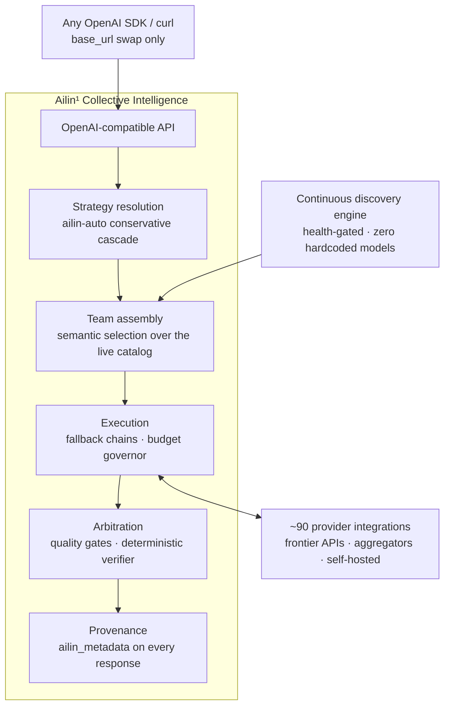
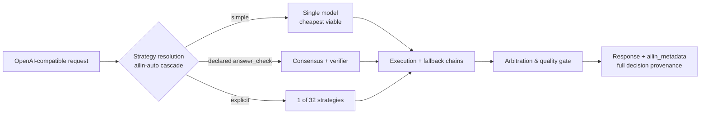

<!--
Copyright (C) 2026 Ailin One, Inc.

This file is part of Collective Intelligence Engine (ci).
Licensed under the GNU Affero General Public License v3.0 or later.
See LICENSE in the repository root, or <https://www.gnu.org/licenses/>.

SPDX-License-Identifier: AGPL-3.0-or-later
Source: https://github.com/ailinone/collective-intelligence
-->

<p align="center">
  
</p>

# Ailin¹ 集体智能

<p align="center">
  <a href="https://github.com/ailinone/collective-intelligence"><b>⭐ 为这个仓库点亮 Star，支持一个更集体、更协作的 AI 新时代</b></a>
</p>

> 🌐 英文版为权威版本（canonical）。本翻译对应 commit 596a94e6。如有疑问，请阅读英文版 README（[README.md](README.md)）。

<p align="center">
  <a href="README.md"></a>
  <a href="README.zh-CN.md"></a>
  <a href="README.pt-BR.md"></a>
  <a href="README.es.md"></a>
  <a href="README.ja.md"></a>
  <a href="README.ko.md"></a>
  <a href="README.fr.md"></a>
  <a href="README.de.md"></a>
  <a href="README.ru.md"></a>
</p>

> **TL;DR**：Ailin¹ 让 **76,636 个 AI 模型** 在同一个集体模型中协同，通过 **32 种策略** 编排，而非路由到单一模型。每一次请求都具备结构化多样性、独立推理与完整的决策审计轨迹，比任何单模型集成更可靠、更有韧性、更可审计，并且[已在公开场景中对阵前沿完成实证](#对阵前沿的公开实证)。
>
> **→ [快速开始](#快速开始) · [查看实证](#对阵前沿的公开实证) · [文档](https://ailin.guide)**

**数以千计的 AI 模型，在同一个集体模型中协同运作。**

每一次请求都具备结构化多样性、独立推理与完整的决策溯源，
旨在让输出比任何单模型集成更可靠、更有韧性、更可审计。
每天都有新模型发布并宣称自己是最强的。而这里，正是它们协同工作的那一层。
完整文档：**[ailin.guide](https://ailin.guide)**。

[](https://github.com/ailinone/collective-intelligence/actions/workflows/ci.yml)
[](LICENSE)
[](https://github.com/ailinone/collective-intelligence/actions/workflows/license-compliance.yml)
[](https://github.com/ailinone/collective-intelligence/actions/workflows/dco.yml)
[](CODE_OF_CONDUCT.md)
[](https://github.com/ailinone/collective-intelligence/security/code-scanning)
[](https://ailin.guide/architecture/provider-ecosystem)
[](#数万个模型始终站在前沿)
[](#请求如何流转)
[](https://github.com/ailinone/collective-intelligence/stargazers)
[](https://github.com/ailinone/collective-intelligence/discussions)

[快速开始](#快速开始) · [下一个前沿](#集体智能ai的下一个前沿) ·
[为什么是集体](#为什么集体能胜过最大的单一模型) ·
[实证数据](#对阵前沿的公开实证) ·
[始终站在前沿](#数万个模型始终站在前沿) ·
[工作原理](#架构一览) ·
[参与贡献](#参与贡献集体智能需要一个集体) · [文档](https://ailin.guide)

## 集体智能：AI的下一个前沿

AI 行业一直专注于打造更大的单体模型。Ailin¹ 采取一条互补的路线：
一个由 **76,636 个 AI 模型**（2026-07 生产环境实时统计）组成的集体，
它们可以协作、辩论、互相批判并共同综合，将[结构化多样性](https://ailin.guide/architecture/cognitive-diversity)应用于那些
对单一模型而言意味着单点训练、单点架构、单点偏见与单点故障的问题。

**这不是多模型路由。这不是 API 网关。这是集体智能（Collective
Intelligence）**：一个让来自各大架构的模型（前沿 API、开放权重挑战者，
以及我们自己的模型家族）通过[数十种策略](https://ailin.guide/architecture/strategy-catalog)进行协同的系统，
目标是提供比任何单模型集成都更高的可靠性、更广的评估覆盖面与
更完整的可审计性。

这一原则植根于关于集体智能与认知多样性的研究：Hong & Page 的
"多样性胜过能力"（diversity trumps ability）结论，以及 Woolley 等人
关于集体绩效的工作（见公开的[参考文献](https://ailin.guide/reference/bibliography)）。Ailin¹ 把这一原则
落地为一个工程平台：一个索引了 76,636 个模型的发现引擎、数十种协同
策略、一个记录每一次协同决策的[审计基座](https://ailin.guide/architecture/collective-intelligence)，以及一条闭环训练
流水线。其中一些层今天已达到生产级，另一些仍在成熟之中。文档带有
状态标识，让你始终清楚哪些已经交付、哪些还在路线图上。

## 为什么集体能胜过最大的单一模型

前沿模型在不断变大，任一时刻最强的那个单一模型都令人惊叹。但单一
模型永远是**单点训练、单点架构、单点故障、单点偏见**。一个协同良好的
集体，以单靠规模无法企及的方式，逐一化解这些结构性局限。

| 单一模型的结构性风险 | 集体如何应对 |
|---|---|
| **韧性**：单一模型意味着单一依赖；一旦其提供商在某一天出现降级、节流、限速或定价异常，每一次调用都会受影响 | 在无需人工干预的情况下自动绕开提供商故障、降级模型与局部失败；请求依然成功，并附带完整溯源（[韧性深度解读](https://ailin.guide/architecture/why-collective-resilience)） |
| **评估多样性**：单一模型（无论多大）都会自信地重复自己的错误与盲区 | 向不同目标、不同数据训练出的多个模型提问并对比输出；分歧变成质量信号，而不是缺陷 |
| **反集中化**：依赖一个模型，等于把组织锁定在一家供应商的路线图、定价与政策决定之上 | 把能力与任何单一提供商解耦；随着前沿更替、特定提供商兴起、衰落或调价，平台持续运转 |
| **降低单点偏见**：每个模型都带着自己的训练数据偏见、拒答模式与风格默认值 | 由架构各异的模型组成的集体会稀释任何单一模型盲区的影响，尤其是在要求独立推理者达成收敛的仲裁策略中 |
| **动态专业化**：没有哪个模型在所有事情上都最强 | 把合适的专家分配给合适的任务（重推理、重代码、视觉、长上下文、低延迟），并把每个请求路由给恰好在任务所需之处强悍的模型 |
| **更强的治理**：企业级工作负载需要可审计的决策、受控的成本、租户隔离与可靠的回退，而单模型集成把这些控制留给集成方自己去建 | 在平台层强制执行治理：决策溯源、成本上限、配额隔离与策略执行覆盖每一个请求、每一种策略、每一个模型 |

这些效应会复合叠加。它们不是六个彼此独立的特性，而是同一个结构性
选择的六个切面：把众多模型协同好，结果就是更可靠、更可治理、更持久。
而且，在正确性可被客观验证的、不断扩大的任务集合上，
**可测量地比我们测试过的每一个前沿旗舰模型更准确**
（97% vs 68–82%，凭据见下文）。

## 对阵前沿的公开实证

我们公开地、以客观评分对照自身检验这一论题：版本固定（pinned）的
评审、凡任务允许即采用机器可校验的答案，以及提交到本仓库的每次执行
的原始数据
（**[完整报告](reports/experiments/AILIN-COLLECTIVE-FRONTIER-BENCHMARK-2026-07.md)** ·
[原始 CSV 与脚本](reports/experiments/) ·
[亲手重新生成每一张表](docs/experiments/REPRODUCING_THE_BENCHMARK.md)）。

**✅ 已验证：在可验证任务上，集体击败了每一个前沿旗舰。**
- **97% 的客观准确率（37/38）**，而 GPT-5.5-pro、Claude Opus 4.8、Gemini 3.1 Pro 与 Grok 4.3 在全部三轮运行合并统计中仅为 **68–82%**
- 在每一轮运行中，**校验器从未选中过一个客观错误的答案**
- 一组**次前沿的开放权重模型**，在良好协同之下，在同样的任务上答得比每一个旗舰都好（[含每个 n 与全部注意事项的排行榜，§3](reports/experiments/AILIN-COLLECTIVE-FRONTIER-BENCHMARK-2026-07.md)）

**这一论题当前的前沿**（诚实测量，驱动路线图）：

| 维度 | 现状 | 我们正在做什么 |
|---|---|---|
| 可验证的正确性 | ✅ **集体获胜**（97% vs 68–82%） | 将校验器覆盖扩展到更多任务形态（tool-calling 战役已于 2026-07-18 完成） |
| 开放式文本 | 在创意写作与重构上单一模型仍占优 | 决策者（decider）选择能可测量地区分获胜与失败的运行：一个可学习的杠杆（[决策者选择，§7](reports/experiments/AILIN-COLLECTIVE-FRONTIER-BENCHMARK-2026-07.md)） |
| 成本 | 集体存在如实记录的成本溢价，**但**校验器短路一旦触发，可将其压缩 ~100×（[成本明细，§5](reports/experiments/AILIN-COLLECTIVE-FRONTIER-BENCHMARK-2026-07.md)） | 拓宽短路路径；`ailin-auto` 默认采用最便宜的可行策略 |
| 延迟 | 多轮仲裁，每一种策略都从第一个 token 起就流式推送实时进度 | `ailin-auto` 只在质量门控确实需要时才动用最深层的策略；对延迟敏感的流量按设计路由至 `single` |

以上每一个数字都由本仓库中提交的原始逐次执行数据与可复现脚本
支撑：你可以在自己的工作负载上亲自运行这套测试框架，以同样的
标准检验我们。

## 数万个模型，始终站在前沿

Ailin¹ 集体不依赖硬编码的模型列表或人工的提供商集成。一个持续运行
的发现引擎扫描全球 AI 生态，并在新模型发布时自动将其吸纳。

结果是：一个横跨 [~90 个提供商集成](https://ailin.guide/architecture/provider-ecosystem)、由 **76,636 个模型**
组成、与生态同步演进的实时集体。当一个已被发现的来源发布新模型时，
发现引擎无需代码改动、无需配置、无需停机即可将其吸纳。

### 语义化发现，零硬编码模型

发现引擎并行扫描数十个来源：
- 原生提供商 API
- 云端 hub
- 模型聚合器
- 开放模型仓库
- 私有推理端点

但来源本身不是重点，关键在于**模型是如何被选中的**。

每一个被发现的模型都会按**能力、性能画像、定价、上下文窗口、模态与
架构**被分析、分类并建立索引，全部自动推断，无需人工映射或配置。
路由经过健康门控：模型只有在被证明确实可用之后才会被对外通告。

模型选择是**完全语义化的**。请求到达时，集体不会从静态列表里挑选，
而是依据任务需求、所选策略与期望的结果画像（最高质量、最佳性价比、
最低成本、最快响应）组建理想的模型团队。合适的模型在每一次请求中
都被实时选举出来。当明天的"史上最强模型"发布时，集体会把它吸纳
进来，而不是与它竞争。

### 自有模型，同场竞技

`ailin` 模型家族及其训练飞轮是设计的一部分：在引擎自身协同流量上
训练的协调器检查点，与所有第三方模型在同一个池中竞争，没有任何
路由特权。**捕获每一次协同决策的审计基座今天已经交付；生产级协调器
权重是仍在开发中的前沿**
（[诚实的状态，始终保持最新](https://ailin.guide)）。

### 作为可证伪假设的集体策略

32 种注册在案的策略（带收敛下限的共识、盲辩论、专家小组、魔鬼
代言人共识、成本级联、带客观校验的 best-of-N），每一种都标注了诚实
的可达性（可自动选择 / 仅显式调用 / 路线图中），每一种都可被本仓库
中的实验框架证伪。**策略靠证据赢得席位，也会因证据失去席位。**

### 多模态+确定性文件生成

多模态生成（图像、音频、视频）按能力路由，外加由任何具备结构化
输出的聊天模型驱动的确定性文件渲染（DOCX、XLSX、PDF、PPTX、ZIP、
代码），已在生产环境得到验证。

### 企业真正需要的治理

| 控制项 | 具体内容 |
|---|---|
| 决策溯源 | `ailin_metadata`：策略、模型、最终决策者、每个子调用的成本、异议 |
| 成本治理 | 在准入时强制执行的按请求 `max_cost` |
| 租户隔离 | 架构级隔离，而非仅停留在配置层面 |
| AGPL §13 合规 | 由引擎自身提供的 `/source`、`/license` 端点 |
| 发布溯源 | SLSA/Sigstore + SPDX SBOM |

**证明我们主张的审计轨迹，与治理你的流量的是同一条**：治理是[一等原则](https://ailin.guide/architecture/principles)，而不是额外负担。

## 架构一览

这是系统的端到端全貌，发现引擎为团队组建输送候选模型，每一条执行路径最终都会收敛到同一个生成溯源记录的仲裁环节：



*文字版：请求通过 OpenAI 兼容 API 进入，来源可以是任意 OpenAI SDK 或
curl 客户端，只需切换 base_url。策略解析套用 `ailin-auto` 保守级联，
交给团队组建环节，在发现引擎持续供给的实时模型目录上做语义化选型
（健康门控、零硬编码模型）。组建好的团队进入执行环节，由回退链与
预算调控器管理，并与约 90 个提供商集成双向通信。执行结果交给仲裁
环节，套用质量门控与确定性校验器，最终生成带完整溯源信息
（`ailin_metadata`）的响应。*

## 请求如何流转

放大聚焦到单次请求，它会走上述三条路径中的哪一条，以及为什么：



*文字版：策略解析的 `ailin-auto` 级联把请求分流到三条路径之一：
简单请求交给单一的、成本最低的可行模型；声明了 `answer_check` 的
请求走共识加确定性校验器；显式指定策略的请求则使用 32 种注册策略
中的那一种。三条路径都汇聚到执行环节及其回退链，再进入仲裁与质量
门控，最终生成带完整 `ailin_metadata` 溯源信息的响应。*

当请求通过 `ailin_constraints.answer_check` 声明了机器可校验的答案时，
校验器随即武装就绪。级联是保守的：其经济模型的设计默认偏向廉价
路径，只有当质量门控提出要求时才升级。

**不适合集体的场景**（[完整指南](docs/use-cases/when-not-to-use-collective.md)、
[ailin.guide 上的同一份指南](https://ailin.guide/use-cases/when-not-to-use-collective)）：
- 高流量、低风险的请求
- 严格的延迟 SLA
- 文档式行文

这是一个运营层面的决策，不是哲学立场。

## 快速开始

> 需要带 Compose v2 的 Docker、~8 GB 空闲内存、空闲端口
> 3000/5432/6379、`python3`（用于解析下方的注册响应），以及
> `pip install openai`（用于 Python 客户端示例）。在 Windows 上，请在
> **Git Bash 或 WSL** 中运行下面的代码块（它使用了 heredoc 和
> `openssl`）。

### 第 1 步：克隆仓库并配置密钥

```bash
git clone https://github.com/ailinone/collective-intelligence.git
cd collective-intelligence/docker
cat > .env <<EOF
# strong JWT secrets are REQUIRED — the app refuses weak/default values
JWT_SECRET=$(openssl rand -base64 48)
AILIN_SHARED_JWT_SECRET=$(openssl rand -base64 48)
# local-first secrets: skip GCP Secret Manager entirely
SECRETS_PROVIDER_PRIMARY=env
# one provider key is the minimum — any of the ~90 works
OPENAI_API_KEY=sk-...
EOF
```

编辑 `.env`，将 `sk-...` 替换为真实密钥（或者完全跳过密钥，见下文
的 Ollama 选项）。完整的配置选项列表见
[api/.env.example](api/.env.example)。然后：

### 第 2 步：启动服务栈

```bash
docker compose up -d api postgres redis   # coord-serving 也会随之自动构建并启动，这是预期行为
docker compose logs -f api    # 观察首次启动：数据库迁移 + 提供商/模型发现扫描，约 1-5 分钟
curl http://localhost:3000/health
# → {"status":"ok","uptime":…,"version":"0.1.0"}
```

### 第 3 步：注册并获取令牌

```bash
export TOKEN=$(curl -s -X POST http://localhost:3000/v1/auth/register \
  -H 'Content-Type: application/json' \
  -d '{"email":"you@example.com","password":"pick-a-strong-one","name":"You"}' \
  | python3 -c "import sys,json; print(json.load(sys.stdin)['tokens']['accessToken'])")
echo "token: ${TOKEN:0:12}..."   # 非空即代表注册成功
```

### 第 4 步：安装 Python 客户端

```bash
pip install openai
```

### 第 5 步：调用集体

```python
# 需在与上方 export 相同的 shell 会话中运行（否则请先重新执行一次 export TOKEN）
import os
from openai import OpenAI
client = OpenAI(base_url="http://localhost:3000/v1", api_key=os.environ["TOKEN"])

r = client.chat.completions.create(
    model="ailin-auto",   # or ailin-best / ailin-fast / ailin-economy / ailin-consensus
    messages=[{"role": "user", "content": "Why is the sky blue?"}],
)
print(r.choices[0].message.content)
# → The sky looks blue because of Rayleigh scattering...
print(r.model_extra["ailin_metadata"])  # strategy, models, costs, dissent — the receipts
# → {'strategy_used': 'single', 'models_used': ['...'], 'cost_actual': 0.0003, ...}
```

**如果服务起不来**：`Cannot connect to the Docker daemon` → 先启动
Docker Desktop 或 docker 服务。3000/5432/6379 端口 `bind: address
already in use` → 停掉占用该端口的其他进程，或在
`docker/docker-compose.override.yml` 中重新映射端口。`docker compose
logs -f api` 里反复刷出 `Secret retrieval failed` → 参见
[降级启动模式](docs/hardening/DEGRADED_BOOT_MODE.md)。

完全没有外部 API 密钥？在 `docker/.env` 中设置
`OLLAMA_URL=http://host.docker.internal:11434`，引擎将以降级的自托管
模式启动（[降级启动模式文档](docs/hardening/DEGRADED_BOOT_MODE.md)）。在原生
Linux 上，还需为 api 服务添加
`extra_hosts: ["host.docker.internal:host-gateway"]`（或使用你的
bridge IP）。面向 OpenAPI 校验的原生（无 Docker）开发环境搭建：
[安装指南](docs/getting-started/installation.md)。托管 API 快速开始：
[ailin.guide/getting-started/quickstart](https://ailin.guide/getting-started/quickstart)。

下一步：[如何选择策略](docs/guides/strategy-selection.md) ·
[模型别名与路由说明](docs/guides/model-aliases-and-routing.md)。

## 现已交付与开发中

| 今天已交付 | 开发中 |
|---|---|
| OpenAI 兼容 API（chat、responses、embeddings、images、files） | 训练完成的协调器权重（设计+审计基座现已交付） |
| 32 种编排策略（含单模型基线）+ `ailin-auto` 级联 | 专有模型家族的生产权重（训练飞轮已建成） |
| 发现引擎、健康门控路由、回退链 | 范围更广的基准测试战役，附带完整审计的成本核算 |
| 完整决策溯源（`ailin_metadata`） | 面向独立评测的分步战役指南 |
| 多模态+确定性文件生成（DOCX/XLSX/PDF/PPTX/ZIP/代码） | |
| AGPL §13 端点（`/source`、`/license`）+ 许可证响应头 | |
| 广播投递流水线（代码已交付，置于 `BROADCAST_FEATURE_ENABLED` 开关之后，默认关闭；尚未经生产验证） | |

对验证状态的诚实本身就是一项特性：凡不在左列的内容，在文档中的
标注方式与此处完全一致。

## 参与贡献：集体智能需要一个集体

这一论题本身就预言了这一点：多样、独立的贡献者，在良好协同之下，
能建成任何单打独斗都无法完成的东西。欢迎在 **DCO** 下贡献代码
（`git commit -s`，见 [DCO.md](DCO.md) 与
[CONTRIBUTING.md](CONTRIBUTING.md)）：提供商适配器（轻薄、自包含
的模块）、策略实现、客观任务校验器，以及 [ailin.guide](https://ailin.guide) 上的文档。

而且这个项目拥有大多数项目都没有的贡献面：**亲自运行基准测试并发布
结果，无论结果偏向哪一方。** 从
[REPRODUCING_THE_BENCHMARK.md](docs/experiments/REPRODUCING_THE_BENCHMARK.md) 开始：
用已提交的原始数据重新生成每一张已发布的表格，只需大约两分钟和
Python 标准库。每一次独立复现（无论是验证还是证伪）都让集体更
聪明。这正是全部意义所在。

问题与结果：[GitHub Discussions](https://github.com/ailinone/collective-intelligence/discussions)。
安全报告：**绝不要**用公开 issue，见 [SECURITY.md](SECURITY.md)。

## 许可证与治理

**AGPL-3.0-or-later。** 如果你将修改后的版本作为网络服务运行，§13
要求向其用户提供对应的源代码：引擎提供 `/source` 与 `/license`
端点，并在每个响应上发送 `X-License`/`X-Source-Code` 头，让合规变得
容易（将 `AGPL_SOURCE_URL` 指向*你的*修改后源码）。见
[COMPLIANCE.md](COMPLIANCE.md)；商业许可：licensing@ailin.one。

| 治理主题 | 参考资料 |
|---|---|
| 贡献者签署（DCO 1.1） | [DCO.md](DCO.md) |
| 行为准则（Contributor Covenant 2.1） | [CODE_OF_CONDUCT.md](CODE_OF_CONDUCT.md) |
| 商标（"Ailin"、"Ailin One"、"ailin.one"） | [TRADEMARKS.md](TRADEMARKS.md) |
| 发布溯源（SLSA/Sigstore + SPDX SBOM） | [release-provenance.yml](.github/workflows/release-provenance.yml) |
| 安全政策 | [SECURITY.md](SECURITY.md) |
| 更新日志（v0.1.0） | [CHANGELOG.md](CHANGELOG.md) |
| 完整文档 | [ailin.guide](https://ailin.guide) |

由 **Ailin One, Inc.** 维护。AGPL 许可的是代码，不是商标。

## Star历史与贡献者

<p align="center">
  <a href="https://github.com/ailinone/collective-intelligence"><b>⭐ 为这个仓库点亮 Star，支持一个更集体、更协作的 AI 新时代</b></a>
</p>

[](https://star-history.com/#ailinone/collective-intelligence&Date)

<a href="https://github.com/ailinone/collective-intelligence/graphs/contributors">
  
</a>

如果你希望集体智能这一论题（公开检验、凭据就在仓库里）在这个
世界上存在下去，一颗 ⭐ 就是你告诉其他开发者"这值得他们花十分钟"
的方式。
</content>
