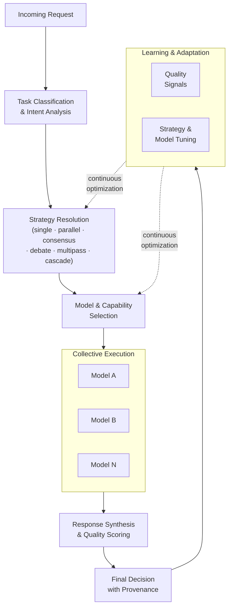

<!--
Copyright (C) 2026 Ailin One, Inc.

This file is part of Collective Intelligence Engine (ci).
Licensed under the GNU Affero General Public License v3.0 or later.
See LICENSE in the repository root, or <https://www.gnu.org/licenses/>.

SPDX-License-Identifier: AGPL-3.0-or-later
Source: https://github.com/ailinone/collective-intelligence
-->

# Collective Intelligence

Collective Intelligence (CI) in this project means multiple actors contributing to one governed result:

- users and applications
- orchestration logic
- provider adapters
- one or many models
- policy and quota gates
- memory, telemetry, and feedback loops

## Execution Modes

Depending on strategy, requests can run through:

- single model execution
- parallel candidates with best-response selection
- consensus/debate with synthesis
- quality multipass with validator/reviewer loops
- cost cascade fallback

## Why Collective Intelligence Outperforms Single-Model Routing

### Scientific Foundation

Collective Intelligence is grounded in established theory:

- **Condorcet Jury Theorem (1785)**: If independent voters each have >50% accuracy, group accuracy approaches 100% as group size grows. Applied to LLMs: diverse models with varying strengths collectively exceed any single model's accuracy.
- **Page's Diversity Prediction Theorem**: Diverse groups outperform homogeneous experts when aggregation is effective. Ailin's strategies (debate, consensus, collaborative synthesis) implement effective aggregation.
- **Wisdom of Crowds (Surowiecki)**: Conditions for wise crowds are diversity, independence, decentralization, and aggregation — all enforced by Ailin's orchestration.

### Empirical Evidence

From Ailin's benchmark v3 (2,394 executions across 66 tasks; experiment
`5cf023a1` — preliminary, see caveats):

- **Orchestration gain (strongest finding)**: collective orchestration over
  budget models scored **+77% quality vs the same budget models alone**
  (0.698 vs 0.394, Cohen's d = 0.919 — large effect)
- **Consensus Strategy**: 0.863 average quality on completed runs — above
  every individual Tier 1 model measured (GPT-5.4: 0.631, Grok-4: 0.724) —
  but on a small sample (n=12) with a low completion rate during the
  credit-constrained run
- **Debate Strategy**: 0.780 average quality (n=41), the best
  quality×reliability trade-off among collective strategies
- **CI vs Single Tier 1 (aggregate)**: +2.0pp quality (0.698 vs 0.678) —
  **not statistically significant** at this sample size (Welch p=0.706); the
  v4 benchmark with guaranteed credits and unified cost accounting is the
  planned confirmation run
- **Task-specific wins**: +33.7pp (factual-QA), +26.3pp (creative), +13.5pp
  (debugging) — directional, same small-sample significance caveat
- **Cost**: the v3 cost figures ($0.021 vs $0.027, "24% cheaper") came from
  cost accounting with known bugs (since fixed: synthesizer, triage and judge
  sub-calls now fold into `totalCost`, and missing provider prices are
  normalized) and are **not a reliable comparison** — comparative cost claims
  are deferred to the v4 re-run

Single-model routing is simpler; whether collective routing beats it on
quality-per-dollar is exactly what the v4 experiment is designed to settle.
Full method, raw data and limitations: `docs/ARTICLE-CI-BENCHMARK.md` and
`reports/experiments/` (raw v3 outputs).

### Competitive Advantages

- **Resilience Without Redundancy**: If one provider degrades, orchestration routes to alternatives with equivalent capabilities (learned from 1,251 models). Single-model integration fails.
- **Dynamic Cost-Quality Tradeoffs**: Cascade strategy can drop from consensus→debate→single based on latency pressure, learning what threshold works per task type. Single model has no knobs.
- **Continuous Learning**: Thompson Sampling learns which strategies work for which task profiles; capability matching improves as execution data accumulates. Single integration is static.
- **Specialization Without Lock-In**: Models are selected for their unique strengths (reasoning experts, creative specialists, factual QA specialists). Single model accepts generalist compromise.

## Runtime Building Blocks

- capability-based model filtering
- provider operability checks
- fallback chain construction
- quality scoring and strategy adaptation
- usage and cost tracking

## Determinism and Governance

CI does not mean uncontrolled fan-out. The runtime still enforces:

- tenant boundaries
- policy decisions
- quota and rate limit controls
- security and audit constraints

## Proprietary Ailin Intelligence Systems

Ailin's differentiation is not just orchestration—it's proprietary decision intelligence built through continuous learning:

### Semantic Triage Engine

The triage component is LLM-powered semantic analysis that goes beyond simple rule-based routing:

- **Intent Understanding**: Analyzes request semantics, not just endpoint/model field
- **Complexity Classification**: Determines whether task requires single-model speed or multi-model depth (debate, consensus)
- **Capability Matching**: Maps semantic requirements (reasoning, creativity, factual accuracy) to specialized models
- **Context Enrichment**: Retrieves historical outcomes and memory to inform strategy selection

### Strategy Optimization Loop

Thompson Sampling learns per-strategy effectiveness:

- **Beta Distributions per Strategy**: Maintains Bayesian uncertainty estimates (α, β parameters) for each strategy's quality distribution
- **Exploration-Exploitation**: Balances trying new strategies (exploration) against known winners (exploitation)
- **Task-Specific Tuning**: Learns different strategy preferences per task type (factual-QA favors consensus; creative tasks favor debate)
- **Real-Time Adaptation**: Updates distributions continuously as execution feedback arrives

### Capability Registry & Model Matching

Over time, Ailin learns model strengths:

- **Quality per (Model, Task Type, Complexity)**: Accumulates evidence of which models excel at which problem classes
- **Cost-Quality Frontier**: Learns efficient allocation — which models deliver quality at lowest cost per task
- **Provider Health & Latency**: Tracks provider degradation and latency patterns, feeding into fallback decisions
- **Semantic Specialization**: Identifies "reasoning specialists" (Claude Opus), "speed specialists" (GPT-4o), "factual specialists" (Grok, Gemini) through execution feedback

This feedback loop is proprietary to Ailin — it cannot be replicated by integrating single providers directly.

## Final Decision Semantics

In multi-model strategies there are multiple executed models. To avoid ambiguity, runtime metadata includes:

- full participant set (`models_used`)
- resolved compatibility model (`resolved_model`)
- explicit final decider (`final_decider_model_id`, `final_decider_model_name`, `final_decider_role`)
- strategy used and why (from Thompson Sampling or explicit routing)
- quality score and cost efficiency

This metadata is queryable, auditable, and essential for enterprise governance — you understand exactly why Ailin made each decision and can tune guidance for future requests.
