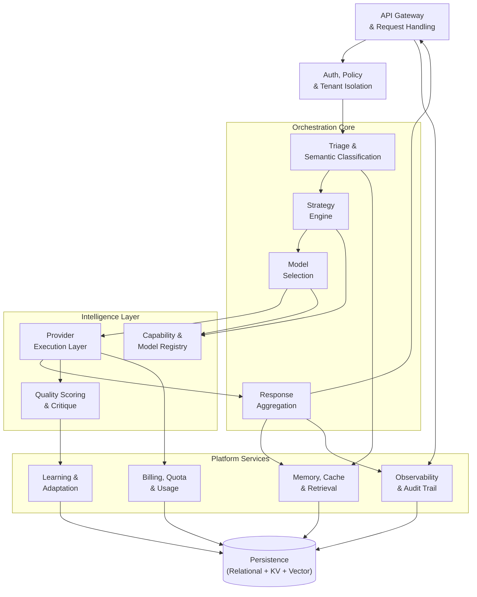
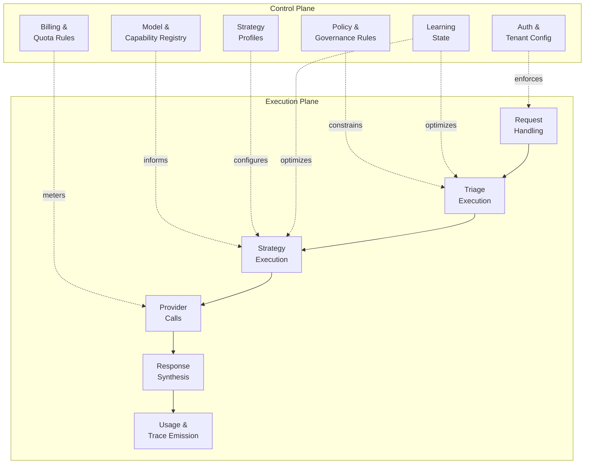

<!--
Copyright (C) 2026 Ailin One, Inc.

This file is part of Collective Intelligence Engine (ci).
Licensed under the GNU Affero General Public License v3.0 or later.
See LICENSE in the repository root, or <https://www.gnu.org/licenses/>.

SPDX-License-Identifier: AGPL-3.0-or-later
Source: https://github.com/ailinone/collective-intelligence
-->

# Container View

Routing and governance are centralized in orchestration; capability execution, persistence, billing, learning, and observability are isolated containers. The orchestration core follows a triage-strategy-selection-execution-aggregation pipeline.

## Control-Plane vs Execution-Plane

Conceptual separation between declarative governance and runtime execution.

The control plane holds declarative configuration and learned state. The execution plane processes requests procedurally, constrained by control-plane rules at every stage.
