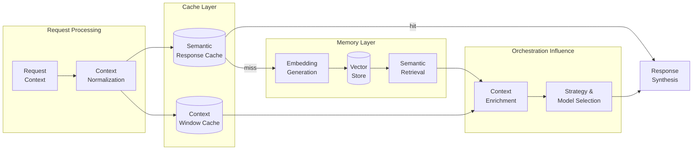

<!--
Copyright (C) 2026 Ailin One, Inc.

This file is part of Collective Intelligence Engine (ci).
Licensed under the GNU Affero General Public License v3.0 or later.
See LICENSE in the repository root, or <https://www.gnu.org/licenses/>.

SPDX-License-Identifier: AGPL-3.0-or-later
Source: https://github.com/ailinone/collective-intelligence
-->

# Data Flow: Memory and Cache

Memory and cache layers optimize latency and recall while orchestration preserves tenant boundaries and policy controls. Semantic response caching short-circuits repeated queries; context enrichment from memory and retrieval feeds into strategy and model selection decisions.

## How Memory Drives Intelligent Selection

Retrieved context doesn't just enrich responses—it shapes model selection strategy. When semantic retrieval surfaces related tasks, prior outcomes, or capability requirements, the orchestration engine uses this intelligence to:

- **Refine strategy**: If context shows a task benefits from debate/consensus, the engine elects that strategy over single-model routing
- **Filter models**: Capability registry narrows candidates based on what worked before and what context requires
- **Optimize for cost**: Historical data about quality-cost tradeoffs per (task, strategy, model) tuple allows the learning loop to suggest lower-cost alternatives without sacrificing quality

This semantic context → intelligent selection feedback loop is core to Ailin's proprietary intelligence system.
