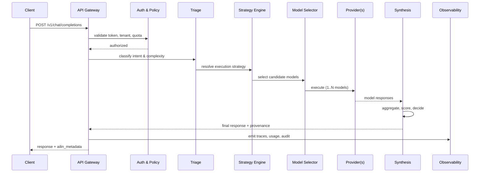

<!--
Copyright (C) 2026 Ailin One, Inc.

This file is part of Collective Intelligence Engine (ci).
Licensed under the GNU Affero General Public License v3.0 or later.
See LICENSE in the repository root, or <https://www.gnu.org/licenses/>.

SPDX-License-Identifier: AGPL-3.0-or-later
Source: https://github.com/ailinone/collective-intelligence
-->

# Request Sequences

Sequence guarantees deterministic response envelope while preserving multi-model execution provenance. The triage-strategy-selection pipeline dynamically resolves how many models participate and how their outputs are synthesized into a final decision.

