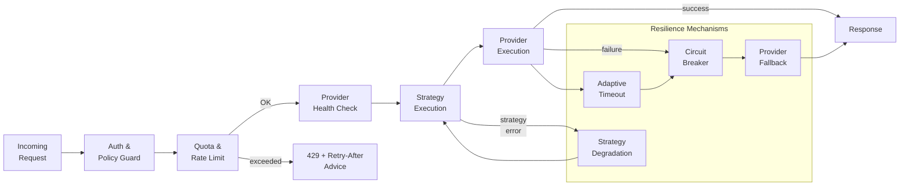

<!--
Copyright (C) 2026 Ailin One, Inc.

This file is part of Collective Intelligence Engine (ci).
Licensed under the GNU Affero General Public License v3.0 or later.
See LICENSE in the repository root, or <https://www.gnu.org/licenses/>.

SPDX-License-Identifier: AGPL-3.0-or-later
Source: https://github.com/ailinone/collective-intelligence
-->

# Resilience and Rate Limit

Resilience combines quota/rate-limit controls, retry hints (`Retry-After`), circuit breakers, provider failover, strategy-level degradation, and adaptive timeouts. Provider health checks gate execution; strategy degradation allows the engine to downgrade to simpler execution modes under pressure.

