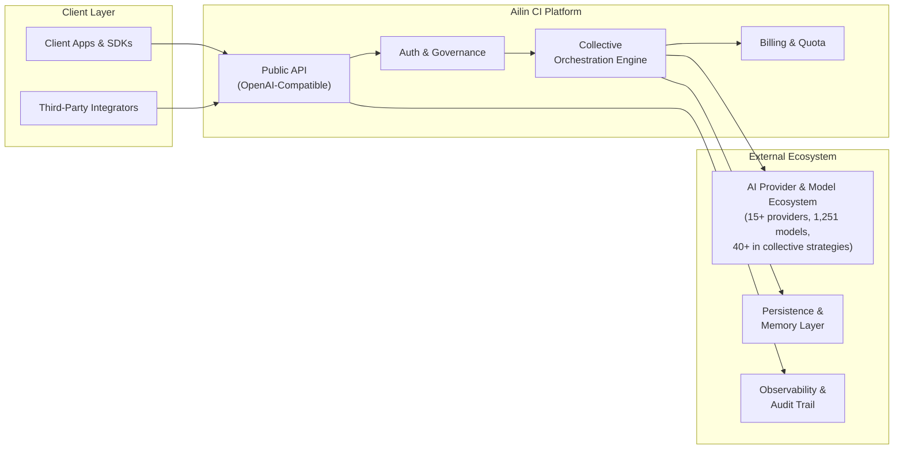

<!--
Copyright (C) 2026 Ailin One, Inc.

This file is part of Collective Intelligence Engine (ci).
Licensed under the GNU Affero General Public License v3.0 or later.
See LICENSE in the repository root, or <https://www.gnu.org/licenses/>.

SPDX-License-Identifier: AGPL-3.0-or-later
Source: https://github.com/ailinone/collective-intelligence
-->

# System Context

The API sits between clients and a dynamic multi-provider ecosystem, enforcing governance, tenancy, billing, and observability at the platform boundary. Collective orchestration coordinates real-time strategy resolution and semantic model selection across 1,251 AI models from 15+ providers worldwide.

## Why Scale Matters

Operating at the scale of 1,251 models unlocks collective intelligence advantages impossible at single-provider scale:

- **Semantic Diversity:** Triage engine analyzes request intent and selects from diverse model families (Anthropic, OpenAI, Google, xAI, Meta, Zhipu, Qwen, etc.), each with distinct strengths in reasoning, creativity, factual accuracy, and code generation.
- **Strategy-Model Fit:** The 5-layer decision cascade (explicit routing → semantic triage → MAP-Elites archive → Pareto frontier → Thompson Sampling) selects not just a model, but the strategy that maximizes quality and cost efficiency for that specific request type.
- **Resilience Through Diversity:** If a provider experiences degradation, the orchestration engine seamlessly routes to alternative models with equivalent capabilities, with fallback chains built dynamically per request.
- **Learning Feedback:** Execution feedback from 1,251 models trains proprietary Ailin intelligence systems (quality scoring, capability matching, strategy optimization), improving decision quality over time.
