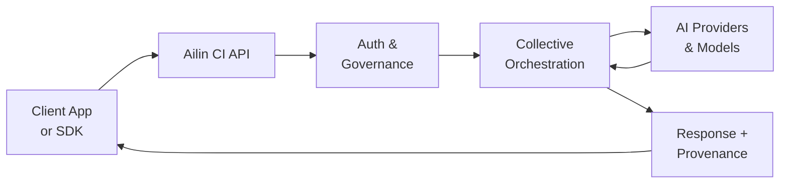

<!--
Copyright (C) 2026 Ailin One, Inc.

This file is part of Collective Intelligence Engine (ci).
Licensed under the GNU Affero General Public License v3.0 or later.
See LICENSE in the repository root, or <https://www.gnu.org/licenses/>.

SPDX-License-Identifier: AGPL-3.0-or-later
Source: https://github.com/ailinone/collective-intelligence
-->

# Overview

`ci/api` exposes a single control plane for AI execution with provider/model abstraction.

## High-Level Flow



1. Client sends a request to a standard endpoint.
2. Runtime validates auth, tenancy, policy, and quota.
3. Orchestration resolves strategy and candidate models.
4. One or many models execute (depending on strategy).
5. Final response is synthesized and returned.
6. Usage, metrics, and traces are recorded.

## How Collective Orchestration Works

Single-model routing is simple; collective orchestration aims to do better by combining diverse models. The v3 experiment produced the following per-strategy figures — reported here **with the caveats below**, not as proven superiority:

| Approach | Quality (v3) | Latency | Notes |
|----------|---------|--------------|-------|
| **Consensus Strategy** | 0.863 | +30% | Highest mean quality in v3, but on a small valid sample (~10% success rate) |
| **Debate Strategy** | 0.780 | +20% | Structured reasoning synthesis |
| **Single Tier 1 (GPT-5.4, Claude Opus, etc.)** | 0.678 | baseline | Consistent baseline |
| **Cost-Cascade (Quality Mode)** | 0.750 | — | Quality-biased cascade |
| **Single Budget Model** | 0.394 | — | No orchestration advantage |

> **Correction (2026-06-11).** The v3 cost figures came from accounting with known bugs (missing catalog prices yielding near-zero costs; the collective synthesizer's own cost excluded from the strategy total). Both are fixed in the engine, but the dollar costs and any "% cheaper" / "% better quality" claims **predate the fix and must not be cited** — they await the v4 re-run on audited accounting. The CI-vs-Single quality difference in v3 was **not statistically significant** (Welch p=0.706, Cohen's d=0.052).

Why it can work: diverse models have different strengths. Triage identifies task complexity, strategy selection matches it to an orchestration approach (single, debate, consensus, cascade), and quality feedback optimizes allocation. Whether this yields net-superior quality *and* cost is exactly what the v4 benchmark is designed to test.

### Quality vs Cost Trade-off Visualization

```mermaid
quadrantChart
    title Ailin Strategy Quality vs Cost Efficiency
    x-axis Low Efficiency --> High Efficiency
    y-axis Low Quality --> High Quality
    Consensus Strategy: (85, 95)
    Debate Strategy: (75, 85)
    Cost-Cascade (Quality): (70, 80)
    Single Tier 1: (50, 70)
    Single Budget: (30, 40)
    Single (Speed): (20, 50)
```

**Interpretation:**
- **Upper-right quadrant** (best): High quality AND cost-efficient (Consensus, Debate, Cascade)
- **Upper-left quadrant** (sacrifice efficiency for quality): Premium quality, higher cost (pure Consensus)
- **Lower-right quadrant** (efficient but lower quality): Budget solutions with routing optimization
- **Lower-left quadrant** (avoid): Low quality and inefficient — not recommended

Choose based on your use case: prioritize quality (consensus) or cost (cascade)?

## 5-Layer Strategy Selection Cascade

Rather than a simple routing decision, Ailin runs a sophisticated decision cascade:

1. **Explicit Routing**: User specifies strategy directly (most common for power users)
2. **Semantic Triage**: LLM-based analysis of request intent and complexity (drives dynamic selection)
3. **MAP-Elites Archive**: Quality-diversity archive of historically best (strategy, models) combinations per (task type, complexity) pair
4. **Pareto Frontier**: Multi-objective optimization across quality, cost, and latency tradeoffs
5. **Thompson Sampling Bandit**: Bayesian exploration-exploitation with Beta distributions per strategy (continuous learning)

When no layer produces high confidence, heuristic scoring selects the most suitable strategy. Over time, Thompson Sampling learns which strategies win for which task profiles, optimizing both quality and cost.

## Learning & Continuous Optimization

Every execution feeds quality signals back into proprietary Ailin intelligence systems:

- **Strategy Learning**: Thompson Sampling beta distributions update per strategy, task type, and outcome — the system learns which approaches work for which problems
- **Model Capability Matching**: Quality feedback tagged with resolved model, task type, and input characteristics refines the capability registry
- **Cost-Quality Frontier**: Historical cost-quality tradeoffs per (strategy, model, task) tuple inform future routing decisions
- **Semantic Context**: Retrieved memory and prior outcomes shape strategy and model selection for subsequent requests

This closed-loop learning is why Ailin's recommendations improve over time — the platform doesn't just orchestrate; it gets smarter.

## Main Concepts

- `strategy`: execution approach (`single`, `parallel`, `consensus`, `cost-cascade`, `debate`, etc.) — dynamically selected or explicitly specified
- `capabilities`: required functionality (`chat`, `reasoning`, `vision`, tools) — matched against available models
- `virtual aliases`: `ailin-*` model names that map to orchestration profiles (e.g., `ailin-reasoning` → consensus debate on reasoning specialists)
- `runtime constraints`: provider/capability/cost/latency filters applied during selection
- `billing profile`: markup and floor logic for monetization across provider costs

## Endpoint Families

- Auth and identity
- Models and capability discovery
- Chat and Responses
- Embeddings, Audio, Images
- Files, Vector Stores, Threads, Assistants
- Enterprise usage, quotas, billing
- Observability, status, realtime, tools

See API Surface: `ci/docs/reference/api-surface.md`.

## OpenAPI Contract

- Source of truth: `openapi-spec.yaml`
- JSON bundle: `openapi-spec.json`
- Validation command:

```bash
npm -C ci run check:openapi
```
