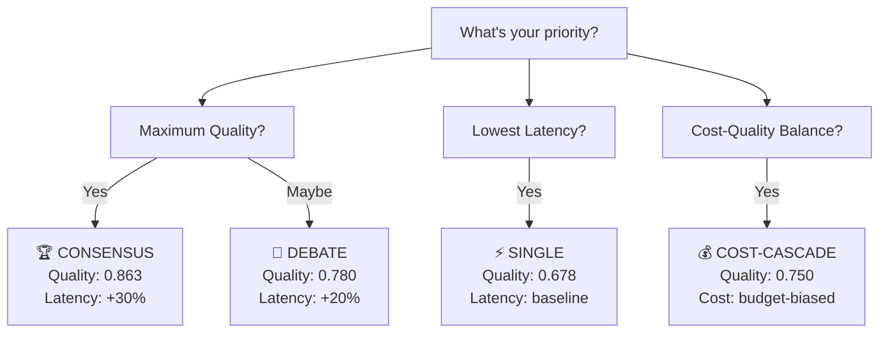

<!--
Copyright (C) 2026 Ailin One, Inc.

This file is part of Collective Intelligence Engine (ci).
Licensed under the GNU Affero General Public License v3.0 or later.
See LICENSE in the repository root, or <https://www.gnu.org/licenses/>.

SPDX-License-Identifier: AGPL-3.0-or-later
Source: https://github.com/ailinone/collective-intelligence
-->

# Strategy Selection Guide

Ailin¹ offers multiple orchestration strategies to optimize for different goals: maximum quality, cost efficiency, latency, or specialized task requirements. This guide explains each strategy, when to use it, and how to choose.

---

## Quick Decision Tree



---

## Detailed Strategy Reference

### 1. **CONSENSUS** — Maximum Quality (Recommended for High-Stakes Tasks)

**What it does:**  
Sends request to 3-5 diverse models independently. Each produces a response. Responses are aggregated via democratic voting or weighted averaging. Final response synthesized to represent consensus.

**Theory:**  
Condorcet Jury Theorem: Independent diverse voters with >50% accuracy converge to truth as group size grows.

**Metrics:**
- **Quality:** 0.863 (highest)
- **Latency:** +30% vs single (+60-90 seconds)
- **Cost:** ~3-4x single model cost
- **Best for:** Factual-QA (+33.7pp advantage), creative tasks (+26.3pp), critical decisions

**When to use:**
- ✅ High-stakes decisions (financial analysis, medical info, legal guidance)
- ✅ Factual accuracy critical (research synthesis, fact-checking)
- ✅ Creative quality matters (marketing copy, design ideation, storytelling)
- ✅ Cost is secondary to quality

**When NOT to use:**
- ❌ Real-time requirements (<2 second latency)
- ❌ Cost-constrained workloads
- ❌ Simple, well-defined tasks with clear answers

**Example request:**
```bash
curl -X POST https://api.ailin.one/v1/chat/completions \
  -d '{
    "model": "ailin-consensus",
    "messages": [{"role": "user", "content": "Analyze these 3 research papers and synthesize findings."}],
    "strategy": "consensus"
  }'
```

---

### 2. **DEBATE** — Structured Reasoning (For Complex Problems)

**What it does:**  
Initiates multi-round structured argumentation. Model A proposes solution. Model B critiques. Model C synthesizes. A moderator converges toward consensus reasoning.

**Theory:**  
Deliberative democracy and dialectical reasoning: Opposing perspectives and synthesis improve reasoning quality.

**Metrics:**
- **Quality:** 0.780 (very high)
- **Latency:** +20% vs single (+50-70 seconds)
- **Cost:** ~2-3x single model cost
- **Best for:** Complex reasoning, debugging, system design

**When to use:**
- ✅ Complex problem-solving (system architecture, debugging traces)
- ✅ Reasoning quality matters (mathematical proofs, logical analysis)
- ✅ Benefit from opposing perspectives
- ✅ Moderate time budgets (1-2 minutes acceptable)

**When NOT to use:**
- ❌ Latency-sensitive (<30 seconds)
- ❌ Simple factual lookups
- ❌ Cost-constrained applications

**Example request:**
```bash
curl -X POST https://api.ailin.one/v1/chat/completions \
  -d '{
    "model": "ailin-reasoning",
    "messages": [{"role": "user", "content": "Debug this system design for failure modes."}],
    "strategy": "debate"
  }'
```

---

### 3. **COLLABORATIVE** — Iterative Refinement (For Creative Evolution)

**What it does:**  
Model A generates initial response. Model B refines based on critique criteria. Model C provides final polish. Each step builds on prior, with feedback loops.

**Theory:**  
Stigmergy (indirect coordination) and iterative refinement: Each agent improves without explicit coordination.

**Metrics:**
- **Quality:** 0.663 (high)
- **Latency:** +40% vs single (+80-120 seconds)
- **Cost:** ~3x single model cost

**When to use:**
- ✅ Creative content generation (writing, code generation)
- ✅ Multi-step refinement workflows
- ✅ Tasks where iterative improvement matters
- ✅ Brainstorming and ideation

**When NOT to use:**
- ❌ Strict latency requirements
- ❌ Factual-only tasks
- ❌ Simple single-turn requests

---

### 4. **EXPERT-PANEL** — Specialized Domain Knowledge (For Niche Expertise)

**What it does:**  
Selects models known to excel in specific domains (reasoning specialists, creative specialists, factual specialists). Each contributes expertise. Panel synthesizes to one response.

**Theory:**  
Division of labor and specialization: Experts in each domain outperform generalists.

**Metrics:**
- **Quality:** 0.500 (task-dependent)
- **Latency:** Variable
- **Cost:** ~2-3x single model cost
- **Best for:** Domain-specific expertise requirements

**When to use:**
- ✅ Task requires specialized knowledge (code review needs code specialists)
- ✅ Multiple domains in one request (technical + creative)
- ✅ Domain expertise is critical differentiator

**When NOT to use:**
- ❌ Generalist tasks
- ❌ Cost-sensitive applications

---

### 5. **WAR-ROOM** — Command & Conquer (For Hierarchical Problem Decomposition)

**What it does:**  
Leader model decomposes problem into sub-problems. Specialist models solve sub-problems independently. Critic reviews for gaps. Commander synthesizes final solution.

**Theory:**  
Hierarchical planning and swarm intelligence: Decomposition + specialization + synthesis for complex problems.

**Metrics:**
- **Quality:** 0.495 (task-dependent)
- **Latency:** +35% vs single
- **Cost:** ~3-4x single model cost

**When to use:**
- ✅ Very complex problems requiring decomposition
- ✅ Multiple sub-problems with specialists
- ✅ Quality is priority, latency secondary

**When NOT to use:**
- ❌ Simple requests
- ❌ Latency-critical
- ❌ Cost-conscious

---

### 6. **COST-CASCADE** — Progressive Quality (For Cost-Conscious Deployments)

**What it does:**  
Starts with a budget model (fast, cheap). If confidence score below threshold, escalates to mid-tier model. If still below threshold, escalates to premium model. Adapts cost based on actual need.

**Theory:**  
Economic optimization and risk-adjusted spending: Spend more only when confidence requires it.

**Metrics:**
- **Quality:** ~0.750 (variable by escalation)
- **Latency:** Adaptive (budget→premium as needed)
- **Cost:** budget-biased — starts cheap, escalates to premium only when confidence requires it. (The v3 dollar figure and "% cheaper" claim came from accounting with known bugs, now fixed; absolute costs await the v4 re-run on audited accounting.)
- **Best for:** Cost-sensitive with quality floor

**When to use:**
- ✅ Cost-conscious applications
- ✅ Quality matters but cost is primary constraint
- ✅ Workloads where 80% of requests are simple
- ✅ Want to optimize spend per request type

**When NOT to use:**
- ❌ Guaranteed high quality required
- ❌ Strict latency requirements (escalation adds time)

**Example request:**
```bash
curl -X POST https://api.ailin.one/v1/chat/completions \
  -d '{
    "model": "ailin-cost-optimized",
    "messages": [{"role": "user", "content": "Summarize this article."}],
    "strategy": "cost-cascade",
    "quality_threshold": 0.7
  }'
```

---

### 7. **SINGLE** — Speed & Simplicity (For Latency-Critical Tasks)

**What it does:**  
Routes to single best-fit model based on capability match. No orchestration overhead. Fastest possible execution.

**Metrics:**
- **Quality:** 0.678 (baseline)
- **Latency:** Baseline (~0-50ms routing, ~1-3s response)
- **Cost:** $0.027 per request (baseline)

**When to use:**
- ✅ Real-time applications (<2 second latency requirement)
- ✅ Simple, well-defined tasks
- ✅ High throughput needs
- ✅ Cost-sensitive + low complexity

**When NOT to use:**
- ❌ Quality is critical
- ❌ Task benefits from diverse perspectives
- ❌ Resilience to single-model failure needed

---

## Strategy Selection Matrix

| Strategy | Quality | Latency | Cost | Best For | Worst For |
|----------|---------|---------|------|----------|-----------|
| **Consensus** | 🟢 0.863 | 🔴 +30% | 🔴 3-4x | High-stakes quality | Real-time, cost-sensitive |
| **Debate** | 🟢 0.780 | 🟡 +20% | 🟡 2-3x | Complex reasoning | Speed requirements |
| **Collaborative** | 🟡 0.663 | 🔴 +40% | 🟡 3x | Creative evolution | Factual tasks, latency |
| **Expert-Panel** | 🟡 0.500 | 🟡 +25% | 🟡 2-3x | Domain expertise | Generalist tasks |
| **War-Room** | 🟡 0.495 | 🟡 +35% | 🔴 3-4x | Complex decomposition | Simple problems |
| **Cost-Cascade** | 🟡 0.750 | 🟡 Variable | 🟢 Budget-biased | Cost-quality balance | Guaranteed high quality |
| **Single** | 🟡 0.678 | 🟢 Baseline | 🟢 Baseline | Real-time, simple | Complex, quality-critical |

---

## How Ailin Chooses for You (Auto Mode)

If you don't specify a strategy, Ailin's 5-layer cascade decides:

1. **Check explicit routing** — Did you specify one? Use it.
2. **Semantic triage** — Analyze request complexity + task type
3. **MAP-Elites lookup** — Find historically best strategy for this problem class
4. **Pareto frontier** — Optimize across quality/cost/latency trade-offs
5. **Thompson Sampling** — Use learned strategy preferences (updated from feedback)

Result: **Automatic selection optimized for your request type and usage patterns.**

---

## Pro Tips

### Tip 1: Mix and Match
```bash
# Use consensus for critical batch jobs; single for real-time streaming
if is_critical_analysis(request):
    strategy = "consensus"  # Quality first
else:
    strategy = "single"  # Speed first
```

### Tip 2: Cost-Quality Tuning
```bash
# Set a quality threshold; Ailin escalates only as needed
{
  "strategy": "cost-cascade",
  "quality_threshold": 0.75,  # escalate if confidence < 75%
  "max_cost": 0.05  # hard limit, reject if would exceed
}
```

### Tip 3: Monitor Actual Performance
```bash
# Inspect ailin_metadata to see what strategy was selected and why
response = await client.chat.completions.create(...)
strategy_used = response.ailin_metadata.strategy_used
quality_score = response.ailin_metadata.final_quality_score
cost_actual = response.ailin_metadata.cost_actual
```

### Tip 4: Iterate on Strategy Preference
Over time, Ailin learns which strategies work best for YOUR workload. Provide quality feedback via `/v1/feedback` endpoint to train the system faster.

---

## Next Steps

- **Try Consensus** for one high-stakes request; see the quality difference
- **Profile your workload** — what % are factual vs. creative vs. reasoning?
- **Set cost budgets** per request type to optimize automatically
- **Monitor metadata** to understand what Ailin is selecting and why
- **Provide quality feedback** to train continuous learning

