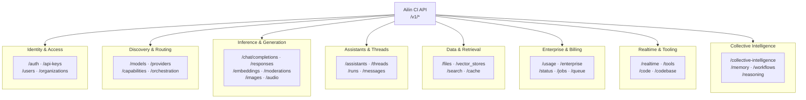

<!--
Copyright (C) 2026 Ailin One, Inc.

This file is part of Collective Intelligence Engine (ci).
Licensed under the GNU Affero General Public License v3.0 or later.
See LICENSE in the repository root, or <https://www.gnu.org/licenses/>.

SPDX-License-Identifier: AGPL-3.0-or-later
Source: https://github.com/ailinone/collective-intelligence
-->

# API Surface

This page describes the functional API surface of `ci/api` and how it is exposed in documentation.

## Contract Layers

1. Public contract (OpenAPI):
- Source: `ci/openapi-spec.yaml` and `ci/openapi-spec.json`
- Full operation list: `ci/docs/reference/endpoints-catalog.md`

2. Runtime-implemented endpoints:
- Implemented in route modules under `ci/api/src/routes`
- Some endpoints are intentionally not public due to security/operability scope

3. Internal/operator endpoints:
- Infrastructure, diagnostics, and webhook receiver paths
- Not intended for general client integration

## Functional Domains

### Identity and Access
- Purpose: authentication, session/token lifecycle, API key management, and tenant boundary enforcement.
- Main endpoints: `/v1/auth/*`, `/v1/api-keys*`, `/v1/user/profile`, `/v1/users*`, `/v1/organizations*`.

### Model Discovery and Routing
- Purpose: discover provider/model inventory, normalize capability access, and configure orchestration behavior.
- Main endpoints: `/v1/models*`, `/v1/providers*`, `/v1/orchestration/strategies`, `/v1/capabilities*`.

### Inference and Generation
- Purpose: core text/multimodal execution with OpenAI-compatible semantics and CI orchestration metadata.
- Main endpoints: `/v1/chat/completions*`, `/v1/responses*`, `/v1/embeddings*`, `/v1/moderations`, `/v1/images/*`, `/v1/audio/*`.

### Assistants, Threads, and Runs
- Purpose: conversational state, message/run lifecycle, tool output submission, and structured assistant workflows.
- Main endpoints: `/v1/assistants*`, `/v1/threads*`.

### Data and Retrieval
- Purpose: file ingestion, vectorized storage, search/grounding, and cache/context reuse.
- Main endpoints: `/v1/files*`, `/v1/vector_stores*`, `/v1/search`, `/v1/grounding/extract`, `/v1/cache*`, `/v1/caching/*`.

### Collective Intelligence and Memory
- Purpose: long-term memory operations, CI learning scope visibility, workflow execution, and reasoning trace access.
- Main endpoints: `/v1/memory*`, `/v1/workflows/*`, `/v1/reasoning/*`, `/v1/collective-intelligence/*`.

### Enterprise, Billing, and Observability
- Purpose: usage accounting, billing controls, metrics exposure, platform health/readiness, and queue/job state.
- Main endpoints: `/v1/usage/stats`, `/v1/enterprise/*`, `/v1/status*`, `/v1/jobs*`, `/v1/queue/*`, `/metrics`.

### Realtime and Tooling
- Purpose: websocket/streaming interaction and tool execution surfaces for engineering workflows.
- Main endpoints: `/v1/realtime`, `/v1/tools/*`, `/v1/code/*`, `/v1/codebase/*`.

## Endpoint Descriptions and Detail

- Every public operation has summary/description in OpenAPI.
- The generated full catalog is in `ci/docs/reference/endpoints-catalog.md`.
- For onboarding and usage examples, start at:
  - `ci/docs/getting-started/introduction.md`
  - `ci/docs/getting-started/quickstart.md`
  - `ci/docs/architecture/collective-intelligence.md`

## Current Alignment Notes

The route inventory currently includes a small set of endpoints that are runtime-implemented but not intended as general public contract, such as:
- `POST /v1/auth/test-db`
- `GET /internal/jwks/status`
- `GET /health/startup`
- `GET /metrics`
- `POST /v1/billing/webhooks/stripe`

Security rationale and exposure policy are documented at:
- `ci/docs/support/security-and-governance.md`
