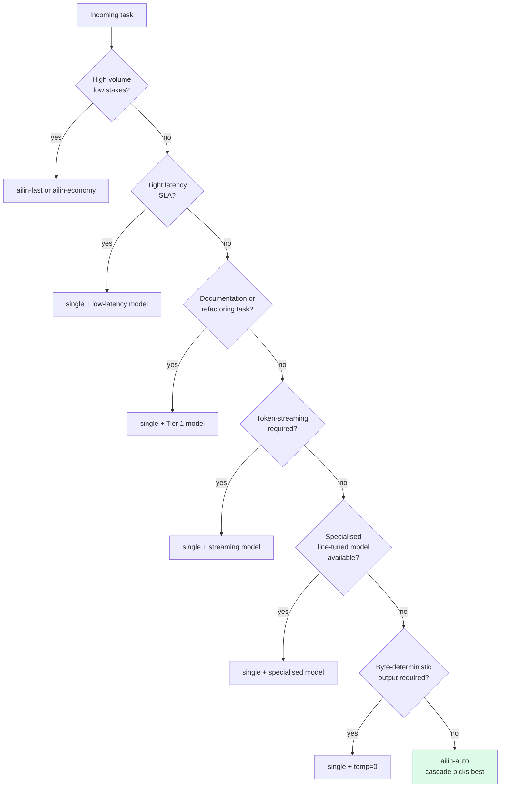

<!--
Copyright (C) 2026 Ailin One, Inc.

This file is part of Collective Intelligence Engine (ci).
Licensed under the GNU Affero General Public License v3.0 or later.
See LICENSE in the repository root, or <https://www.gnu.org/licenses/>.

SPDX-License-Identifier: AGPL-3.0-or-later
Source: https://github.com/ailinone/collective-intelligence
-->

---
title: "When Not to Use the Collective"
description: "Honest antipatterns. The collective is a powerful coordination engine but is not a free lunch — these are the call shapes where a single model is the right answer, and how to make that choice explicit."
---

## TL;DR

The collective is engineered to coordinate diverse models for tasks where diversity, independence, and agreement compound into better answers. It is **not** a free upgrade — multi-model coordination has cost and latency multipliers, and there are well-defined task shapes where a single model is structurally the right choice. This page documents those shapes so the choice can be made explicit rather than discovered through unpleasant cost or latency surprises.

When in doubt, default to `ailin-auto` — the cascade picks the cheapest viable strategy and only escalates when quality-gating fails. That default is the safest economic position.

## Six antipatterns

### 1. High-volume, low-stakes throughput

If your workload is millions of short, low-stakes completions per day (telemetry-style classification, simple template fills, low-precision summarization), the cost multiplier of multi-model coordination is rarely justified. A `single` strategy on a fast, cheap model — pinned via `ailin-fast` or `ailin-economy` — will deliver acceptable quality at a fraction of the cost.

**Recommended.** `ailin-fast`, `ailin-economy`, or an explicit `model: "openai/gpt-4o-mini"` pin with `strategy: "single"`.

### 2. Strict latency SLA

Multi-model coordination has measurable round-trip overhead. Collective strategies (`consensus`, `debate`, `tri-role-collective`) fan out across providers and synthesize, so in practice they routinely run on the order of tens of seconds — substantially slower than a single model. If you have a tight latency SLA, pin a single model.

**Recommended.** `single` with a low-latency model (Groq, Cerebras, SambaNova in the [Provider Ecosystem](https://ailin.guide/architecture/provider-ecosystem)).

### 3. Tasks where Single beats Collective in benchmark

Some task categories are a poor fit for multi-model coordination — typically those where one model's coherent voice beats a synthesizer reconciling several styles:

- **Documentation** — a single model's consistent style usually reads better than a synthesized blend.
- **Refactoring** — applying one coherent set of conventions tends to beat reconciling divergent suggestions.

Use `single` for these categories explicitly, and measure quality on your own task set before assuming collective helps here.

### 4. Streaming-only requirements (token-by-token)

Multi-model strategies converge before emitting; the user does not see tokens stream until arbitration completes. If your UX absolutely requires token-by-token streaming with no upfront delay, pin a single streaming-capable model.

**Recommended.** `single` with `stream: true` on a streaming-native provider.

### 5. Highly idiosyncratic / single-domain prompts

If your domain has a clear best-in-class model (e.g. a fine-tuned Whisper for audio of a particular dialect, or a code model fine-tuned on your codebase), the diversity benefit of multi-model coordination is reduced — multiple generic models cannot match one specialised model. Pin the specialist or include it in a `single` call.

**Recommended.** `single` with a specialised model pin, optionally with [`ailin-collective`](https://ailin.guide/reference/glossary#ailin-collective) only as a fallback.

### 6. Strict deterministic output (e.g. structured JSON contracts)

Multi-model arbitration introduces variance: two runs of the same prompt can converge on different valid syntheses. If your downstream contract requires highly stable output (snapshot tests, idempotent webhooks), pin a single model with `temperature: 0`. Use [Structured Output](https://ailin.guide/guides/structured-output) for the schema contract. Note that even at `temperature: 0`, byte-for-byte determinism is not guaranteed across providers.

**Recommended.** `single` with `temperature: 0` and a JSON schema constraint.

## How to choose deliberately

The decision is operational, not philosophical. The contract for picking the right call shape:

For most production traffic, the answer is `ailin-auto`. The cascade is conservative — it picks `single` or `cost-cascade` when triage detects a low-complexity request and only escalates to coordination strategies when the quality budget warrants it. The economics are designed to favor the cheap path by default.

## How to verify the strategy that ran

Every response includes the resolved strategy in `ailin_metadata.strategy_used`. If you suspect the cascade is escalating more than necessary, query `GET /v1/collective/runs?requestId=...` for the run inspection. Set `max_cost` per request to enforce a hard ceiling at admission — if the estimate exceeds it, the request is rejected with `400 strategy_budget_exceeded` before any provider call.

## See also

- [Strategy Decision Tree](https://ailin.guide/architecture/strategy-decision-tree) — the runtime selection logic.
- [Strategy Catalog](https://ailin.guide/architecture/strategy-catalog) — every strategy with team size, cost multiplier, and theoretical basis.
- [Why Collective Intelligence](https://ailin.guide/architecture/why-collective-intelligence) — the case for multi-model coordination when it applies.
- [Cookbook → Cost-capped routing](https://ailin.guide/guides/cookbook#cost-capped-routing) — operational recipe.
